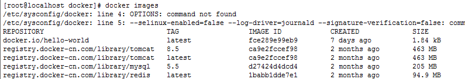
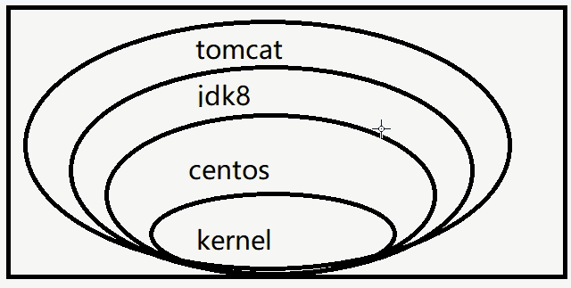
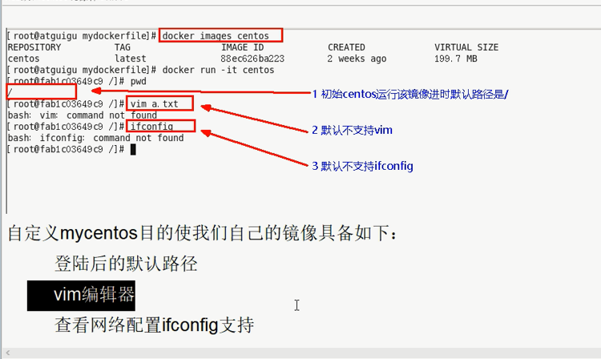
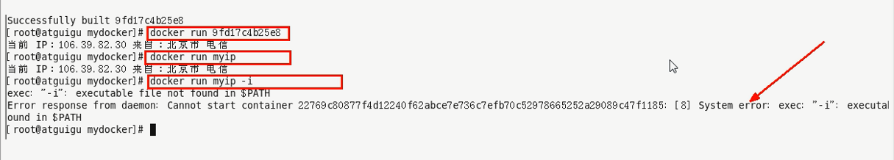
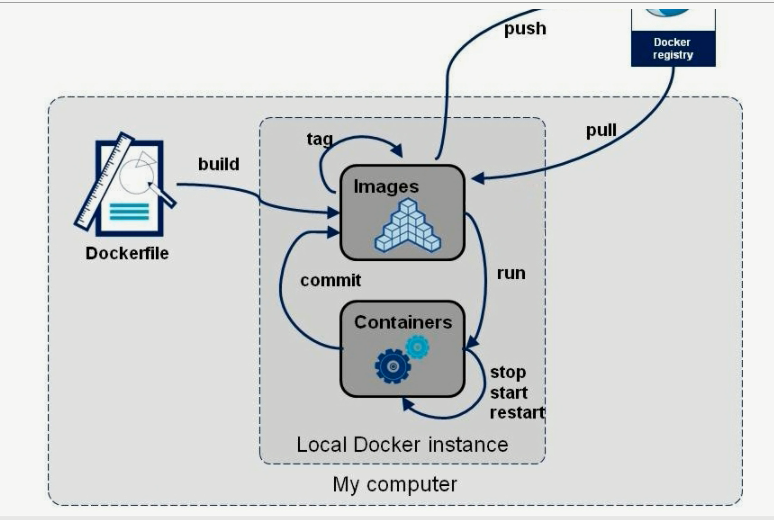

# Docker 安装：

centerOs初次安装无法联网问题：

```shell
[root@localhost /]# cd etc/sysconfig/network-scripts/
[root@localhost network-scripts]# ls
ifcfg-ens33  ifdown-eth   ifdown-post    ifdown-Team      ifup-aliases  ifup-ipv6   ifup-post    ifup-Team      init.ipv6-global
ifcfg-lo     ifdown-ippp  ifdown-ppp     ifdown-TeamPort  ifup-bnep     ifup-isdn   ifup-ppp     ifup-TeamPort  network-functions
ifdown       ifdown-ipv6  ifdown-routes  ifdown-tunnel    ifup-eth      ifup-plip   ifup-routes  ifup-tunnel    network-functions-ipv6
ifdown-bnep  ifdown-isdn  ifdown-sit     ifup             ifup-ippp     ifup-plusb  ifup-sit     ifup-wireless
[root@localhost network-scripts]# vi ifcfg-ens33 
TYPE=Ethernet
PROXY_METHOD=none
BROWSER_ONLY=no
BOOTPROTO=dhcp
DEFROUTE=yes
IPV4_FAILURE_FATAL=no
IPV6INIT=yes
IPV6_AUTOCONF=yes
IPV6_DEFROUTE=yes
IPV6_FAILURE_FATAL=no
IPV6_ADDR_GEN_MODE=stable-privacy
NAME=ens33
UUID=b68e548c-76be-475c-adf7-5f7e05708430
DEVICE=ens33
ONBOOT=yes

```

将`ONBOOT=no`修改为==yes== ;

# 一、CenterOs6.8  安装 docker：

​	1、安装类库 :

​		1）、yum install -y epel-release

​		2）、yum install -y docker-io

​		3）、安装后的配置文件： /etc/sysconfig/docker

​		4）、启动Docker后台服务： service docker start	

​		5）、docker verison 验证

# 二、CenterOs7  安装 docker：

​	安装linux虚拟机

## 1）、VMWare、VirtualBox（安装）；

## 2）、导入虚拟机文件centos7-atguigu.ova；

## 3）、双击启动linux虚拟机;使用  root/ 123456登陆

## 4）、使用客户端连接linux服务器进行命令操作；

## 5）、设置虚拟机网络；

​		桥接网络===选好网卡====接入网线；

​		有线网标识 Controller

​        	无线网标识 Wireless

## 6）、设置好网络以后使用命令重启虚拟机的网络

​		service network restart

## 7）、查看linux的ip地址

​		ip addr

## 8）、使用客户端连接linux；

## 	9）、在linux虚拟机上安装docker

步骤：

==注意：开机自启动（systemctl enable docker==  

```shell
1、检查内核版本，centos版本必须是3.10及以上
uname -r
2、安装docker
yum install docker
3、输入y确认安装 
4、启动docker
[root@localhost ~]# systemctl start docker
[root@localhost ~]# docker -v
Docker version 1.12.6, build 3e8e77d/1.12.6
#5、开机启动docker
[root@localhost ~]# systemctl enable docker
Created symlink from /etc/systemd/system/multi-user.target.wants/docker.service to /usr/lib/systemd/system/docker.service.
6、停止docker
systemctl stop docker
```

## 	10)、控制端使用

==yum install docker安装完成docker后启动docker失败，出现以下信息：==

Job for docker.service failed because the control process exited with error code. See "systemctl status docker.service" and "journalctl -xe" for details.selinux-enabled=false

解决方案：

 重新编辑docker配置文件：

 vi /etc/sysconfig/docker

 划重点：**==selinux-enabled=false==**

\# /etc/sysconfig/docker

\# Modify these options if you want to change the way the docker daemon runs
OPTIONS=‘--selinux-enabled=false --log-driver=journald --signature-verification=false‘
if [ -z "${DOCKER_CERT_PATH}" ]; then
​    DOCKER_CERT_PATH=/etc/docker
fi

最后重新编译：systemctl restart docker 成功了！

查看当前docker是否启动了

ps -ef|grep docker

## 11）、centerOs 7 配置docker中国加速地址

```shell
1.centeros7 docker的配置文件：
	vim /etc/docker/daemon.json
2.添加键值对
	{
  		"registry-mirrors": ["https://registry.docker-cn.com"]
	}
3.重新加载 配置文件
	systemctl daemon-reload
4.重启docker
	systemctl restart docker
```


# 三、Docker常用命令&操作

### 1）、镜像操作

| 操作   | 命令                                       | 说明                                  |
| ---- | ---------------------------------------- | ----------------------------------- |
| 检索   | docker  search 关键字  eg：docker  search redis | 我们经常去docker  hub上检索镜像的详细信息，如镜像的TAG。 |
| 拉取   | docker pull 镜像名:tag                      | :tag是可选的，tag表示标签，多为软件的版本，默认是latest  |
| 列表   | docker images                            | 查看所有本地镜像                            |
| 删除   | docker rmi image-id                      | 删除指定的本地镜像                           |

https://hub.docker.com/

https://www.docker-cn.com/     **docker 中国**

### 2）、容器操作

软件镜像（QQ安装程序）----运行镜像----产生一个容器（正在运行的软件，运行的QQ）；

步骤：

```shell
1、搜索镜像
[root@localhost ~]# docker search tomcat
2、拉取镜像
[root@localhost ~]# docker pull tomcat
3、根据镜像启动容器
docker run --name mytomcat -d tomcat:latest
4、docker ps  
查看运行中的容器
5、 停止运行中的容器
docker stop  容器的id
6、查看所有的容器
docker ps -a
7、启动容器
docker start 容器id
8、删除一个容器
 docker rm 容器id
9、启动一个做了端口映射的tomcat
[root@localhost ~]# docker run -d -p 8888:8080 tomcat
-d：后台运行
-p: 将主机的端口映射到容器的一个端口    主机端口:容器内部的端口

10、为了演示简单关闭了linux的防火墙
service firewalld status ；查看防火墙状态
service firewalld stop：关闭防火墙
11、查看容器的日志
docker logs container-name/container-id

更多命令参看
https://docs.docker.com/engine/reference/commandline/docker/
可以参考每一个镜像的文档

```


### 3）、安装MySQL示例

```shell
docker pull mysql
```


错误的启动

```shell
[root@localhost ~]# docker run --name mysql01 -d mysql
42f09819908bb72dd99ae19e792e0a5d03c48638421fa64cce5f8ba0f40f5846

mysql退出了
[root@localhost ~]# docker ps -a
CONTAINER ID        IMAGE               COMMAND                  CREATED             STATUS                           PORTS               NAMES
42f09819908b        mysql               "docker-entrypoint.sh"   34 seconds ago      Exited (1) 33 seconds ago                            mysql01
538bde63e500        tomcat              "catalina.sh run"        About an hour ago   Exited (143) About an hour ago                       compassionate_
goldstine
c4f1ac60b3fc        tomcat              "catalina.sh run"        About an hour ago   Exited (143) About an hour ago                       lonely_fermi
81ec743a5271        tomcat              "catalina.sh run"        About an hour ago   Exited (143) About an hour ago                       sick_ramanujan


//错误日志
[root@localhost ~]# docker logs 42f09819908b
error: database is uninitialized and password option is not specified 
  You need to specify one of MYSQL_ROOT_PASSWORD, MYSQL_ALLOW_EMPTY_PASSWORD and MYSQL_RANDOM_ROOT_PASSWORD；这个三个参数必须指定一个
```

正确的启动

```shell
[root@localhost ~]# docker run --name mysql01 -e MYSQL_ROOT_PASSWORD=123456 -d mysql
b874c56bec49fb43024b3805ab51e9097da779f2f572c22c695305dedd684c5f
[root@localhost ~]# docker ps
CONTAINER ID        IMAGE               COMMAND                  CREATED             STATUS              PORTS               NAMES
b874c56bec49        mysql               "docker-entrypoint.sh"   4 seconds ago       Up 3 seconds        3306/tcp            mysql01
```

做了端口映射

```shell
[root@localhost ~]# docker run -p 3306:3306 --name mysql02 -e MYSQL_ROOT_PASSWORD=123456 -d mysql
ad10e4bc5c6a0f61cbad43898de71d366117d120e39db651844c0e73863b9434
[root@localhost ~]# docker ps
CONTAINER ID        IMAGE               COMMAND                  CREATED             STATUS              PORTS                    NAMES
ad10e4bc5c6a        mysql               "docker-entrypoint.sh"   4 seconds ago       Up 2 seconds        0.0.0.0:3306->3306/tcp   mysql02
```


几个其他的高级操作

```
docker run --name mysql03 -v /conf/mysql:/etc/mysql/conf.d -e MYSQL_ROOT_PASSWORD=my-secret-pw -d mysql:tag
把主机的/conf/mysql文件夹挂载到 mysqldocker容器的/etc/mysql/conf.d文件夹里面
改mysql的配置文件就只需要把mysql配置文件放在自定义的文件夹下（/conf/mysql）

docker run --name some-mysql -e MYSQL_ROOT_PASSWORD=my-secret-pw -d mysql:tag --character-set-server=utf8mb4 --collation-server=utf8mb4_unicode_ci
指定mysql的一些配置参数

```

# 四、详细解析docker中的原理 和 命令：

## 	1、hello world

​		步骤：

​			1）、docker run hello-world

```javascript
原理：
	1）、先在本地查找 hello-world镜像，
	2）、如果有，则以该镜像作为模板生产容器实例运行，
	3）、如果没有，则去doker hub仓库中查找，如果有，则直接拉取最新镜像并且以该镜像作为模板生产容器实例运行。
```

## 	2、docker的底层原理

​		1）、docker是一个Client-Server结构的系统，docker守护进程运行在主机上，然后通过socket连接从客户端访问，守护进程从客户端接收命名并管理运行在主机上的容器。容器，是一个运行时环境，就是我们前面说的集装箱。

​		2）、为什么docker比VM快

​			a、docker有着比虚拟机更少的抽象层。由于docker不需要Hypervisor实现硬件资源虚拟机化，运行在docker容器上的程序直接使用的都是实际物理机的硬件资源。因此CPU、内存利用率上docker将会在效率上有明显优势。

​			b、docker利用的是宿主机的内核，而不需要Guest OS。因此，当新建一个容器时，docker不需要和虚拟机一样重新加载一个操作系统内核。仍而避免引寻、加载操作系统内核返个比较费时费资源的过程。由于docker，直接利用宿主机的操作系统，则忽略了返个过程，因此新建一个docker容器只需要几秒钟。

## 	3、docker常用命令

### 		a、帮助命令：

​			1） docker version

​			2）docker info

​			3）docker --help ：  docker的帮助命令

### 		b、镜像命令：

### 			1）、docker images 列出本机上的镜像



​			各项说明：

​			REPOSITORY: 表示镜像的仓库源

​			TAG: 镜像的标签

​			IMAGE ID： 镜像ID

​			CREATED : 镜像创建时间

​			SIZE: 镜像大小

### 			2）、docker images options

​				 docker images -a  列出本地所有的镜像（含中间映像层）

​				 docker images -q  只列出镜像ID

​				 docker images --digests  显示镜像的摘要信息

​				 docker images --no-trunc  显示完整镜像信息

### 			3）、docker search 某个xxx镜像名字

​					网站：https://hub.docker.com

​					命令：

​						docker search 【options】 镜像名字

​						options说明：  --no-trunc  :显示完整的镜像描述

 									   -s  : 点赞数  eg: -s 30 点赞数超过30的镜像

### 		 	4）、docker pull 某个xxx镜像名字

​					下载镜像：

​					docker pull 镜像名字[：TAG]

​						docker pull tomcat   等价于 docker pull tomcat:latest

### 	   		5）、docker rmi 某个xxx镜像ID

​					删除镜像

​					删除单个:

​						docker rmi  -f  镜像ID

​					删除多个

​						docker rmi -f 镜像名1：TAG 镜像名2：TAG

​					删除全部

​						docker rmi -f $(docker images -qa)

## 	4、容器命令：

### 		a:有镜像才能创建容器，着是根本前提（下载一个centos镜像演示）

### 		b:新建并启动容器

```shell
docker run [OPTIONS] IMAGE [COMMAND][ARG...]
```

​				  OPTIONS说明：（有些事一个减号，有些是两个减号）

```javascript
--name="容器新名字"：为容器指定一个名称；
-d: 后台运行容器，并返回容器ID，也即启动守护式容器；
-i: 以交互模式运行容器，通常与-t同时使用；
-t: 为容器重新分配一个伪输入终端，通常与 -i 同时使用；
-P(大写P): 随机端口映射；
-p(小写p): 指定端口映射，有一下四种格式
	ip:hostPort:containerPort
	ip::containerPort
	hostPort:containerPort
	containerPort
```

​				  启动交互式容器：

```shell
[root@localhost docker]# docker run -it 1e1148e4cc2c

一回车 ：
启动并且进入centos容器终端
[root@2e909a9ed729 /]# ls 
anaconda-post.log  bin  dev  etc  home  lib  lib64  media  mnt  opt  proc  root  run  sbin  srv  sys  tmp  usr  var
```

​				后台运行容器：

（很重要的要说明的一点：docker容器后台运行，就必须有一个前台进程。

容器运行的命令如果不是那些一直挂起的命令（比如运行top,tail）,就是会自动退出的。）

```shell
[root@localhost sysconfig]# docker run -d --name mycentos02 1e1148e4cc2c
f2fc226a97d973285047d6d7e1d68475c43227f99fce24465b5492167ade9c78
```


### 		c：列出当前所有正在运行的容器

​					docker ps [OPTIONS]

​					OPTIONS参数说明：

```javascript
-a：列出当前所有正在运行的容器+历史上运行过的
-l:显示最近创建的容器。
-n：显示最近n个创建的容器
-q：静默模式，只显示容器编号。
--no-trunc：不截断输出
```


### 		d：退出容器

​				两种方法：

​					1： exit  容器==停止退出==

​					2：ctrl+p+q  容器==不停止退出==

### 		e：启动容器

​				docker start 容器ID或者容器名

### 		f：重启容器

​				docker restart 容器ID或者容器名

### 		g：停止容器

​				docker stop 容器ID或者容器名

### 		h：强制停止容器

​				docker kill 容器ID或者容器名

### 		i：删除已停止的容器

​				docker rm  容器ID

​				一次性删除多个容器：

​					docker rm -f $(docker ps -a -q)

​					docker ps -a -q |xargs docker rm

### 		==j：重要==

#### 			1）、启动守护式容器：

​				docker run -d 容器名

​				docker机制问题：后台进程模式运行，会导致docker 前台没有运行的应用，

​				这样容器后台启动后，会立即自杀因为他觉得他没有事可做了。

#### 			2）、查看容器日志：

​				docker logs -f  -t  --tail 容器ID

​				-t  是加入时间戳

​				-f  是跟随最新的日志打印

​				--tail  数字  显示最后多少条

​			docker run -d centos /bin/sh -c  "while true;do echo hello zzyy;sleep 2;done"

​			后台启动，每两秒循环打印 hello zzyy,

#### 			3）、查看容器内的运行进程

​				docker top 容器ID

#### 			4）、查看容器内部细节

​				docker inspect 容器ID

#### 			5）、进入正在运行的容器并以命令行交互

​				*** docker exec -it 容器ID bashShell

​					eg: docker exec -it ca97c0e3b6a1 /bin/bash

​				*** ==重新进入docker attach 容器ID==

​				 	上述两个区别：

​					a、

​					attach直接进入容器启动命令的终端，不会启动新的进程

```shell
[root@localhost sysconfig]# docker attach ca97c0e3b6a1
[root@ca97c0e3b6a1 /]# 
```

​					b、

​					exec是在容器中打开新的终端，并且可以启动新的进程

```shell
在容器外部直接进行操作
[root@localhost sysconfig]# docker exec -it ca97c0e3b6a1 ls -l /tmp
total 4
-rwx------. 1 root root 836 Dec  5 01:37 ks-script-h2MyUP
-rw-------. 1 root root   0 Dec  5 01:36 yum.log
[root@localhost sysconfig]# 
```

和attach一样  ，进入容器中

```shell
[root@localhost sysconfig]# docker exec -it ca97c0e3b6a1 /bin/bash
[root@ca97c0e3b6a1 /]# 
```

#### 				6）、从容器中拷贝文件到主机上

​					docker cp 容器ID:容器内部路径  目的主机路径

```shell
[root@localhost ~]# docker cp ca97c0e3b6a1:/tmp/yum.log /root
[root@localhost ~]# ls
anaconda-ks.cfg  yum.log
```

#### 				7）、从主机上拷贝文件到tomcat上

```shell
docker cp /root/eim_firm_web.war 99a3f8945457:/usr/local/tomcat/webapps
     docker cp 主机中的文件路径 容器ID或者容器名:容器中的路径         (注意镜像id和路径之间没有空格)
```

#### 				8）、进入tomcat容器中

```shell
[root@localhost local]# docker exec -it 99a3f8945457 /bin/bash
root@99a3f8945457:/usr/local/tomcat/webapps# ls
ROOT  docs  eim_firm_web  eim_firm_web.war  examples  host-manager  manager
```


# 五、docker镜像

## 1、docker镜像是什么？

镜像是一种轻量级，可执行的独立软件包，==用来打包软件运行环境和基于运行环境开发的软件==，它包含运行某个软件所需的所有内容，包括代码、运行时、库、环境变量和配置文件。

​	1）UnionFS（联合文件系统）

​	2）docker镜像加载原理

​		docker 的镜像实际上由一层一层的文件系统组成，这种层级的文件系统UnionFS.

​	bootfs(boot file system)在Docker镜像的最底层是bootfs。

​	rootfs(root file system)

​	3）分层的镜像



​	4）为什么docker镜像要采用这种分层结构呢？

## 2、特点

​	docker镜像都是只读的

​	当容器启动时，一个新的可写层被加载到镜像的顶部。

​	着一层通常被称作“容器层”，容器层之下的都叫“镜像层”。

## 3、docker镜像commit操作补充

​	docker commit 提交容器副本使之成为一个新的镜像

​	docker commit  -m="提交的描述信息"  -a="作者"  容器ID  要创建的目标镜像名:[标签名]

​	案例演示：

​		1）、从hub上下载tomcat镜像到本地并成功运行

​			docker run -it -p 8080:8080 tomcat

​				-p:主机端口：docker容器端口

​				-P:（大P）随机分配端口

​				-i:交互

​				-t:终端

​		2）、故意删除上一步镜像生产tomcat容器文档

```shell
root@3f70b7675766:/usr/local/tomcat/webapps# rm -rf docs
```

​		3）、也即当前的tomcat运行实例是一个没有文档内容的容器

​			以它为模板commit一个没有doc的tomcat新镜像atguigu/tomcat02

​			eg:

```shell
[root@localhost ~]# 
docker commit -m="提交的描述信息" -a="作者" 容器ID 要创建的目标镜像名:[标签名]
docker commit -a="zzyy" -m="tomcat withot docs" 3f70b7675766 atguigu/mytomcat02:1.2
```

​		4 )、启动我们的新镜像并和原来的对比

# 六、Docker容器数据卷

## 	1、是什么

​			类似于拷贝资料的活动硬盘

​			docker容器产生的数据，如果不通过docker commit生成新的镜像，是的数据作为镜像				 					    		 

​			的一部分保存下来，那么当容器删除后，数据自然也就没有了。

​			为了能保存数据在docker中我们使用卷

## 	2、能干嘛？

### 		a.做数据持久化

### 		b.数据共享

​			卷是目录或文件，

```properties
卷的设计目的就是数据的持久化，完全独立域容器的生存周期，因此Docker不会再容器	 删除是删除其挂载的数据卷
特点：
1：数据卷可以在容器之间共享或重用数据
2：卷中的更改可以直接生效
3：数据卷中的更改不会包含在镜像的更新中
4：数据卷的什么周期一直持续到没有容器使用它为止
```

## 	3、数据卷

### 		容器内添加

### 		1）、直接命令添加

```html
命令： 
	docker run -it -v /宿主机绝对路径目录:/容器内目录 镜像名或ID
	docker run -it -v /myDataVolumeContainer:/dataVolumeContainer 
检查是否挂载成功：
	[root@localhost /]# docker inspect 11231a41775c
	"HostConfig": {
            "Binds": [
                "/myDataVolumeContainer:/dataVolumeContainer"
            ],
创建文件：touch hello.text
容器和宿主机之间的数据共享
容器停止退出后，主机修改后数据是否同步？  是同步的
命令（带权限）:
	docker run -it -v /宿主机绝对路径目录:/容器内目录:ro 镜像名或ID
	没有写操作  read only，只有宿主机的单项的操作是可行的
```

**==小结：==** 

| 宿主机文件 | 容器内文件 | 启动参数（加粗表示不存在）                   | 容器启动情况 |
| ----- | ----- | ------------------------------- | ------ |
| 不存在   | 文件    | -v **~/test.txt**:/etc/hosts    | 启动错误   |
| 不存在   | 文件夹   | -v **~/srv**:/srv               | 启动正常   |
| 文件    | 不存在   | -v ~/test.txt:**/srv/test.txt** | 启动正常   |
| 文件夹   | 不存在   | ~/test:**/srv/test**            | 启动正常   |
| 文件夹   | 文件    | ~/test:/srv/test                | 启动错误   |
| 文件夹   | 文件夹   | -v ~/srv:/srv                   | 启动正常   |
| 文件    | 文件    | -v ~/test.txt:/srv/test.txt     | 启动正常   |
| 文件    | 文件夹   | -v ~/test.txt:/test             | 启动错误   |

### 		2）、dockerFile添加 

```properties
1、根目录下新建 mydocker文件夹并进入
2、可在dockerFile中使用VOLUME指令来给镜像添加一个或多个数据卷
3、File构建
	#volume test
	FROM docker.io/centos
	VOLUME ["dataVolumeContainer1","/dataVolumeContainer2"]
	CMD echo "finished,------success1"
	CMD /bin/bash
	翻译：
docker run -it -v /host1:/dataVolumeContainer1 -v /host1:/dataVolumeContainer1 docker.io/centos /bin/bash

4、build后生产镜像
	docker build -f /mydocker/Dockerfile -t zzyy/centos .
	-f:表示 可执行的file文件的位置
	-t:命名空间
	. ：执行
5、run容器
6、通过上述步骤，容器内的卷目录地址已经知道对应的主机目录地址在哪？
	docker inspect 容器ID  查看宿主机和容器卷对应规则
7、主机对应默认地址
```

### 		3）、备注

## 	4、数据卷容器

### 		1）、是什么？

​				命名的容器挂载数据卷，其它容器通过挂载这个（父容器）实现数据共享，挂载数据卷的容器，称为数据容器卷。

### 		2）、总体介绍

​				以上一步新建的镜像zzyy/centos为模板并运行容器dc01/dc02/dc03

​				它们已经具有容器卷：

​					/dataVolumeContainer1

​					/dataVolumeContainer2

### 		3）、容器间传递共享（--volumes-from）

​				先启动一个父容器dc01  ，在dataVolumeContainer2新增内容

​					==docker run -it --name dc01 zzyy/centos==

​				dc02/dc03继承自dc01:

​					--volumes-from

​					==docker run -it  --name doc2 --volumes-from dc01 zzyy/centos==

​					==docker run -it  --name doc3 --volumes-from dc01 zzyy/centos==

​					命令： dc02/dc03分别在dataVolumeContainer2各自新增内容

​				回到dc01可以看到02/03各自添加的都能共享了

​				删除dc02后dc03可否访问

​				新建dc04继承dc03后再删除dc03

​				结论：容器之间配置信息的传递，数据卷的生命周期一直持续到没有容器使用它为止

# 七、Dockerfile详解：

## 	1、Dockerfile是什么

​		Dockerfile 是用来构建Docker镜像的构建文件，是由一系列命令和参数构成的脚本

​		构建三步骤

​			1：编写Dockerfile文件

​			2：docker build

​			3：docker run

​		文件什么样？

​			以我们熟悉的centos为例：

​			https://hub.docker.com/_/centos

```html

FROM scratch   -----最根源的镜像
ADD centos-7-docker.tar.xz /  ----------压缩包

LABEL org.label-schema.schema-version="1.0" \      
    org.label-schema.name="CentOS Base Image" \
    org.label-schema.vendor="CentOS" \
    org.label-schema.license="GPLv2" \
    org.label-schema.build-date="20181205"

CMD ["/bin/bash"]   -------------命令
```

## 	2、Dockerfile构建过程解析

​		a、Dockerfile内容基础知识

​			1）、每条保留字指令必须为大写字母且后面要跟随只是一个参数

​			2）、指令按照从上到下，顺序执行

​			3）、#表示注释

​			4）、每条指令都会创建一个新的镜像层，并对镜像镜像提交

​		b、Dockerfile执行Dockerfile的大致流程

​			1）、docker从基础镜像运行一个容器

​			2）、执行一条指令并对容器作修改

​			3）、执行类似docker commit的操作提交一个新的镜像层

​			4）、docker再基于刚提交的镜像运行一个新容器

​			5）、执行dockerfile 中的下一条指令知道所有指令都执行完成

​		c、小结

​			Dockerfile是软件的原材料

​			Docker镜像是软件的交付品

​			Docker容器则可以认为是软件的运行态

## 	3、Dockerfile体系结构（保留字指令）

```properties
FROM         --基础镜像，当前新镜像是基于哪个镜像的
MAINTANINER	 --镜像维护者的姓名和邮箱地址
RUN			 --容器构建时需要运行的命令
EXPOSE		 --当前容器对外暴露的端口
WORKDIR		 --指定在创建容器后，终端默认登录的进来工作目录，一个落脚点
ENV			 --用来构建镜像过程中设置环境变量
		     			ENV MY_PATH /usr/mytest
		     这个环境变量可以在后续的任何RUN指令中使用，这就如同在命令前面指定了环境变量前缀一样；
		     也可以在器指令中直接使用(引用)这些环境变量，
		     比如：WORKDIR $MY_PATH
ADD			--将宿主机目录下的文件拷贝进镜像，且ADD命令 自动处理URL和解压tar压缩包
COPY		--类似ADD，拷贝文件和目录到镜像中
			  将从构建上下文目录中<源路径>的文件/目录复制到新的一层的镜像内的<目标路径>位置
			  COPY src dest
			  COPY["src","dest"]
VOLUME		--容器数据卷，用户数据保存和持久化工作
CMD			--指定一个容器启动时要执行的命令
				CMD容器启动命令
				Dockerfile中可以有对个CMD指令，但只有最后一个生效，CMD会被docker run之后的参数替换
ENTRYPOINT	--指定一个容器启动时要执行的命令
				ENTRYPOINT的目的和CMD一样，都是指定容器启动程序及参数
ONBUILD		--当构建一个被继承的Dockerfile时运行命令，父镜像 在被 子镜像 继承 后父镜像的onbuild被触发
小总结：
```


## 	4、案例

### 		1）、Base镜像（scratch）

​				Docker Hub中99%的镜像都是通过在base镜像中安装和配置需要的软件构建出来的

### 		2）、自定义镜像mycentos

#### 			第一步--编写：

##### 					a：hub上默认centos镜像是什么情况

​	

​					自动以mycentos目的使我们自己的镜像具备如下：

​						登录后的默认路径

​						vim编辑器

​						查看网络配置ifconfig支持

##### 					b：准备编写Dockerfile文件

​						vim Dockerfile

```shell
#继承自 本地 镜像的centos
FROM centos
#作者和邮箱
MAINTAINER zzyy<zzyy167@123.com>
#环境变量
ENV MYPATH /usr/local
WORKDIR $MYPATH

#运行安装vim net-tools指令
RUN yum -y install vim
RUN yum -y install net-tools

#对外暴露端口
EXPOSE 80

#打印
CMD echo $MYPATH
CMD echo "success------------ok"
#最后执行进入交互终端
CMD /bin/bash
```

##### 					c：myCentos内容DockerFile

```shell

FROM centos

MAINTAINER zzyy<zzyy167@123.com>

ENV MYPATH /usr/local
WORKDIR $MYPATH

RUN yum -y install vim
RUN yum -y install net-tools

EXPOSE 80

CMD echo $MYPATH
CMD echo "success------------ok"
CMD /bin/bash
```

#### 			第二步--构建：

```shell
docker build -f dockerfile的绝对路径 -t 新镜像名字:TAG .
docker build -f /mydocker/Dockerfile2 -t mycentos:1.3 .
```

#### 			第三步--运行：

```shell
docker run -it 镜像名:镜像版本/镜像ID
docker run -it mycentos:1.3
```

#### 			第四步--列出镜像的变更历史：

```shell
docker history 镜像ID
[root@localhost mydocker]# docker history d56914642208
```

### 		3）、CMD/ENTRYPOINT镜像案例

#### 			a：都是指定一个容器启动时要运行的命令

#### 			b：Dokcerfile中可以有多个CMD指令，但只有一个生效，CMD会被docker run后的参数替换

​					case :tomcat的讲解演示  docker run -it  -p 8888:8080 tomcat ls -l

#### 			c：ENTRYPONIT

​					docker run 之后的参数会被当做参数传递给ENTRYPOINT,之后形成新的命令组合

​					case：

​						制作CMD版可以查询IP信息的容器

​							curl 命令  下载网址的内容

​							eg: curl http://www.baidu.com

```shell
FROM centos
RUN yum install -y curl
CMD ["curl","-s","http://ip.cn"]
```

​						问题:如果我们希望现实HTTP头信息，就需要加上-i参数



​						WHY?

​							有多个CMD指令，但只有一个生效，CMD会被docker run后的参数替换

​						制作ENTRYPOINT版查询IP信息的容器

```shell
FROM centos
RUN yum install -y curl
ENTRYPOINT ["curl","-s","http://ip.cn"]
```

### 		4）、自定义镜像Tomcat9

```properties
1、mkdir -p /zzyyuse/mydockerfile/tomcat9
2、在上述目录下touch c.txt
3、将jdk和tomcat安装的压缩包拷贝进上一步目录
4、在/zzyy/mydockerfile/tomcat9目录下新建Dockerfile文件
   内容：
   
FROM centos
MAINTAINER zzyy<zzyybs@1236.com>
#把宿主机当前上下文的c.txt拷贝到容器/usr/local路径下
COPY c.txt /usr/local/cincontainer.txt
#把java与tomcat添加到容器中
ADD jdk-8u171-linux-x64.tar.gz /usr/local/
ADD apache-tomcat-9.0.8.tar.gz /usr/local/
#安装VIM编辑器
RUN yum -y install vim
#设置工作访问时候的WORKDIR路径，登录落脚点
ENV MYPATH /usr/local
WORKDIR $MYPATH
#配置java与tomcat 环境变量
ENV JAVA_HOME  /usr/local/jdk1.8.0_171
ENV CLASSPATH $JAVA_HOME/lib/dt.jar:$JAVA_HOME/lib/tools.jar
ENV CATALINA_HOME /usr/local/apache-tomcat-9.0.8
ENV CATALINA_BASE /usr/local/apache-tomcat-9.0.8
ENV PATH $PATH:$JAVA_HOME/bin:$CATALINA_HOME/lib:$CATALINA_HOME/bin
#容器运行时监听的端口
EXPOSE 8080
#启动是运行tomcat
#ENTRYPOINT ["/usr/local/apache-tomcat-9.0.8/bin/startup.sh"]
#CMD ["/usr/local/apache-tomcat-9.0.8/bin/catalina.sh","run"]
CMD /usr/local/apache-tomcat-9.0.8/bin/startup.sh && tail -F /usr/local/apache-tomcat-9.0.8/bin/logs/catalina.out


5、构建
	docker build -f 指定dockerfile路径 -t 指定名字和版本 .
	docker build -t zzyytomcat9 .
6、run
 	docker run -d -p 9080:8080 --name myt9 -v/zzyyuse/mydockerfile/mytomcat9/test:/usr/local/apache-tomcat-9.0.8/webapps/test -v /zzyyuse/mydockerfile/mytomcat9/tomcat9logs:/usr/local/apache-tomcat-9.0.8/logs --privileged=true zzyytomcat9
__________________________________________________________________________
 docker run -d -p 9080:8080 --name myt9 
 -v /zzyyuse/mydockerfile/mytomcat9/test:/usr/local/apache-tomcat-9.0.8/webapps/test
 -v /zzyyuse/mydockerfile/mytomcat9/tomcat9logs:/usr/local/apache-tomcat-9.0.8/logs
 --privileged=true
 zzyytomcat9
	
7、验证
8、结合前述的容器卷将测试的web服务test发布
```


### 		5）、ONBUILD案例

```shell
FROM centos
RUN yum install -y curl
ENTRYPOINT ["curl","-s","http://ip.cn"]
#子镜像继承我时，会触发onbuild命令
ONBUILD RUN echo "father onbuild----8860"
```


## 	5、小结




# 八、常用安装：

## 	1、安装tomcat:

```shell
docker run -d -p 8080:8080 --name tomcat01 镜像id
```

## 	2、安装mysql:

```shell
docker run -p 3306:3306 --name mysql -v /zyuse/mysql/conf:/etc/mysql/conf.d -v /zyuse/mysql/logs:/logs -v /zyuse/mysql/data:/var/lib/mysql -e MYSQL_ROOT_PASSWORD=123456 -d mysql:5.6
```

```shell
 docker run -p 4406:3306 --name mysql01 
 #配置文件路径映射  /etc/mysql/conf.d 
 #mysql的配置文件路径是文档中提到的 只要在该下列文件夹下的  以.cnf结尾的配置文件就会生效。
 #（!includedir /etc/mysql/conf.d/
 #  !includedir /etc/mysql/mysql.conf.d/）
 -v /zyuse/mysql01/conf:/etc/mysql/conf.d 
 #日志映射
 -v /zyuse/mysql01/logs:/logs 
 #数据库资料文件映射  /var/lib/mysql 
 -v /zyuse/mysql01/data:/var/lib/mysql 
 -e MYSQL_ROOT_PASSWORD=123456 -d 102816b1ee7d
```

```properties
-e MYSQL_USER="woniu"  ：添加woniu用户

-e MYSQL_PASSWORD="123456"：设置添加的用户密码

-e MYSQL_ROOT_PASSWORD="123456"：设置root用户密码
```

 /zyuse/mysql01/data #用于挂载mysql数据文件
  /zyuse/mysql01/conf #用于挂载mysql配置文件

mysql.cnf修改字符集的配置文件案例：

```shell
[client]

default-character-set=utf8

[mysqld]

character-set-server=utf8

[mysql]

default-character-set=utf8

```


## 	3、安装redis:

```shell
docker run -p 6379:6379 -v /zzyy/myredis/data:/data -v /zzyyuse/myredis/conf/redis.conf:/usr/local/etc/redis/redis.conf -dredis:3.2 redis-server /usr/local/etc/redis/redis.conf --appendonly yes
```

## 	4、安装nginx:

### 1、拉取镜像：

```shell
docker pull nginx
```

### 2、运行NGINX容器

```she
docker run -d -p 80:80 --name mynginx 镜像id
```

### 3、NGINX docker中的文件位置

> 静态页面位置

```shell
root@c0462d5e1878:/usr/share/nginx/html# ls 这个路径就是默认的静态页面存放路径
50x.html  index.html
```

> 配置文件位置
>
> b. docker中nginx配置文件位置一览
>
> docker进入nginx命令：     docker exec -it <CONTAINER ID>  /bin/sh
>
> nginx.conf       --/etc/nginx/nginx.conf
>
> default.conf     --/etc/nginx/conf.d/default.conf
>
> logs                 --/var/log/nginx
>
> files                 -- /tmp/files    (配置文件可以更改)

```shell
root@a6ca2640fee9:/etc/nginx# ls
conf.d fastcgi_params   koi-utf  koi-win  mime.types  modules  nginx.conf  scgi_params  uwsgi_params  win-utf
```

配置文件详情：==注意==所有`/etc/nginx/conf.d/*.conf`;都会生效

```shell
root@a6ca2640fee9:/etc/nginx# cat nginx.conf 

user  nginx;
worker_processes  1;

error_log  /var/log/nginx/error.log warn;
pid        /var/run/nginx.pid;


events {
    worker_connections  1024;
}


http {
    include       /etc/nginx/mime.types;
    default_type  application/octet-stream;

    log_format  main  '$remote_addr - $remote_user [$time_local] "$request" '
                      '$status $body_bytes_sent "$http_referer" '
                      '"$http_user_agent" "$http_x_forwarded_for"';

    access_log  /var/log/nginx/access.log  main;

    sendfile        on;
    #tcp_nopush     on;

    keepalive_timeout  65;

    #gzip  on;

    include /etc/nginx/conf.d/*.conf;
}
```

default.config配置文件

```shell
root@408abc7929f8:/etc/nginx/conf.d# cat default.conf 
server {
    listen       80;
    server_name  localhost;

    location / {
        root   /usr/share/nginx/html;
        index  index.html index.htm;
    }
    
    error_page   500 502 503 504  /50x.html;
    location = /50x.html {
        root   /usr/share/nginx/html;
    }

}
```


### 4、挂载docker容器卷

>  配置文件位置

b. docker中nginx配置文件位置一览

docker进入nginx命令：     docker exec -it <CONTAINER ID>  /bin/sh

==/etc/nginx/conf.d/*.conf 路径下所有配置文件都生效== 

nginx.conf       --/etc/nginx/nginx.conf

default.conf     --/etc/nginx/conf.d/default.conf

logs                 --/var/log/nginx

files                 -- /tmp/files    (配置文件可以更改)

思路：因为所有都走配置文件，即配置一个挂载目录，指向/etc/nginx/conf.d/ ，再另起一个挂载目录home,指向home;然后利用配置文件指到home路径即可；

```shell
docker run -d -p 80:80 --name mynginx -v /zyroot/nginx/home:/home  -v /zyroot/nginx/config:/etc/nginx/conf.d 镜像id
```

详解：

```shell
docker run -d 
#端口映射
-p 80:80 
#取名字
--name mynginx 
#容器卷1（静态页面文件夹映射）
-v /zyroot/nginx/home:/home  
#容器卷2（配置文件夹映射）
-v /zyroot/nginx/config:/etc/nginx/conf.d 
镜像id
```

### 参考原文：

3、搭建文件服务器：

如果想要使用nginx搭建静态文件服务器，并使用宿主机的目录存放文件，则需要在创建容器的时候使用-v指定主机挂载目录与容器被挂载的目录。

（1）挂载主机目录：

使用-v挂载目录，冒号前面部分是主机要挂载文件路径，冒号后面部分是挂载到容器的路径

-v /home:/home表示将宿主机的home目录下的所有文件挂载到容器的home目录下

[root@izwz9ib5he33fx3jnuis2xz ~]# docker run --name nginx -d -p 80:80 -v /home:/home nginx

（2）打开配置文件：

第一步：进入容器内部

[root@izwz9ib5he33fx3jnuis2xz ~]# docker exec -ti nginx /bin/bash

第二步：修改nginx的配置文件

root@bcd974e90360:/# cd etc/nginx/conf.d/
root@bcd974e90360:/etc/nginx/conf.d# vim default.conf

（3）修改配置文件，使root根目录指向挂载目录：

```shell
server {

    listen       80;

    server_name  localhost;

charset koi8-r;

access_log  /var/log/nginx/host.access.log  main;

    location / {

root   /usr/share/nginx/html;

     root   /home/userfile;  #修改root根目录，使指向路径为/home/userfile

        index  index.html index.htm;

}
```


## 5、安装FASTDFS文件服务器：

参考地址：https://blog.csdn.net/TTTZZZTTTZZZ/article/details/86709318

### 1.拉取镜像并启动：

```shell
docker run -d --restart=always --privileged=true --net=host --name=fastdfs -e IP=47.95.234.255 -e WEB_PORT=80 -v ${HOME}/fastdfs:/var/local/fdfs registry.cn-beijing.aliyuncs.com/tianzuo/fastdfs
```

> 其中-v  $ {HOME}/fastdfs:/var/local/fdfs是指：
>
> 将$ {HOME}/fastdfs这个目录挂载到容器里的/var/local/fdfs这个目录里。
>
> 所以上传的文件将被持久化到${HOME}/fastdfs/storage/data里，IP 后面是自己的服务器公网ip或者虚拟机ip，
>
> -e WEB_PORT=80 指定nginx端口
>
> 注意：${HOME}  默认指定的是 /root 目录

### 2.运行tracker:

```shell
#进入容器
docker exec -it fastdfs /bin/bash

#插入index.html
echo "Hello FastDFS!">index.html

#测试上传
fdfs_test /etc/fdfs/client.conf upload index.html

#得到访问路径，并成功访问，即证明上传成功

```

### 3.springboot整合fastdfds

添加依赖

```xml
		<dependency>
            <groupId>com.github.tobato</groupId>
            <artifactId>fastdfs-client</artifactId>
        </dependency>
```

### 3.1引入配置类：

```java
@Configuration
@Import(FdfsClientConfig.class)
// 解决jmx重复注册bean的问题
@EnableMBeanExport(registration = RegistrationPolicy.IGNORE_EXISTING)
public class FastClientImporter {
}
```

配置文件：

```yaml
# 分布式文件系统fastdfs配置
fdfs:
 # socket连接超时时长
 soTimeout: 1500
 # 连接tracker服务器超时时长
 connectTimeout: 600
 pool:
   # 从池中借出的对象的最大数目
   max-total: 153
   # 获取连接时的最大等待毫秒数100
   max-wait-millis: 102
 # 缩略图生成参数，可选
 thumbImage:
   width: 150
   height: 150
 # 跟踪服务器tracker_server请求地址,支持多个，这里只有一个，如果有多个在下方加- x.x.x.x:port
 trackerList:
   - 47.95.234.255:22122
 #
 # 存储服务器storage_server访问地址
 web-server-url: http://47.95.234.255/
 spring:
   http:
     multipart:
       max-file-size: 100MB # 最大支持文件大小
       max-request-size: 100MB # 最大支持请求大小
```

测试类：

```java
public class FdfsTest {

    @Autowired
    private FastFileStorageClient storageClient;


    @Test
    public void testUpload() throws FileNotFoundException {
        File file = new File("G:\\img.png");
        // 上传并且生成缩略图
        StorePath storePath = this.storageClient.uploadFile(
                new FileInputStream(file), file.length(), "png", null);
        // 带分组的路径
        System.out.println(storePath.getFullPath());
        // 不带分组的路径
        System.out.println(storePath.getPath());
    }

    @Test
    public void testUploadAndCreateThumb() throws FileNotFoundException {
        File file = new File("G:\\img.png");
        // 上传并且生成缩略图
        StorePath storePath = this.storageClient.uploadFile(
                new FileInputStream(file), file.length(), "png", null);
        // 带分组的路径
        System.out.println(storePath.getFullPath());
        // 不带分组的路径
        System.out.println(storePath.getPath());
    }
}
```


# 九、Docker容器自启动

首先要docker自启动：

- docker服务自动重启设置

```shell
systemctl enable docker.service
```

## 1、容器自启动概述：

​     Docker提供了restart policy机制，可以在容器退出或者Docker重启时控制容器能够自启动。这种Restart policy可以保证相关容器按照正确顺序启动。虽然也可以通过进程监控的方式(如systemd)来完成这种动作，但Docker还是建议尽量避免使用进程监控的方式来 "自启动" 容器。
​    Docker的 Restart policy与dockerd命令的--live-restore启动标志还有区别：--live-restore标志可以在Docker升级的时候保证容器继续运行，但是网络以及用户终端输入会被中断。
​    那到底什么是restart policy呢？我们来看看实际的情况吧。

## 2、使用restart policy

restart policy在使用docker run启动容器时通过--restart标志指定，这个标志有多个value可选，不同的value有不同的行为，如下表所列：

| Flag           | Description                              |
| -------------- | ---------------------------------------- |
| no             | 不自动重启容器. (默认value)                       |
| on-failure     | 容器发生error而退出(容器退出状态不为0)重启容器              |
| unless-stopped | 在容器已经stop掉或Docker stoped/restarted的时候才重启容器 |
| always         | 在容器已经stop掉或Docker stoped/restarted的时候才重启容器 |

举个例子：下面的命令启动一个Redis容器，当Redis容器停止后或者Docker被重启时，Redis容器都会重启。

```shell
$ docker run -dit --restart unless-stopped redis
```

## 3、Restart policy细节

​    使用restart policies时需要注意如下细节：

​    (1) 容器只有在成功启动后restart policy才能生效。这里的"成功启动"是指容器处于up至少10秒且已经处于docker监管。这是避免没有成功启动的容器陷入restart的死循环。

​    (2)如果手动（manually）的stop(与前面的explicitly stopped有何区别)一个容器，容器设置的restart policy将会被忽略，除非Docker daemon重启或者容器手动重启。这是避免了另外一种死循环。

​    (3)restart policies只能用于容器，对于swarm services其restart policies有不通过的配置。

参考: 

flags related to service restart 

## 4、实际使用

> 情景1：容器未启动

在运行docker容器时可以==加==如下参数来保证每次docker服务重启后容器也自动重启：

```shell
docker run --restart=always <CONTAINER ID>
```

> 情景2：容器已经启动

```shell
docker update --restart=always <CONTAINER ID>
```

