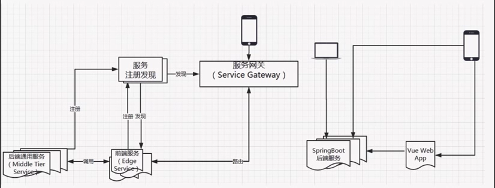
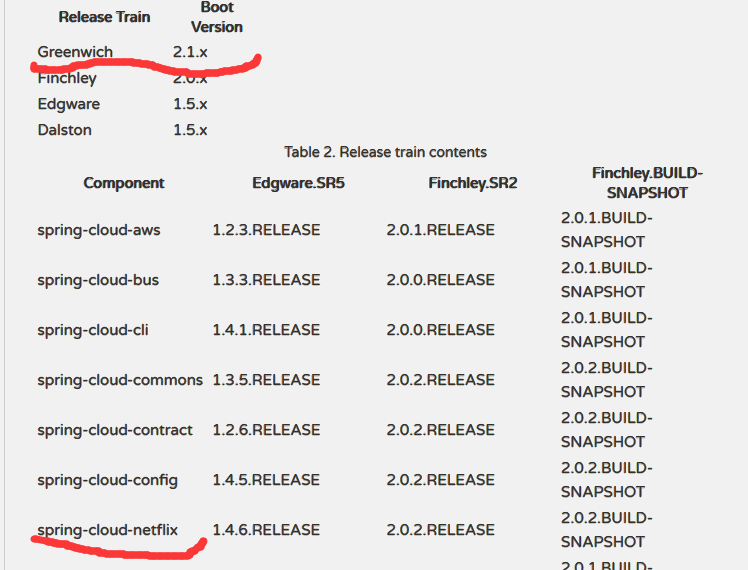
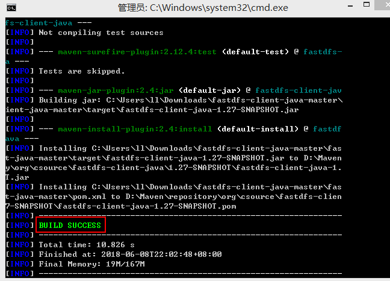

# MY--一、jpa建表，和动态更新时间

sql表：

```sql
CREATE TABLE `product_category` (
  `category_id` int(11) NOT NULL AUTO_INCREMENT,
  `category_name` varchar(32) NOT NULL,
  `category_type` int(11) NOT NULL,
  `create_time` timestamp NOT NULL DEFAULT CURRENT_TIMESTAMP COMMENT '创建时间',
  `update_time` timestamp NOT NULL DEFAULT CURRENT_TIMESTAMP ON UPDATE CURRENT_TIMESTAMP COMMENT '修改时间',
  PRIMARY KEY (`category_id`),
  UNIQUE KEY `uqe_category_type` (`category_type`)
) ENGINE=InnoDB AUTO_INCREMENT=7 DEFAULT CHARSET=utf8;
```

## 1）、实体类 构造

```java
package com.eim.dataObject;

import lombok.Data;
import org.hibernate.annotations.DynamicUpdate;

import javax.persistence.Entity;
import javax.persistence.GeneratedValue;
import javax.persistence.Id;
import javax.persistence.Table;
import java.util.Date;

/**
 * 类目
 * Created by Zy on 2018/12/7.
 */
@Entity
@Data
@DynamicUpdate//【动态更新】使用场景 当字段中有时间，且时间数据库类型是 更新数据就更新时间
@Table(name = "product_category")
public class ProductCategory {

/*
CREATE TABLE `product_category` (
  `category_id` int(11) NOT NULL AUTO_INCREMENT,
  `category_name` varchar(32) NOT NULL,
  `category_type` int(11) NOT NULL,
  `create_time` timestamp NOT NULL DEFAULT CURRENT_TIMESTAMP COMMENT '创建时间',
  `update_time` timestamp NOT NULL DEFAULT CURRENT_TIMESTAMP ON UPDATE CURRENT_TIMESTAMP COMMENT '修改时间',
  PRIMARY KEY (`category_id`),
  UNIQUE KEY `uqe_category_type` (`category_type`)
) ENGINE=InnoDB AUTO_INCREMENT=3 DEFAULT CHARSET=utf8;
 */
    /**类目id. */
    @Id //指定主键
    @GeneratedValue// 主键自增
    private Integer categoryId;
    /**
     * 类目id
     */
    private String categoryName;
    /**
     * 类目类型
     */
    private Integer categoryType;
    /**
     * 创建时间
     */
    private Date createTime;
    /**
     * 修改时间
     */
    private Date updateTime;

}

```

## 2）、repository 编写

```java
package com.eim.repository;

import com.eim.dataObject.ProductCategory;
import org.springframework.data.jpa.repository.JpaRepository;

import java.util.List;

/**
 * 类目dao
 * Created by Zy on 2018/12/7.
 */
public interface ProductCategoryRepository extends JpaRepository<ProductCategory,Integer> {

    //查询类目列表
    List<ProductCategory> findByCategoryTypeIn(List<Integer> categoryTypeList);
}

```

# MY--二、返回json，对象序列化操作

## 1、返回值为对象

### 1）、springmvc

```java
    //创建订单
	@ResponseBody
    @PostMapping("/create")
    public ResultVO<Map<String,String>> createOrder(@Valid OrderForm orderForm, BindingResult bindingResult){

        if(bindingResult.hasErrors()){
            log.error("【创建订单】 表单验证（参数错误） orderForm={}",orderForm);
            throw new SellException(ExceptionEnum.ORDER_FORM_ERROR.getCode(),bindingResult.getFieldError().getDefaultMessage());
        }
        OrderMasterDto orderMasterDto = OrderForm2OrderMasertDTOConvert.convert(orderForm);
        if(CollectionUtils.isEmpty(orderMasterDto.getOrderDetailList())){
            log.error("【创建订单】 购物车不能为空 catlist={}",orderMasterDto.getOrderDetailList());
            throw new SellException(ExceptionEnum.CAR_EMPTY);
        }
        OrderMasterDto updateResult = orderService.createOrder(orderMasterDto);

        HashMap<Object, Object> map = new HashMap<>();

        map.put("orderId",updateResult.getOrderId());

        return ResultVoUtil.success(map);
    }
```

### 2）、指定序列化格式

```java
package com.eim.VO;

import com.fasterxml.jackson.annotation.JsonProperty;
import lombok.Data;

import java.util.List;

/**
 * 商品（包含类目） 第二层
 * Created by Zy on 2018/12/11.
 */
@Data
public class ProductVo {

    @JsonProperty(value = "name")//序列化后的字段名字
    private String cotegoryName;

    @JsonProperty(value = "type")
    private Integer categoryType;

    @JsonProperty(value = "foods")
    private List<ProductInfoVo> productInfoVoList;
}
```

### 3）、返回null,隐藏字段、

```yaml
#全局配置  序列化后字段为null 则不返回
spring:
  jackson:
    default-property-inclusion: non_null
```

### 4）、序列化时间戳格式

```java
/**
 * 自定义json序列化器规则
 * Created by Zy on 2018/12/13.
 */
public class Date2LongSerialize extends JsonSerializer<Date> {

    @Override
    public void serialize(Date date, JsonGenerator jsonGenerator, SerializerProvider serializerProvider) throws IOException, JsonProcessingException {
        long l = date.getTime() / 1000;
        jsonGenerator.writeNumber(l);
    }
}
```

在需要的类上中的 属性上 加上自己序列化器

```java
    @JsonSerialize(using = Date2LongSerialize.class)
    private Date create_time;

```

## 2、返回值为string    

gson使用参考地址：https://www.cnblogs.com/qinxu/p/9504412.html

**说明**：用json转换工具，将对象转为json

```java
import java.util.Date;

import com.google.gson.Gson;

public class JSONTest {

    public static void main(String[] args) {
        Person hbk = new Person();
        hbk.setAge(30);
        hbk.setName("黄宝康");
        hbk.setBirthday(new Date());
        Gson gson = new Gson();
        String result = gson.toJson(hbk);
        System.out.println(result);
    }
}
```

**运行结果：**

{"name":"黄宝康","age":30,"birthday":"May 21, 2018 11:50:23 AM"}

**需求，我需要输出NAME，而不是小写的name，第二，日期格式不是我想要的。**

### 1）、指定序列化名称：

Gson针对这两个问题，提供了相关注解，只需要在Person的name字段加入相关注解即可。

```java
@SerializedName("NAME")
    private String name;
```

再次运行输出如下：可以看出name已经输出成NAME了，第一个问题解决。

`{"NAME":"黄宝康","age":30,"birthday":"May 21, 2018 11:53:25 AM"}` 

### 2）、指定序列化时间格式：

使用GsonBuilder()构建Gson对象，而不是之前的new Gson(); 
这样运行输出了我们想要的格式。

```java
Gson gson = new GsonBuilder().setDateFormat("yyyy-MM-dd HH:mm:ss").create();
```

`{"NAME":"黄宝康","age":30,"birthday":"2018-05-21 11:57:16"}`

### 3）、其他设置：

如打印美化的json格式数据等

GsonBuilder builder = new GsonBuilder();
builder.setPrettyPrinting();
Gson gson = builder.create();

通过上面的设置，控制台输出的json格式是带有缩进的

### 4）、隐藏字段：

默认Gson输出json，会把javabean的所有字段都输出，有的时候，业务上需要隐藏敏感字段。

{"name":"黄宝康","age":30,"birthday":"May 23, 2018 4:08:04 PM","ignore":"不要看见我"}

为了不看见ignore字段，我们只需要在ignore属性前加上==transient==修饰符即可。

`private transient String ignore;`

{"name":"黄宝康","age":30,"birthday":"May 23, 2018 4:12:41 PM"}

### 5)、碰到的异常：

使用Gson将对象转换成字符串的时候报java.lang.StackOverflowError

**原因**：该对象A中有一个有一个组件B，组件B中有这个对象A的属性（==关联查询一对多==），而造成了一个循环 
解决办法：去掉组件B中A的属性，这样做就不能通过B获取A了但是可以正常的转换JSON

**解决方法**：设置组件B为null,即可转换成功


# MY--三、form对象表单验证

## 1）、form对象

```java
package com.eim.form;

import lombok.Data;
import org.hibernate.validator.constraints.NotEmpty;

/**
 * 创建订单
 * 表单验证
 * Created by Zy on 2018/12/13.
 */
@Data
public class OrderForm {

    @NotEmpty(message = "姓名必填")
    private String name;

    @NotEmpty(message = "电话必填")
    private String phone;

    @NotEmpty(message = "地址必填")
    private String address;

    @NotEmpty(message = "openid必填")
    private String openid;

    @NotEmpty(message = "购物车不能为空")
    private String items;

}

```

参考地址：<https://www.cnblogs.com/chenlove/p/8708627.html>

常用正则表达式：<https://www.cnblogs.com/fozero/p/7868687.html> 

### 常见表单验证注解

限制	说明
@Null	限制只能为null
@NotNull	限制必须不为null
@AssertFalse	限制必须为false
@AssertTrue	限制必须为true
@DecimalMax(value)	限制必须为一个不大于指定值的数字
@DecimalMin(value)	限制必须为一个不小于指定值的数字
@Digits(integer,fraction)	限制必须为一个小数，且整数部分的位数不能超过integer，小数部分的位数不能超过fraction
@Future	限制必须是一个将来的日期
@Max(value)	限制必须为一个不大于指定值的数字
@Min(value)	限制必须为一个不小于指定值的数字
@Past	限制必须是一个过去的日期
@Pattern(value)	限制必须符合指定的正则表达式
@Size(max,min)	限制字符长度必须在min到max之间
@Past	验证注解的元素值（日期类型）比当前时间早
@NotEmpty	验证注解的元素值不为null且不为空（字符串长度不为0、集合大小不为0）
@NotBlank	验证注解的元素值不为空（不为null、去除首位空格后长度为0），不同于@NotEmpty，@NotBlank只应用于字符串且在比较时会去除字符串的空格

@Email	验证注解的元素值是Email，也可以通过正则表达式和flag指定自定义的email格式

**注意**：

@NotEmpty 用在集合类上面
@NotBlank 用在String上面
@NotNull    用在基本类型上

如果在基本类型上面用NotEmpty或者NotBlank 会出现报错

## 2）、mvc验证及捕获异常

### **自定义异常：**

```java
package com.eim.exception;

import com.eim.enums.ResultEnum;

/**
 * Created by Zy on 2018/10/29.
 */
public class SellException extends RuntimeException{

    private Integer code;

    public SellException(ResultEnum resultEnum) {//结合枚举使用
        super(resultEnum.getMessage());
        this.code = resultEnum.getCode();
    }
  
  	public SellException(Integer code,String msg) {//处理controller valid表单对象，异常处理
        super(msg);
        this.code = code;
    }
  
}
```

### **异常枚举类：**

```java
package com.eim.enums;

import lombok.Getter;

/**
 * Created by Zy on 2018/10/29.
 */
@Getter
public enum ResultEnum {

    PRODUCT_NOT_EXIST(10,"商品不存在"),
    product_stock_error(11,"库存不正确")
    ;

    private Integer code;

    private String message;

    ResultEnum(Integer code, String message) {
        this.code = code;
        this.message = message;
    }
}
```

@Valid ：表单验证注解

BindingResult bindingResult : 绑定验证结果

###   捕获异常：

```java
if(bindingResult.hasErrors()){
       log.error("【创建订单】 表单验证（参数错误） orderForm={}",orderForm);
        throw new SellException(ExceptionEnum.ORDER_FORM_ERROR.getCode(),bindingResult.getFieldError().getDefaultMessage());
}
```

```java
    //创建订单
    @PostMapping("/create")
    public ResultVO<Map<String,String>> createOrder(@Valid OrderForm orderForm, BindingResult bindingResult){

        if(bindingResult.hasErrors()){
            log.error("【创建订单】 表单验证（参数错误） orderForm={}",orderForm);
            throw new SellException(ExceptionEnum.ORDER_FORM_ERROR.getCode(),bindingResult.getFieldError().getDefaultMessage());
        }
        OrderMasterDto orderMasterDto = OrderForm2OrderMasertDTOConvert.convert(orderForm);
        if(CollectionUtils.isEmpty(orderMasterDto.getOrderDetailList())){
            log.error("【创建订单】 购物车不能为空 catlist={}",orderMasterDto.getOrderDetailList());
            throw new SellException(ExceptionEnum.CAR_EMPTY);
        }
        OrderMasterDto updateResult = orderService.createOrder(orderMasterDto);

        HashMap<Object, Object> map = new HashMap<>();

        map.put("orderId",updateResult.getOrderId());

        return ResultVoUtil.success(map);
    }
```

## 3）、参考地址

参考地址：<https://www.cnblogs.com/chenlove/p/8708627.html>

常用正则表达式：<https://www.cnblogs.com/fozero/p/7868687.html> 

# MY--四、微信公众号授权

## 引入依赖：

```xml
github地址：https://github.com/Wechat-Group/weixin-java-tools
<!--微信公众平台-->
		<dependency>
			<groupId>com.github.binarywang</groupId>
			<artifactId>weixin-java-mp</artifactId>
			<version>3.2.0</version>
		</dependency>
```

## 1）、配置

### 配置微信相关属性（application.yml）：

```yaml
#微信配置
wechat:
  mpAppId: wx19eb7b496e9e29cc
  mpAppSecret: ae1479087ca5f5fbf2ba56a80b5cec7b
```

### 配置读取属性的配置类

```java
package com.eim.config;

import lombok.Data;
import org.springframework.boot.context.properties.ConfigurationProperties;
import org.springframework.stereotype.Component;

/**
 * 微信数据配置类
 * Created by Zy on 2018/12/13.
 */
@Data
@Component
@ConfigurationProperties(prefix = "wechat")
public class WechatPropertiesConfig {

    private String mpAppId;

    private String mpAppSecret;

}

```

### 微信Java开发工具包（SDK）公众号配置类

```java
package com.eim.config;

import me.chanjar.weixin.mp.api.WxMpConfigStorage;
import me.chanjar.weixin.mp.api.WxMpInMemoryConfigStorage;
import me.chanjar.weixin.mp.api.WxMpService;
import me.chanjar.weixin.mp.api.impl.WxMpServiceImpl;
import org.springframework.beans.factory.annotation.Autowired;
import org.springframework.context.annotation.Bean;
import org.springframework.stereotype.Component;
/**
 * Created by Zy on 2018/12/13.
 */
@Component
public class WechatConfig {

    //微信数据配置类
    @Autowired
    private WechatPropertiesConfig wechatPropertiesConfig;

    //注入自定义配置的wxMpService
    @Bean
    public WxMpService wxMpService(){
        WxMpServiceImpl wxMpService = new WxMpServiceImpl();
        wxMpService.setWxMpConfigStorage(wxMpConfigStorage());
        return wxMpService;
    }

    //配置项
    @Bean
    public WxMpConfigStorage wxMpConfigStorage(){
        WxMpInMemoryConfigStorage wxMpInMemoryConfigStorage = new WxMpInMemoryConfigStorage();
        wxMpInMemoryConfigStorage.setAppId(wechatPropertiesConfig.getMpAppId());
        wxMpInMemoryConfigStorage.setSecret(wechatPropertiesConfig.getMpAppSecret());
        return wxMpInMemoryConfigStorage;
    }
}

```

## 2）、调用

```java
package com.eim.controller;

import lombok.extern.slf4j.Slf4j;
import me.chanjar.weixin.common.api.WxConsts;
import me.chanjar.weixin.common.error.WxErrorException;
import me.chanjar.weixin.mp.api.WxMpService;
import me.chanjar.weixin.mp.bean.result.WxMpOAuth2AccessToken;
import me.chanjar.weixin.mp.bean.result.WxMpUser;
import org.springframework.beans.factory.annotation.Autowired;
import org.springframework.stereotype.Controller;
import org.springframework.web.bind.annotation.RequestMapping;
import org.springframework.web.bind.annotation.RequestParam;
/**
 * Created by Zy on 2018/12/13.
 */
@Slf4j
@Controller
@RequestMapping("/wechat")
public class WechatController {

    @Autowired
    private WxMpService wxMpService;

    /**
     * 1、
     * 首先构造网页授权url，然后构成超链接让用户点击：
     * @param returnUrl
     * @return
     */
    @RequestMapping("/authorize")
    public String authorize(@RequestParam("returnUrl")String returnUrl){
        //1.配置
        //2.调用
        String url = "http://wechat.ei-marketing.net/sell/wechat/userInfo";
        /**
         * url : 重定向接收code 和 携带参数 state的 路径
         * WxConsts.OAuth2Scope.SNSAPI_USERINFO ：授权类型
         * returnUrl ：携带的参数
         */
        String redirectUrl = wxMpService.oauth2buildAuthorizationUrl(url, WxConsts.OAuth2Scope.SNSAPI_USERINFO, returnUrl);
        log.info("redirectUrlt={}",redirectUrl);
        return "redirect:"+redirectUrl;
    }

    /**
     * 2、
     * 当用户同意授权后，会回调所设置的url并把authorization code传过来，
     * 然后用这个code获得access token，其中也包含用户的openid等信息
     * @param code
     * @param state
     */
    @RequestMapping("/userInfo")
    public String userInfo(@RequestParam("code")String code,@RequestParam("state")String state){
        log.info("获取到了code={}",code);
        WxMpOAuth2AccessToken wxMpOAuth2AccessToken = null;
        WxMpUser wxMpUser = null;
        try {
            wxMpOAuth2AccessToken = wxMpService.oauth2getAccessToken(code);
            wxMpUser = wxMpService.oauth2getUserInfo(wxMpOAuth2AccessToken, null);
        } catch (WxErrorException e) {
            e.printStackTrace();
        }
        if(wxMpOAuth2AccessToken == null){
          log.error("【获取accessToken】token为空， accessToken={}",wxMpOAuth2AccessToken);
        }
        if(wxMpUser == null){
          log.error("【获取wxMpUser】对象为空， wxMpUser={}",wxMpUser);
        }
        //获取昵称
        wxMpUser.getNickname();
        //openid
        wxMpUser.getOpenId();
        //获取省
        wxMpUser.getProvince();
        //市
        wxMpUser.getCity();
        //国家
        wxMpUser.getCountry();
        //头像
        wxMpUser.getHeadImgUrl();
        //语言
        wxMpUser.getLanguage();
        //性别
        wxMpUser.getSex();
        return "redirect:"+state+"?openid="+wxMpUser.getOpenId();
    }

}

```


# MY--五、微信公众号支付

## 1、引入best-pay-sdk依赖

github地址：

```xml
		<!--微信支付-->
		<dependency>
			<groupId>cn.springboot</groupId>
			<artifactId>best-pay-sdk</artifactId>
			<version>1.1.0</version>
		</dependency>
```


## 2、配置支付所需的属性

```yaml
#微信配置
wechat:
  #公众号appid
  mpAppId: wx19eb7b496e9e29cc
  #公众号appsecret
  mpAppSecret: ae1479087ca5f5fbf2ba56a80b5cec7b
  #商户id
  mchId: 1365910202
  #商户秘钥
  mchKey: eimeim12eimeim12eimeim12eimeim12
  #商户证书地址
  keyPath: C:/Users/Zy/Desktop/apiclient_cert.p12
  #回调地址
  notifyUrl: http://appeim.natapp1.cc/sell/pay/notify.do
```

```java
package com.eim.config;

import lombok.Data;
import org.springframework.boot.context.properties.ConfigurationProperties;
import org.springframework.stereotype.Component;

/**
 * 微信数据配置类
 * Created by Zy on 2018/12/13.
 */
@Data
@Component
@ConfigurationProperties(prefix = "wechat")
public class WechatPropertiesConfig {

    private String mpAppId;

    private String mpAppSecret;

    private String mchId;

    private String mchKey;

    private String keyPath;

    private String notifyUrl;

}

```


## 3、配置自定义bestService

```java
package com.eim.config;

import com.lly835.bestpay.config.WxPayH5Config;
import com.lly835.bestpay.service.impl.BestPayServiceImpl;
import org.springframework.beans.factory.annotation.Autowired;
import org.springframework.context.annotation.Bean;
import org.springframework.stereotype.Component;

/**
 * BESTPAY
 * 配置类
 * Created by Zy on 2018/12/14.
 */
@Component
public class WechatPayConfig {


    @Autowired
    private WechatPropertiesConfig wechatPropertiesConfig;

    /**
     * 引入自定义bestPayService
     * @return
     */
    @Bean
    public BestPayServiceImpl bestPayService(){
        BestPayServiceImpl bestPayService = new BestPayServiceImpl();
        bestPayService.setWxPayH5Config(wxPayH5Config());
        return  bestPayService;
    }

    /**
     * 引入配置项
     * @return
     */
    @Bean
    public WxPayH5Config wxPayH5Config(){
        WxPayH5Config wxPayH5Config = new WxPayH5Config();
        //公众号id
        wxPayH5Config.setAppId(wechatPropertiesConfig.getMpAppId());
        //公众号appsecret
        wxPayH5Config.setAppSecret(wechatPropertiesConfig.getMpAppSecret());
        //商户id
        wxPayH5Config.setMchId(wechatPropertiesConfig.getMchId());
        //商户秘钥
        wxPayH5Config.setMchKey(wechatPropertiesConfig.getMchKey());
        //商户证书地址
        wxPayH5Config.setKeyPath(wechatPropertiesConfig.getKeyPath());
        //回调地址
        wxPayH5Config.setNotifyUrl(wechatPropertiesConfig.getNotifyUrl());
        return wxPayH5Config;
    }
}

```


## 4、配置支付详情 payrequest

```java
package com.eim.service.impl;

import com.eim.dto.OrderMasterDto;
import com.eim.service.PayService;
import com.eim.util.JsonFomateUtil;
import com.lly835.bestpay.enums.BestPayTypeEnum;
import com.lly835.bestpay.model.PayRequest;
import com.lly835.bestpay.model.PayResponse;
import com.lly835.bestpay.service.BestPayService;
import lombok.extern.slf4j.Slf4j;
import org.springframework.beans.factory.annotation.Autowired;
import org.springframework.stereotype.Service;

/**
 * 支付
 * Created by Zy on 2018/12/14.
 */
@Slf4j
@Service
public class PayServiceImpl implements PayService {

    private static final String ORDERNAME = "微信点餐订单";

    @Autowired
    private BestPayService bestPayService;

    @Override
    public OrderMasterDto create(OrderMasterDto orderMasterDto) {
        //配置支付详情
        // PayRequest
        PayRequest payRequest = new PayRequest();
        //openid
        payRequest.setOpenid(orderMasterDto.getBuyerOpenid());
        //订单id
        payRequest.setOrderId(orderMasterDto.getOrderId());
        //订单总金额
        payRequest.setOrderAmount(orderMasterDto.getOrderAmount().doubleValue());
        //订单名字
        payRequest.setOrderName(ORDERNAME);
        //支付类型
        payRequest.setPayTypeEnum(BestPayTypeEnum.WXPAY_H5);
        log.info("【微信支付】 payRequest={}", JsonFomateUtil.toJson(payRequest));
        //发起支付
        PayResponse payResponse = bestPayService.pay(payRequest);
        log.info("【微信支付】 payResponse={}",JsonFomateUtil.toJson(payResponse));
        return payResponse;
    }
}

```


## 5、发起支付 bestPayService.pay()

```java
PayResponse payResponse = bestPayService.pay(payRequest);
payResponse中的属性
    private String prePayParams;
    private URI payUri;
    private String appId;
    private String timeStamp;
    private String nonceStr;
    @JsonProperty("package")
    private String packAge;
    private String signType;
    private String paySign;
    private Double orderAmount;
    private String orderId;
    private String outTradeNo;
```

## 6、将payResponse返回到前端控制器，并调起H5 支付页面

```java
package com.eim.controller;

import com.eim.dto.OrderMasterDto;
import com.eim.repository.OrderMasterRepository;
import com.eim.service.OrderService;
import com.eim.service.PayService;
import com.lly835.bestpay.model.PayResponse;
import org.springframework.beans.factory.annotation.Autowired;
import org.springframework.stereotype.Controller;
import org.springframework.web.bind.annotation.RequestMapping;
import org.springframework.web.bind.annotation.RequestParam;

import java.util.Map;

/**
 * Created by Zy on 2018/12/14.
 */
@Controller
@RequestMapping("/pay")
public class PayController {

    @Autowired
    private OrderService orderService;

    @Autowired
    private PayService payService;

    @RequestMapping("/create")
    public String create(@RequestParam("orderId") String orderId, 			     	 @RequestParam("returnUrl")String returnUrl, Map map){
        //查询订单
        OrderMasterDto orderMasterDto = orderService.findOne(orderId);

        //发起支付
        PayResponse payResponse = payService.create(orderMasterDto);
        map.put("pay",payResponse);
        map.put("returnUrl",returnUrl);

        return "pay/pay.html";
    }

}

```

## 7、H5微信支付页面：pay.html

```html
<script>
    function onBridgeReady(){
        WeixinJSBridge.invoke(
            'getBrandWCPayRequest', {
                "appId":"[[${pay.appId}]]",     //公众号名称，由商户传入
                "timeStamp":"[[${pay.timeStamp}]]",         //时间戳，自1970年以来的秒数
                "nonceStr":"[[${pay.nonceStr}]]", //随机串
                "package":"[[${pay.packAge}]]",
                "signType":"[[${pay.signType}]]",         //微信签名方式：
                "paySign":"[[${pay.paySign}]]" //微信签名
            },
            function(res){
                location.href = "[[${returnUrl}]]"
                if(res.err_msg == "get_brand_wcpay_request:ok" ){
                    // 使用以上方式判断前端返回,微信团队郑重提示：
                    //res.err_msg将在用户支付成功后返回ok，但并不保证它绝对可靠。
                }
            });
    }
    if (typeof WeixinJSBridge == "undefined"){
        if( document.addEventListener ){
            document.addEventListener('WeixinJSBridgeReady', onBridgeReady, false);
        }else if (document.attachEvent){
            document.attachEvent('WeixinJSBridgeReady', onBridgeReady);
            document.attachEvent('onWeixinJSBridgeReady', onBridgeReady);
        }
    }else{
        onBridgeReady();
    }
</script>
```

## 8、支付完成，异步回调

### 1）、回调配置：

 ==notifyUrl: http://appeim.natapp1.cc/sell/pay/notify.do==

```
wechat:
  #公众号appid
  mpAppId: wx19eb7b496e9e29cc
  #公众号appsecret
  mpAppSecret: ae1479087ca5f5fbf2ba56a80b5cec7b
  #商户id
  mchId: 1365910202
  #商户秘钥
  mchKey: eimeim12eimeim12eimeim12eimeim12
  #商户证书地址
  keyPath: C:/Users/Zy/Desktop/apiclient_cert.p12
  #回调地址
  notifyUrl: http://appeim.natapp1.cc/sell/pay/notify.do

```

### 2）、回调的前端控制器

```java
    /**
     * 微信支付异步回调
     * String notifyData 接收微信传入的 xml
     * @RequestBody:表示接收的是文本格式内容
     */
    @PostMapping("/notify")
    public String notify(@RequestBody String notifyData){
        payService.notify(notifyData);
        //回复微信异步回调，已成功接收。停止回调
        return "pay/paySuccess.html";
    }
```

微信传入的 xml:

```
<xml><appid><![CDATA[wx19eb7b496e9e29cc]]></appid>
<bank_type><![CDATA[CFT]]></bank_type>
<cash_fee><![CDATA[1]]></cash_fee>
<fee_type><![CDATA[CNY]]></fee_type>
<is_subscribe><![CDATA[Y]]></is_subscribe>
<mch_id><![CDATA[1365910202]]></mch_id>
<nonce_str><![CDATA[gAn5Cf6ZFWktphJS]]></nonce_str>
<openid><![CDATA[orLm4wTPuPxGk5ZUVOOuvd-3gRe4]]></openid>
<out_trade_no><![CDATA[1545028214494922677]]></out_trade_no>
<result_code><![CDATA[SUCCESS]]></result_code>
<return_code><![CDATA[SUCCESS]]></return_code>
<sign><![CDATA[F8D28C788D880FF0F41858D53DFC5D46]]></sign>
<time_end><![CDATA[20181217143022]]></time_end>
<total_fee>1</total_fee>
<trade_type><![CDATA[JSAPI]]></trade_type>
<transaction_id><![CDATA[4200000227201812173156238669]]></transaction_id>
</xml>

```

### 3）、payService

==PayResponse payResponse = bestPayService.asyncNotify(notifyData)==

```java
  @Override
    public PayResponse notify(String notifyData) {
        //1.验证签名（bestPay已做）
        //2.验证支付状态（bestPay已做）
        //3、验证金额是否相等（自己校验）
        //4、验证下单和支付人是否一致（根据具体业务需求而定）
        PayResponse payResponse = bestPayService.asyncNotify(notifyData);
        log.info("【微信支付】 微信异步通知，payResponse={}",payResponse);

        OrderMasterDto masterDto = orderService.findOne(payResponse.getOrderId());
        if(masterDto == null){
            log.error("【微信支付】 微信异步通知，订单不存在 order ={}",masterDto);
            throw new SellException(ExceptionEnum.ORDER_NOT_EXIST);
        }

        /**
         * 比较金额是否一致
         *   特别考虑：
         *      1、数据类型是否一致
         *      2、数据类型不一致转换时，会发生精度问题
         *      3、0.1 和0.10 也应该是一致的
         */
        if(MathUtil.isMath(masterDto.getOrderAmount().doubleValue(),payResponse.getOrderAmount())){
            //修改订单支付状态
            orderService.paidOrder(masterDto);
        }else{
            log.error("【微信支付】 订单总金额不一致 newM={},oldM={}",payResponse.getOrderAmount(),masterDto.getOrderAmount().doubleValue());
            throw new SellException(ExceptionEnum.ORDER_AMOUNT_ERROR);
        }

        return payResponse;
    }
```

### 4）、金额比较：

```java
package com.eim.util;

import java.math.BigDecimal;

/**
 * 金额比较
 * Created by Zy on 2018/12/17.
 */
public class MathUtil {

    /**
     * 比较俩个金额是否一致
     */
    public static boolean isMath(double d1, double d2){

        double abs = Math.abs(d1 - d2);

        if(abs < 0.01){
            return true;
        }else{
            return false;
        }
    }
}

```

### 5）、终止回调：

"pay/paySuccess.html"

```java
return "pay/paySuccess.html";
```

paySuccess.html

```html
<xml>
    <return_code><![CDATA[SUCCESS]]></return_code>
    <return_msg><![CDATA[OK]]></return_msg>
</xml>
```

### 6）、gson格式化输出

```java
package com.eim.util;

import com.google.gson.Gson;
import com.google.gson.GsonBuilder;
import org.springframework.stereotype.Component;

/**
 * 打印为json格式
 * Created by Zy on 2018/12/14.
 */
public class JsonFomateUtil {

    public static String toJson(Object object){
        GsonBuilder gsonBuilder = new GsonBuilder();
        gsonBuilder.setPrettyPrinting();
        Gson gson = gsonBuilder.create();
        return gson.toJson(object);
    }
}

```


## 9、微信退款

### 1）、配置证书

  ==keyPath: C:/Users/Zy/Desktop/apiclient_cert.p12==

```yaml
#微信配置
wechat:
  #公众号appid
  mpAppId: wx19eb7b496e9e29cc
  #公众号appsecret
  mpAppSecret: ae1479087ca5f5fbf2ba56a80b5cec7b
  #商户id
  mchId: 1365910202
  #商户秘钥
  mchKey: eimeim12eimeim12eimeim12eimeim12
  #商户证书地址
  keyPath: C:/Users/Zy/Desktop/apiclient_cert.p12
  #回调地址
  notifyUrl: http://appeim.natapp1.cc/sell/pay/notify.do
```

### 2）微信退款：

```java
 /**
     * 微信退款
     */
    public RefundResponse reFund(OrderMasterDto orderMasterDto){
        RefundRequest refundRequest = new RefundRequest();
        //微信退款类型
        refundRequest.setPayTypeEnum(BestPayTypeEnum.WXPAY_H5);
        //微信退款订单号
        refundRequest.setOrderId(orderMasterDto.getOrderId());
        //微信退款总金额
        refundRequest.setOrderAmount(orderMasterDto.getOrderAmount().doubleValue());
        log.info("【微信退款】 request={}",JsonFomateUtil.toJson(refundRequest));

        //bestPayService调起退款
        RefundResponse refund = bestPayService.refund(refundRequest);
        log.info("【微信退款】 response={}",JsonFomateUtil.toJson(refund));

        return refund;
    }
```

# MY--六、返回状态（0,1,2）枚举时，如何动态处理

## 1）、写一个枚举接口

```java
package com.eim.enums;

/**
 * Created by Zy on 2018/12/17.
 */
//public interface CodeEnum<T> {
//    //当项目较大时，全部使用泛型
//    T getCode();
//
//}
public interface CodeEnum {

    Integer getCode();

}

```


## 2）、自己写的枚举去实现这个接口

```java
package com.eim.enums;

import lombok.Getter;

/**
 * Created by Zy on 2018/12/11.
 */
@Getter
public enum OrderStatusEnum implements CodeEnum{

    NEW(0,"新订单"),
    FINISH(1,"完结订单"),
    CANCEL(2,"取消订单"),
    ;

    private Integer code;

    private String msg;

    OrderStatusEnum(Integer code, String msg) {
        this.code = code;
        this.msg = msg;
    }
}

```

## 3）、写一个枚举工具类

```java
package com.eim.util;

import com.eim.enums.CodeEnum;

/**
 * 枚举工具类
 *
 * Created by Zy on 2018/12/17.
 */
public class EnumUtil {

    /**
     * <T extends CodeEnum> 泛型说明
     * @param code
     * @param enumClass
     * @param <T>
     * @return
     */
    public static <T extends CodeEnum> T getCode(Integer code, Class<T> enumClass){
        //遍历该枚举的内容
        for (T t : enumClass.getEnumConstants()) {
            //进行匹配
            if(t.getCode().equals(code)){
                //匹配返回该枚举
                return t;
            }
        }
        return null;
    }
}

```


## 4）、返回给前端的对象类中，写根据枚举code,返回枚举对象的方法

@JsonIgnore

==public PayStatusEnum getPayStatusEnum(){==

​	==return EnumUtil.getCode(payStatus,PayStatusEnum.class)==

==}==


```java
package com.eim.dto;
import com.eim.dataObject.OrderDetail;
import com.eim.enums.OrderStatusEnum;
import com.eim.enums.PayStatusEnum;
import com.eim.serialize.Date2LongSerialize;
import com.eim.util.EnumUtil;
import com.fasterxml.jackson.annotation.JsonIgnore;
import com.fasterxml.jackson.databind.annotation.JsonSerialize;
import lombok.Data;
import javax.persistence.Id;
import java.math.BigDecimal;
import java.util.Date;
import java.util.List;
/**
 * 数据传输层
 * Created by Zy on 2018/12/11.
 */
@Data
public class OrderMasterDto {

    /** 订单id */
    private String orderId;

    /** 买家名字 */
    private String buyerName;

    /** 买家电话 */
    private String buyerPhone;

    /** 买家地址 */
    private String buyerAddress;

    /** 买家openid */
    private String buyerOpenid;

    /** 订单总金额 */
    private BigDecimal orderAmount;

    /** 订单状态 默认为新下单（0），*/
    private Integer orderStatus ;

    /** 支付状态 默认是未支付（0）*/
    private Integer payStatus;

    @JsonSerialize(using = Date2LongSerialize.class)
    private Date create_time;

    @JsonSerialize(using = Date2LongSerialize.class)
    private Date update_time;

    /**  购物车. */
    private List<OrderDetail> orderDetailList;

    @JsonIgnore
    public PayStatusEnum getPayStatusEnum(){
        return EnumUtil.getCode(payStatus,PayStatusEnum.class);
    }
    @JsonIgnore
    public OrderStatusEnum getOrderStatusEnum(){
        return EnumUtil.getCode(payStatus,OrderStatusEnum.class);
    }
}
```


## 5）、对象转为json时，忽略的注解

==@JsonIgnore==

```java
@JsonIgnore
public PayStatusEnum getPayStatusEnum(){

	return EnumUtil.getCode(payStatus,PayStatusEnum.class)

}
```

# MY--七、thymeleaf分页：

thymeleaf 数字工具类：${#numbers

${#numbers.sequence(1,orderDtoPage.getTotalPages())}

orderDtoPage.getTotalPages()----》 数字（总数）

```javascript
data-th-each ---  ThymeLeaf还⽀持HTML5友好属性语法来处理
```

${#numbers.sequence 和 data-th-each 

结合进行遍历

..th:classappend 追加class

..th:attr  修改属性

```html
<!--分页-->
<!--
orderDtoPage.getNumber()当前页从0开始的
实际项目中是从一开始的
所以：orderDtoPage.getNumber() 表示上一页
orderDtoPage.getNumber() +1 表示当前页
orderDtoPage.getNumber() +2 表示下一页
-->
<div class="col-md-12 column">
  <ul class="pagination pull-right">
    <li th:classappend="${orderDtoPage.getNumber() eq 0}?'disabled':''">
      <a href="#" th:href="@{'/seller/order/list?page='+${orderDtoPage.getNumber()}+'&size='+${size}}">上一页</a>
    </li>
    <!-- 迭代生成页码 -->
    <li class="page-item" th:each="i : ${#numbers.sequence(1,orderDtoPage.getTotalPages())}"
        th:classappend="${(orderDtoPage.getNumber() + 1) eq i} ? 'active' : ''" >
      <a class="page-link" th:attr="pageIndex=${i} - 1" th:href="@{'/seller/order/list?page='+${i}+'&size='+${size}}">
        <span th:text="${i}"></span>
      </a>
    </li>
    <li th:classappend="${orderDtoPage.getNumber() eq (orderDtoPage.getTotalPages()-1)}?'disabled':''">
      <a href="#" th:href="@{'/seller/order/list?page='+${orderDtoPage.getNumber()+2}+'&size='+${size}}">下一页</a>
    </li>
  </ul>
</div>
```

### 一、th:text字符串拼接

user.name从后台传来的变量，${user.name}获得变量值。文本链接：用“+”符号，也可以用“|”符号。

若user.name="张三"，解析结果为：<span>Welcome,张三</span>

```html
<span th:text="'Welcome,'+${user.name}">
<span th:text="|Welcome, ${user.name}|">
```

### 二、th:action字符串拼接

若user.userId=1，解析结果为：<form action="/user/1"></form>

```html
<form th:action="@{'/user/'+${user.userId}}"></form>
<form th:action="@{/user/{userId}(userId=${user.userId})}"></form>
```

# MY--八、前端控制器模板：

```java
    /**
     * 订单详情
     * @param orderId
     * @param map
     * @return
     */
    @GetMapping("/detail")
    public String detail(@RequestParam("orderId")String orderId,
                         Map map){
        OrderMasterDto orderMasterDto = null;
      //捕获异常
        try {
             orderMasterDto = orderService.findOne(orderId);
        } catch (Exception e) {
           log.error("【订单详情】订单不存在 ",e);
           map.put("msg",e.getMessage());
           map.put("url","/seller/order/list");
          //统一返回错误页面
           return "common/error";
        }
        map.put("orderMasterDto",orderMasterDto);
        return "seller/detail";
    }
```

## 错误页面：

```html
<!DOCTYPE html>
<html lang="en"  xmlns:th="http://www.thymeleaf.org">
<head>
    <meta charset="UTF-8">
    <title>错误页面</title>
    <link href="https://cdn.bootcss.com/twitter-bootstrap/3.0.1/css/bootstrap.min.css" rel="stylesheet">
</head>
<body>
<div class="container">
    <div class="row clearfix">
        <div class="col-md-12 column">
            <div class="alert alert-dismissable alert-danger">
                <button type="button" class="close" data-dismiss="alert" aria-hidden="true">×</button>
                <h4>
                    失败!
                </h4> <strong>[[${msg}]]!</strong>3秒后回到列表页面. <a href="#" th:href="@{${url}}" class="alert-link">点我返回</a>
            </div>
        </div>
    </div>
</div>
</body>
<script>
    setTimeout('location.href="[[@{${url}}]]"',3000)
</script>
</html>
```

# MY--九、微信模板消息推送

## 1）、配置appId secret

## 2）、配置白名单

## 3）、使用微信sdk模板消息推送

```java
package com.eim.service.impl;

import com.eim.dto.OrderMasterDto;
import com.eim.service.OrderService;
import com.eim.service.PushMessage;
import lombok.extern.slf4j.Slf4j;
import me.chanjar.weixin.common.error.WxErrorException;
import me.chanjar.weixin.mp.api.WxMpService;
import me.chanjar.weixin.mp.bean.template.WxMpTemplateData;
import me.chanjar.weixin.mp.bean.template.WxMpTemplateMessage;
import org.springframework.beans.factory.annotation.Autowired;
import org.springframework.stereotype.Service;

import java.util.Arrays;
import java.util.List;

/**
 * 推送消息模板
 * Created by Zy on 2018/12/19.
 */
@Slf4j
@Service
public class PushMessageImpl implements PushMessage {

    @Autowired
    private WxMpService wxMpService;

    @Autowired
    private OrderService orderService;

    @Override
    public void pushMessage(OrderMasterDto orderMasterDto) {
        OrderMasterDto masterDto = orderService.findOne(orderMasterDto.getOrderId());
        //微信模板推送操作类
        WxMpTemplateMessage wxMpTemplateMessage = new WxMpTemplateMessage();
        //模板id
        wxMpTemplateMessage.setTemplateId("16O4E-Uh5885rxcf-UQfapItXdDaluexXWiZeQGN-T0");
        //发送给谁
        wxMpTemplateMessage.setToUser("orLm4watuJguhURDbZ9asX6YWs4o");
        //自定义模板消息
        List<WxMpTemplateData> data = Arrays.asList(
                new WxMpTemplateData("first","亲记得收货哦"),
                new WxMpTemplateData("keyword1","微信点餐"),
                new WxMpTemplateData("keyword2",masterDto.getOrderId()),
                new WxMpTemplateData("keyword3",masterDto.getOrderAmount().toString()),
                new WxMpTemplateData("remark",masterDto.getBuyerName()+masterDto.getBuyerAddress())
        );
        //设置模板数据
        wxMpTemplateMessage.setData(data);
        try {
            //发送消息模板
            wxMpService.getTemplateMsgService().sendTemplateMsg(wxMpTemplateMessage);
        } catch (WxErrorException e) {
            e.printStackTrace();
            log.error("【消息模板推送失败】");
        }
    }
}
```

# MY--十、统一异常捕获

```java
package com.eim.handler;

import com.eim.VO.ResultVO;
import com.eim.exception.SellException;
import com.eim.util.ResultVoUtil;
import org.springframework.http.HttpStatus;
import org.springframework.web.bind.annotation.ControllerAdvice;
import org.springframework.web.bind.annotation.ExceptionHandler;
import org.springframework.web.bind.annotation.ResponseBody;
import org.springframework.web.bind.annotation.ResponseStatus;

/**
 * 异常处理类
 * Created by Zy on 2018/12/20.
 */
@ControllerAdvice
public class SellExceptionHandler {

    /**
     * 发生异常统一处理
     * 此方法返回的http状态是200
     * @param e 捕获的异常
     * @return 自定义的返回信息
     */
//    @ExceptionHandler(value = SellException.class)
//    @ResponseBody
//    public ResultVO handlerSellerException(SellException e){
//        return ResultVoUtil.error(e.getCode(),e.getMessage());
//    }

    /**
     * 发生异常统一处理
     * 此方法返回的http状态是自定义状态（不再是200）
     * @param e 捕获的异常
     * @return 自定义的返回信息
     */
    @ExceptionHandler(value = SellException.class)
    @ResponseStatus(HttpStatus.FORBIDDEN)
    public void handlerSellerException(SellException e){
    }

}

```


# MY--十一、redis分布式锁

## 1）、 redis中命令： SETNX            key value

```java
将key设置值为value，如果key不存在，这种情况下等同SET命令。 当key存在时，什么也不做。SETNX是”SET if Not eXists”的简写。

Integer reply, 特定值:
    1 如果key被设置了
    0 如果key没有被设置

redis> SETNX mykey "Hello"
(integer) 1
redis> SETNX mykey "World"
(integer) 0
redis> GET mykey
"Hello"
redis> 

设计模式：使用!SETNX加锁
```

## 2）、GETSET            key value

```sql
GETSET可以和INCR一起使用实现支持重置的计数功能。举个例子：每当有事件发生的时候，一段程序都会调用INCR给key mycounter加1，但是有时我们需要获取计数器的值，并且自动将其重置为0。这可以通过GETSET mycounter “0”来实现：

redis> INCR mycounter
(integer) 1
redis> GETSET mycounter "0"
"1"
redis> GET mycounter
"0"
redis> 
```

## 3）redis分布式锁

```java
package com.eim.util;

import lombok.extern.slf4j.Slf4j;
import org.springframework.beans.factory.annotation.Autowired;
import org.springframework.data.redis.core.StringRedisTemplate;
import org.springframework.stereotype.Component;
import org.springframework.util.StringUtils;
/**
 * redis 分布式锁
 * Created by Zy on 2018/12/20.
 */
@Slf4j
@Component
public class RedisLock {

    //redis操作模板类
//    @Autowired
    @Autowired(required = true)
    private StringRedisTemplate redisTemplate;

    /**
     *上锁
     * @param key  键值（productId）
     * @param value 当前时间+余留时间=超时时间
     * @return
     */
    public boolean lock(String key,String value){
        /**
         * setnx 当key存在设置失败，key不存在设置成功
         *setIfAbsent()---->setnx 设置成功返回true,失败返回false
         */
        if(redisTemplate.opsForValue().setIfAbsent(key,value)){
            return true;
        }
        /**
         * 设置失败
         * 防止死锁（解锁未成功），和多线程访问
         * 通过key 获取当前值
         */
        String currentValue = redisTemplate.opsForValue().get(key);
        //判断锁是否过期 ---作用防止死锁
        if(!StringUtils.isEmpty(currentValue) &&
                Long.parseLong(currentValue) < System.currentTimeMillis()){//如果过期
            //获取上一个锁的时间（value）
            //getAndSet  先获取值返回，再设置值
            //此时，oldValue和 currentValue因为多线程原因可能会相同或者不同
            String oldValue = redisTemplate.opsForValue().getAndSet(key,value);
            //如果一致
            if(!StringUtils.isEmpty(oldValue) && oldValue.equals(currentValue)){
                return true;
            }
        }

        //失败返回false
        return false;
    }

    /**
     * 解锁
     * @param key（productId）
     * @param value 当前时间+余留时间=超时时间
     * @return
     */
    public void unlock(String key,String value){
        try {
            String currentValue = redisTemplate.opsForValue().get(key);
            if(!StringUtils.isEmpty(currentValue) && currentValue.equals(value)){
                //删除键值
                redisTemplate.opsForValue().getOperations().delete(key);
            }
        }catch (Exception e){
            log.error("【解锁异常】");
        }
    }

}

```


## 4）、测试使用

```java
package com.eim.util;

import org.junit.Test;
import org.junit.runner.RunWith;
import org.springframework.beans.factory.annotation.Autowired;
import org.springframework.boot.test.context.SpringBootTest;
import org.springframework.test.context.junit4.SpringRunner;

import static org.junit.Assert.*;

/**
 * Created by Zy on 2018/12/20.
 */
@RunWith(SpringRunner.class)
@SpringBootTest
public class RedisLockTest {

    @Autowired
    private RedisLock redisLock;

    @Test
    public void lock() throws Exception {

        //上锁
        long l = System.currentTimeMillis() + 10 * 1000;
        if(redisLock.lock("sdfd",String.valueOf(l))){
            System.out.println("处理业务逻辑");
        }
        //解锁
        redisLock.unlock("sdfd",String.valueOf(l));

    }
    

}
```


# MY--十二、redis分布式session

利用redis存储session中要保存的值即可

# MY--十三 、 FTP文件服务器操作：

```java
	<!-- https://mvnrepository.com/artifact/commons-net/commons-net -->
		<dependency>
			<groupId>commons-net</groupId>
			<artifactId>commons-net</artifactId>
			<version>3.6</version>
		</dependency>
```


```java
package com.eim.util;

import java.io.IOException;
import java.io.PrintWriter;
import java.util.ArrayList;
import org.apache.commons.net.PrintCommandListener;
import org.apache.commons.net.ftp.FTPClient;
import org.apache.commons.net.ftp.FTPFile;
import org.apache.commons.net.ftp.FTPReply;
import org.apache.log4j.Logger;

/**
 * 列出FTP服务器上指定目录下面的所有文件
 */
public class FtpClientUtil{

    private static Logger            logger = Logger.getLogger(FtpClientUtil.class);
    public         FTPClient         ftp;
    public         ArrayList<String> arFiles;

    /**
     * 重载构造函数
     *
     * @param isPrintCommmand 是否打印与FTPServer的交互命令
     */
    public FtpClientUtil(boolean isPrintCommmand) {
        ftp = new FTPClient();
        arFiles = new ArrayList<String>();
        if (isPrintCommmand) {
            ftp.addProtocolCommandListener(new PrintCommandListener(new PrintWriter(System.out)));
        }
    }

    /**
     * 登陆FTP服务器
     *
     * @param host     FTPServer IP地址
     * @param port     FTPServer 端口
     * @param username FTPServer 登陆用户名
     * @param password FTPServer 登陆密码
     * @return 是否登录成功
     * @throws IOException
     */
    public boolean login(String host, int port, String username, String password) throws IOException {
        this.ftp.connect(host, port);
        if (FTPReply.isPositiveCompletion(this.ftp.getReplyCode())) {
            if (this.ftp.login(username, password)) {
                /**
                 需要注意这句代码，如果调用List()方法出现，文件的无线递归，与真实目录结构不一致的时候，可能就是因为转码后，读出来的文件夹与正式文件夹字符编码不一致所导致。
                 则需去掉转码，尽管递归是出现乱码，但读出的文件就是真实的文件，不会死掉。等读完之后再根据情况进行转码。
                 如果ftp部署在windows下，则：
                 for (String arFile : f.arFiles) {
                 arFile = new String(arFile.getBytes("iso-8859-1"), "GBK");
                 logger.info(arFile);
                 }
                 */
                this.ftp.setControlEncoding("GBK");
                return true;
            }
        }
        if (this.ftp.isConnected()) {
            this.ftp.disconnect();
        }
        return false;
    }

    /**
     * 关闭数据链接
     *
     * @throws IOException
     */
    public void disConnection() throws IOException {
        if (this.ftp.isConnected()) {
            this.ftp.disconnect();
        }
    }

    /**
     * 递归遍历出目录下面所有文件
     *
     * @param pathName 需要遍历的目录，必须以"/"开始和结束
     * @throws IOException
     */
    public void List(String pathName) throws IOException {
        if (pathName.startsWith("/") && pathName.endsWith("/")) {
            //更换目录到当前目录
            this.ftp.changeWorkingDirectory(pathName);
            FTPFile[] files = this.ftp.listFiles();
            for (FTPFile file : files) {
                if (file.isFile()) {
                    arFiles.add(pathName + file.getName());
                } else if (file.isDirectory()) {
                    // 需要加此判断。否则，ftp默认将‘项目文件所在目录之下的目录（./）’与‘项目文件所在目录向上一级目录下的目录（../）’都纳入递归，这样下去就陷入一个死循环了。需将其过滤掉。
                    if (!".".equals(file.getName()) && !"..".equals(file.getName())) {
                        List(pathName + file.getName() + "/");
                    }
                }
            }
        }
    }

    /**
     * 递归遍历目录下面指定的文件名
     *
     * @param pathName 需要遍历的目录，必须以"/"开始和结束
     * @param ext      文件的扩展名
     * @throws IOException
     */
    public void List(String pathName, String ext) throws IOException {
        if (pathName.startsWith("/") && pathName.endsWith("/")) {
            //更换目录到当前目录
            this.ftp.changeWorkingDirectory(pathName);
            FTPFile[] files = this.ftp.listFiles();
            for (FTPFile file : files) {
                if (file.isFile()) {
                    if (file.getName().endsWith(ext)) {
                        arFiles.add(pathName + file.getName());
                    }
                } else if (file.isDirectory()) {
                    if (!".".equals(file.getName()) && !"..".equals(file.getName())) {
                        List(pathName + file.getName() + "/", ext);
                    }
                }
            }
        }
    }

    public static void main(String[] args) throws IOException {
        FtpClientUtil f = new FtpClientUtil(true);
        if (f.login("39.104.125.243", 22, "root", "AAbb1234++")) {
            f.List("/", "tar");
        }
        f.disConnection();
        for (String arFile : f.arFiles) {
            logger.info(arFile);
        }

    }
}
```

# MY--十四、lombok的使用

```xml
<dependency>
   <groupId>org.projectlombok</groupId>
   <artifactId>lombok</artifactId>
</dependency>
```

```xml
<!--插件工具
@Data  set get tostring
@Slf4j  log 直接输出日志
        @Data   ：注解在类上；提供类所有属性的 getting 和 setting 方法，此外还提供了equals、canEqual、hashCode、toString 方法
        @Setter：注解在属性上；为属性提供 setting 方法
        @Getter：注解在属性上；为属性提供 getting 方法
        @Log4j ：注解在类上；为类提供一个 属性名为log 的 log4j 日志对象
        @NoArgsConstructor：注解在类上；为类提供一个无参的构造方法
        @AllArgsConstructor：注解在类上；为类提供一个全参的构造方法
@Cleanup
该注解能帮助我们自动调用close()方法，很大的简化了代码。
@NonNull
该注解用在属性或构造器上，Lombok会生成一个非空的声明，可用于校验参数，能帮助避免空指针。

-->
```

# MY--十五、微服务

## 一、简介：

​	1）、一系列微小的服务共同组成

​	2）、跑在自己的进程里

​	3）、每个服务为独立的业务开发

​	4）、独立部署

​	5）、分布式的管理

## 二、分布式定义：

​	旨在支持应用程序和服务的开发，可以利用物理架构由==多个自治的处理元素==，==不共享主内存==，但通过==网络==发送==消息==合作。

## 三、微服务架构的基础框架/组件

​	1）、服务注册发现：正确发目标服务

​	2）、服务网关：为了让外部访问，路由，限流，安全

​	3）、后端通用服务

​	4）、前端服务

​	

四、spring cloud是什么？

​	1）、spring cloud是一个开发工具集，含了多个子项目

​	2）、spring cloud简化了分布式开发

​	3）、掌握如何使用，更要理解分布式，架构的特点。

五、spring cloud eureka 

​	1）、基于Netflix Eureka做了二次封装

​	2）、两个组件组成：

​		a、Eureka Server 注册中心

​		b、Eureka Client 服务注册

六、Eureka Server注册中心初体验：

​	1）、前往spring官网查看springboot和spring-cloud-netflix（包含eureka）版本对应规则：

​		 http://spring.io/projects/spring-cloud



​	2）、添加依赖：

```xml
		<dependency>
			<groupId>org.springframework.cloud</groupId>
			<artifactId>spring-cloud-starter-netflix-eureka-server</artifactId>
		</dependency>
```

​	3）、开启eureka-server注解：

​		在启动类类上添加@EnableEurekaServer

​	4）、配置eureka 服务端：

```yaml
eureka:
  client:
#  注册时配置 服务器默认地址
    service-url:
      defaultZone: http://localhost:8761/eureka/
#   注册否定
    register-with-eureka: false
#  给当前应用取名字
spring:
  application:
    name: eureka
#项目端口
server:
  port: 8761
```

# MY--十六、fastdfs文件服务使用

解决Maven无法下载fastdfs-client-java依赖，Dependency 'org.csource:fastdfs-client-java:1.27-SNAPSHOT' not found.

<u>因为fastdfs-client-java-1.27-SNAPSHOT.jar这个依赖包在maven中央仓库是没有的，</u>

```
1.下载fastdfs-client-java开发工具包
https://github.com/happyfish100/fastdfs-client-java
2.需要把fastdfs-client-java开发工具包打包到本地的Maven仓库
　　2.1解压fastdfs-client-java-master
　　2.2进入fastdfs-client-java目录，在此处打开命令窗口 cmd 
　　2.3输入 mvn clean install
3.构建一小会，如出现以下。则成功把fastdfs-client-java打包到本地的Maven仓库
```



## 1、添加依赖：

```xml
		<dependency>
			<groupId>org.csource</groupId>
			<artifactId>fastdfs-client-java</artifactId>
			<version>1.27-SNAPSHOT</version>
		</dependency>
```

## 2、配置文件:

resources目录下添加`fdfs_client.conf`文件

```properties
connect_timeout = 60
network_timeout = 60
charset = UTF-8
http.tracker_http_port = 8080
http.anti_steal_token = no
http.secret_key = 123456

tracker_server = 192.168.53.85:22122
tracker_server = 192.168.53.86:22122
```

配置文件设置了连接的超时时间，编码格式以及tracker_server地址等信息

详细内容参考：[fastdfs-client-java](https://github.com/happyfish100/fastdfs-client-java)

## 3、封装FastDFS上传工具类

封装FastDFSFile，文件基础信息包括文件名、内容、文件类型、作者等。

```java
public class FastDFSFile {
    private String name;
    private byte[] content;
    private String ext;
    private String md5;
    private String author;
    //省略getter、setter
```

