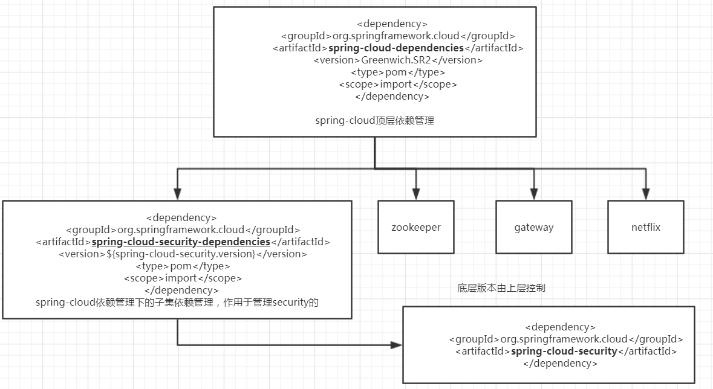
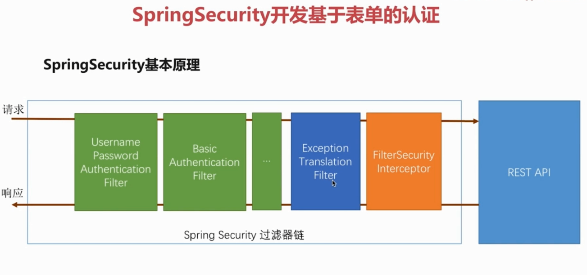
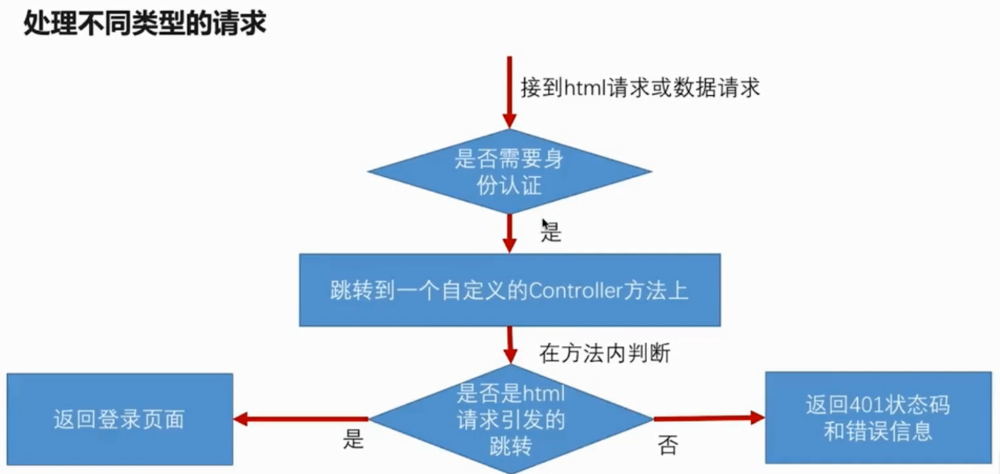
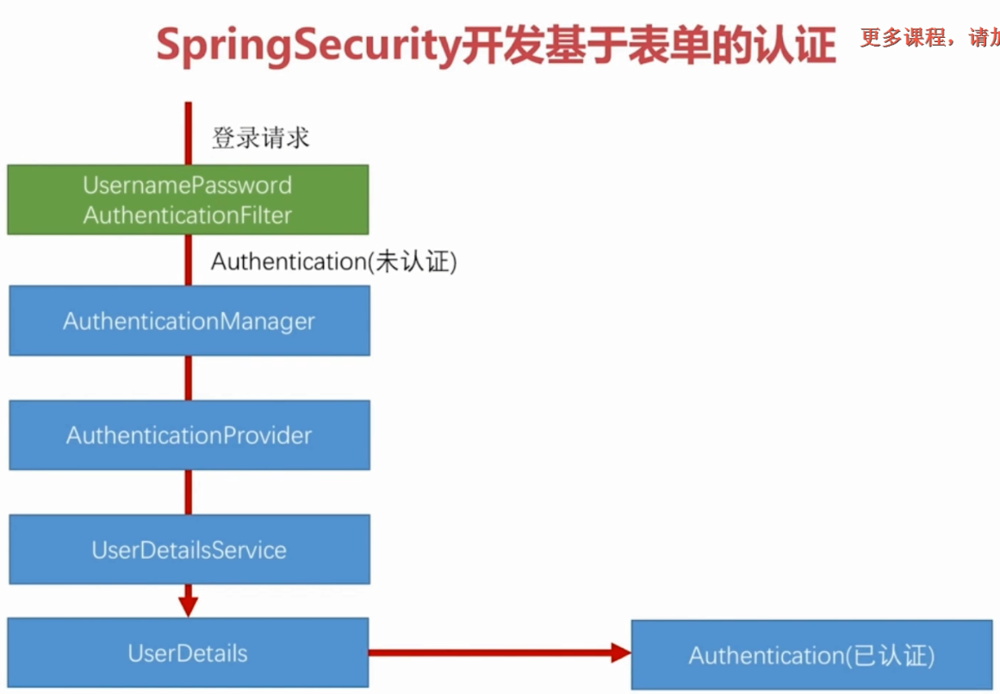
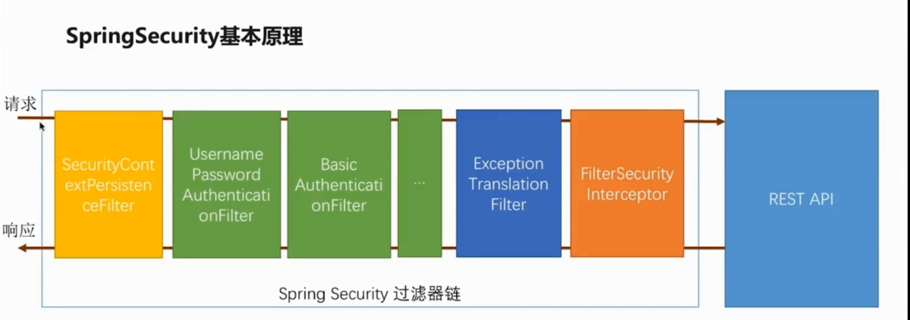
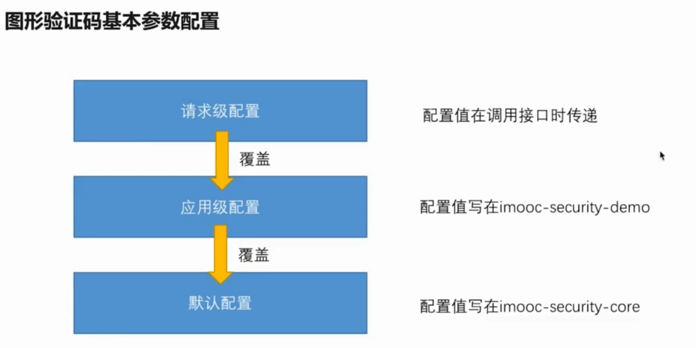

# spring-cloud-security

# 是什么：

>  Spring Cloud Security提供了一组原语，用于构建安全的应用程序和服务，而且操作简便。可以在外部（或集中）进行大量配置的声明性模型有助于实现大型协作的远程组件系统，通常具有中央身份管理服务。它也非常易于在Cloud Foundry等服务平台中使用。==在Spring Boot和Spring Security OAuth2的基础上==，可以快速创建实现常见模式的系统，如单点登录，令牌中继和令牌交换。
>
>  它是基于spring-security之上的产物，对应的它的功能更强大

**功能：**

* 安全的认证、授权

- 从Zuul代理中的前端到后端服务中继SSO令牌
- 资源服务器之间的中继令牌
- 使Feign客户端表现得像`OAuth2RestTemplate`（获取令牌等）的拦截器
- 在Zuul代理中配置下游身份验证


# cloud版本控制流程图：



==注：== spring-cloud-starter-oauth 也是由security-dependencies管理

```xml
        <dependency>
            <groupId>org.springframework.cloud</groupId>
            <artifactId>spring-cloud-starter-oauth2</artifactId>
        </dependency>
```


# 怎么做？

一：引入依赖

```xml
    <dependencyManagement>
        <dependencies>
            <dependency>
                <groupId>org.springframework.cloud</groupId>
                <artifactId>spring-cloud-dependencies</artifactId>
                <version>Greenwich.SR2</version>
                <type>pom</type>
                <scope>import</scope>
            </dependency>
        </dependencies>
    </dependencyManagement>

    <dependencies>
        <dependency>
            <groupId>org.springframework.cloud</groupId>
            <artifactId>spring-cloud-starter-oauth2</artifactId>
        </dependency>
	</dependencies>
```

引入依赖后启动项目，springsecurity会自动配置安全，任何请求都会要求登录，且默认登录为表单登录方式（spirngboot2.0开始）。

第一个类：webSecurity

```java
/**
 * <p>@Description:web安全配置</p>
 * <p>@Author: zhengyong</p>
 * <p>@Date: 2019/7/20 11:10</p>
 * <p>@Version: 1.0.0</p>
 **/
@Component
public class WebSecurityConfig extends WebSecurityConfigurerAdapter {

    @Override
    protected void configure(HttpSecurity http) throws Exception {
        http
          		//表单登录
                .formLogin()
          		//basic登录
//                .httpBasic()
          		//认证请求+所有请求+鉴定---》认证鉴定所有请求
                .and().authorizeRequests().anyRequest().authenticated()
                ;
    }
}
```

# spring-security基本原理：



```java
UsernamePasswordAuthenticationFilter
//表单登录过滤器
```

```java
BasicAuthenticationFilter
//httpbacis登录过滤器
```

```java
FilterSecurityInterceptor
//过滤器安全拦截器---》守门员
```

>只有绿色的过滤器可以控制，其他的是无法进行控制的。

# 自定义用户认证逻辑

## 一：处理用户信息获取逻辑

封装在一个UserDetailsService接口来获取用户信息的：

```java
public interface UserDetailsService {
	// ~ Methods
	// ========================================================================================================

	/**
	 * Locates the user based on the username. In the actual implementation, the search
	 * may possibly be case sensitive, or case insensitive depending on how the
	 * implementation instance is configured. In this case, the <code>UserDetails</code>
	 * object that comes back may have a username that is of a different case than what
	 * was actually requested..
	 *
	 * @param username the username identifying the user whose data is required.
	 *
	 * @return a fully populated user record (never <code>null</code>)
	 *
	 * @throws UsernameNotFoundException if the user could not be found or the user has no
	 * GrantedAuthority
	 */
 	 //获取用户名字、返回一个用户信息（封装在了UserDetails中）--》最终存入session中
	UserDetails loadUserByUsername(String username) throws UsernameNotFoundException;
}
```

返回的UserDetails是一个接口，User（security.core.userdetails包下）的类实现了这个接口

```java
public class User implements UserDetails, CredentialsContainer {

	private static final long serialVersionUID = SpringSecurityCoreVersion.SERIAL_VERSION_UID;

	private static final Log logger = LogFactory.getLog(User.class);

	// ~ Instance fields
	// ================================================================================================
	private String password;//密码
	private final String username;//用户名
	private final Set<GrantedAuthority> authorities;//授权的权限集合
	private final boolean accountNonExpired;//账号没过期
	private final boolean accountNonLocked;//账号没被锁
	private final boolean credentialsNonExpired;//认证没有过去
	private final boolean enabled;//是可用
  /**
   *四个Boolean值是默认为true的，有一个返回为false则视为校验失败
   *
   /
}  
```

eg:

```java
@Component
public class UserServiceImpl implements UserDetailsService {
	//加密类，新版本必须制定一个
    @Bean
    public PasswordEncoder passwordEncoder(){
        return PasswordEncoderFactories.createDelegatingPasswordEncoder();
    }

	//重写的方法，返回UserDetails的实现类（这么默认使用security自带的user类，可以自定义）
    @Override
    public UserDetails loadUserByUsername(String username) throws UsernameNotFoundException {
        return new User(username,passwordEncoder().encode("123"), AuthorityUtils.createAuthorityList("admin"));
    }
}
```


## 二：处理用户校验逻辑

用户的校验逻辑封装在UserDetails这个接口中，可以选择自己实现这个接口，也可以使用自带的User类

```java
@Component
public class UserServiceImpl implements UserDetailsService {

    @Resource
    private ClientUserDAO clientUserDAO;

    @Bean
    public PasswordEncoder passwordEncoder(){
        return new BCryptPasswordEncoder();
    }


    @Override
    public UserDetails loadUserByUsername(String username) throws UsernameNotFoundException {
        QueryWrapper<ClientUser> wrapper = new QueryWrapper<>();
        wrapper.eq("username",username);
        ClientUser clientUser = clientUserDAO.selectOne(wrapper);
        if(clientUser == null){
            throw new UsernameNotFoundException("用户不存在");
        }
        return new User(username,clientUser.getPassword(),
                //设置用户的其他信息
                true,true,true,true
                ,AuthorityUtils.createAuthorityList("admin"));
    }
}
```


## 三：处理密码加密解密

```java
PasswordEncoder
//处理密码的加密和解密的接口,现有版本是必须制定一个加密的方式，不然会报错
```


# 个性化用户认证流程

## 一：自定义登录页面

1）、新建一个html登录页面

```html
<!DOCTYPE html>
<html lang="en">
<head>
    <meta charset="UTF-8">
    <title>自定义登录页面</title>
</head>
<body>
<h2>标准登录页面</h2>
<form action="/form" method="post">
    <input type="text" name="username">
    <input type="password" name="password">
    <button type="submit">登录</button>
</form>
</body>
</html>
```

2）、配置自定义登录页面

```java
/**
 * <p>@Description:web安全配置</p>
 * <p>@Author: zhengyong</p>
 * <p>@Date: 2019/7/20 11:10</p>
 * <p>@Version: 1.0.0</p>
 **/
@Component
public class WebSecurityConfig extends WebSecurityConfigurerAdapter {
    @Override
    protected void configure(HttpSecurity http) throws Exception {
        http
             //springsecurity配置了csrf()，csrf会拦截我所有的post请求，这涉及到csrf攻击.。暂时关闭
                .csrf().disable()
                .formLogin()
                //自定义登录页面
                .loginPage("/eim-login.html")
                //自定义表单登录请求地址（让security知道何时使用UserNamePasswordFilter）
                .loginProcessingUrl("/form")
                .and()
                .authorizeRequests()
                //放行自定义登录页
                .antMatchers("/eim-login.html").permitAll()
                .anyRequest()
                .authenticated()
                ;
    }
}
```


**根据不同的请求方式，做不同的响应：** 




* 是html请求则跳转到登录页面
* 是请求则返回401和状态码

①、修改http自定义登录页面的url，.loginPage

```java
/**
 * <p>@Description:web安全配置</p>
 * <p>@Author: zhengyong</p>
 * <p>@Date: 2019/7/20 11:10</p>
 * <p>@Version: 1.0.0</p>
 **/
@Component
public class WebSecurityConfig extends WebSecurityConfigurerAdapter {
    @Override
    protected void configure(HttpSecurity http) throws Exception {
        http
                //springsecurity配置了csrf()，csrf会拦截我所有的post请求，这涉及到csrf攻击.。暂时关闭
                .csrf().disable()
                .formLogin()
                //自定义登录页面
                .loginPage("/authentication/require")
                //自定义表单登录请求地址（让security知道何时使用UserNamePasswordFilter）
                .loginProcessingUrl("/form")
                .and()
                .authorizeRequests()
                //放行自定义登录页
                .antMatchers("/authentication/require").permitAll()
                .anyRequest()
                .authenticated()
                ;
    }
}
```

②、自定义返回内容

```java
/**
 * <p>@Description:浏览安全跳转控制器</p>
 * <p>@Author: zhengyong</p>
 * <p>@Date: 2019/7/22 18:18</p>
 * <p>@Version: 1.0.0</p>
 **/
@RestController
public class BrowserSecurityController {

    //可以拿到上一次请求中的数据
    private RequestCache requestCache = new HttpSessionRequestCache();

    //重定向的工具类
    private RedirectStrategy redirectStrategy = new DefaultRedirectStrategy();

    /**
     * 当需要身份认证时，跳转到这里
     *
     * @param request  请求
     * @param response 响应
     * @return         状态码或者登录页面
     */
    @ResponseStatus(code = HttpStatus.UNAUTHORIZED)
    @RequestMapping("/authentication/require")
    public ResponseEntity<String> requireAuthentication(HttpServletRequest request, HttpServletResponse response) throws IOException {
        //获取上一次请求
        SavedRequest savedRequest = requestCache.getRequest(request,response);
        if(savedRequest != null){
            //获取到引发跳转的URL
            String targetUrl = savedRequest.getRedirectUrl();
            if(StringUtils.endsWithIgnoreCase(targetUrl,".html")){
                //是html跳转到登录页
                redirectStrategy.sendRedirect(request,response,"可以自己配置");
            }
        }
        return ResponseEntity.ok("请引导用户到登录页面");
    }
}
```


## 二：自定义登录成功处理

自定义登录成功的配置抽象类：AbstractAuthenticationTargetUrlRequestHandler（顶层）

继承这个类的子类SavedRequestAwareAuthenticationSuccessHandler，并实现方法

```java
package com.eim.demo.config;

import com.eim.demo.properties.MySecurityProperties;
import com.eim.demo.properties.ResponseTypeEnum;
import com.fasterxml.jackson.databind.ObjectMapper;
import org.springframework.http.MediaType;
import org.springframework.security.core.Authentication;
import org.springframework.security.web.authentication.SavedRequestAwareAuthenticationSuccessHandler;
import org.springframework.stereotype.Component;

import javax.annotation.Resource;
import javax.servlet.ServletException;
import javax.servlet.http.HttpServletRequest;
import javax.servlet.http.HttpServletResponse;
import java.io.IOException;

/**
 * <p>DESC: 授权成功处理器</p>
 * <p>DATE: 2019-07-25 15:37</p>
 * <p>VERSION:2.0.0</p>
 * <p>@AUTHOR: ZhengYong</p>
 */
@Component
public class MyAuthenticationSuccessHandler extends SavedRequestAwareAuthenticationSuccessHandler {

    private final ObjectMapper objectMapper;

    public MyAuthenticationSuccessHandler(ObjectMapper objectMapper) {
        this.objectMapper = objectMapper;
    }

  	//自定义配置类
    @Resource
    private MySecurityProperties mySecurityProperties;

    @Override
    public void onAuthenticationSuccess(HttpServletRequest httpServletRequest, HttpServletResponse httpServletResponse, Authentication authentication) throws IOException, ServletException {
      	//判断是返回json还是默认跳转到上请求
        if(ResponseTypeEnum.JSON.equals(mySecurityProperties.getBrowser().getType())){
            String valueAsString = objectMapper.writeValueAsString(authentication);
            httpServletResponse.setContentType(MediaType.APPLICATION_JSON_UTF8_VALUE);
            httpServletResponse.getWriter().write(valueAsString);
        }
        super.onAuthenticationSuccess(httpServletRequest,httpServletResponse,authentication);
    }
}
```


## 三：自定义登录失败处理

自定义登录失败抽象类：SimpleUrlAuthenticationFailureHandler（顶层）

```java
package com.eim.demo.config;

import com.eim.demo.properties.MySecurityProperties;
import com.eim.demo.properties.ResponseTypeEnum;
import com.fasterxml.jackson.databind.ObjectMapper;
import org.springframework.http.HttpStatus;
import org.springframework.http.MediaType;
import org.springframework.security.core.AuthenticationException;
import org.springframework.security.web.authentication.SimpleUrlAuthenticationFailureHandler;
import org.springframework.stereotype.Component;

import javax.annotation.Resource;
import javax.servlet.ServletException;
import javax.servlet.http.HttpServletRequest;
import javax.servlet.http.HttpServletResponse;
import java.io.IOException;

/**
 * <p>DESC: 自定义认证失败</p>
 * <p>DATE: 2019-07-25 16:27</p>
 * <p>VERSION:2.0.0</p>
 * <p>@AUTHOR: ZhengYong</p>
 */
@Component
public class MyAuthenticationFailureHandler extends SimpleUrlAuthenticationFailureHandler {

    @Resource
    private ObjectMapper objectMapper;

  	//配置类
    @Resource
    private MySecurityProperties mySecurityProperties;

  	//AuthenticationException 返回异常信息
    @Override
    public void onAuthenticationFailure(HttpServletRequest httpServletRequest, HttpServletResponse httpServletResponse, AuthenticationException e) throws IOException, ServletException {
      	//判断返回json,还是默认跳转
        if(ResponseTypeEnum.JSON.equals(mySecurityProperties.getBrowser().getType())){
            String value = objectMapper.writeValueAsString(e);
            httpServletResponse.setStatus(HttpStatus.UNAUTHORIZED.value());
            httpServletResponse.setContentType(MediaType.APPLICATION_JSON_UTF8_VALUE);
            httpServletResponse.getWriter().write(value);
        }
        super.onAuthenticationFailure(httpServletRequest,httpServletResponse,e);
    }
}
```

## 四：生效自定义登录成功、失败

```java
/**
 * <p>DESC: web安全配置</p>
 * <p>DATE: 2019-07-24 16:47</p>
 * <p>VERSION:2.0.0</p>
 * <p>@AUTHOR: ZhengYong</p>
 */
@Component
public class WebSecurityConfig extends WebSecurityConfigurerAdapter {

    @Resource
    private MySecurityProperties securityProperties;

  	//注入自定成功处理器
    @Resource
    private MyAuthenticationSuccessHandler myAuthenticationSuccessHandler;
	//注入自定失败处理器
    @Resource
    private MyAuthenticationFailureHandler myAuthenticationFailureHandler;

    @Override
    protected void configure(HttpSecurity http) throws Exception {
        http.formLogin()
                .loginPage("/authentication/require")
                //form表单登录请求
                .loginProcessingUrl("/authentication/login")
                //自定义成功处理器
                .successHandler(myAuthenticationSuccessHandler)
                //自定义失败处理器
                .failureHandler(myAuthenticationFailureHandler)
                .and().authorizeRequests()
                .antMatchers("/authentication/require",securityProperties.getBrowser().getLoginPage()).permitAll()
                .anyRequest().authenticated()
                .and()
                .csrf().disable();
    }
}
```

# spring-security源码流程详解

## 一：认证处理流程说明




`AuthenticationManager`用于管理 `AuthenticationProvider`

AuthenticationManager拿到所有的AuthenticationProvider,一个一个取出来，询问当前provider是否支持当前认证方式（传入的Authentication），

支持则进入认证，列如表单登录，最终会调用UserDetailsService接口实现类中loadUserByUserName方法(和我们自定义的认证逻辑接上了),	

如果所有都成功，会创建一个SuccessAuthentication，此时会反向传递到起始位置，如果认证成功，调用我们自己的成功处理器，如果认证失败，调用我们自己失败处理器。

## 二：认证结果如何在多个请求之间共享


secutityContext和SeCurityHolder,

将我们认证成功的Authentication放在SecurityContext和SecurityContextHolder

SecurityContextHolder中有静态方法，可以将同线程中存入认证信息，和取出认证信息


## 三：获取用户信息




securityContextPersistenceFilter

作用：

①：请求进来的时候，检查session中是否有SecurityContext,如果有，就把securityContext拿出来，放入线程中

②：最后响应前，检查线程中是否是有securityContext,如果有，就拿出来，放入session中

因为，是在一个线程中完成的，所以可以任意位置通过SecurityContext中获取用户信息


获取用户信息eg(三种):

```java
    @GetMapping("me")
    public Object me(){
        return SecurityContextHolder.getContext().getAuthentication();
    }
    @GetMapping("mi")
    public Object mi(Authentication authentication){
        return authentication;
    }
    @GetMapping("mp")
    public Object mp(@AuthenticationPrincipal UserDetails user){
        return user;
    }
```

# 实现图片验证码

## 一：开发生成图形验证码接口

### 1）：生成图形验证码

​	 根据随机数生成验图片

​	将随机数存入session中

​	再将生成的图片写到接口的响应中

a、新建图片对象

```java
package com.eim.demo.validate;

import lombok.AllArgsConstructor;
import lombok.Data;
import lombok.NoArgsConstructor;

import java.awt.image.BufferedImage;
import java.time.LocalDateTime;

/**
 * <p>@Description:图片验证码对象</p>
 * <p>@Author: zhengyong</p>
 * <p>@Date: 2019/7/28 22:50</p>
 * <p>@Version: 1.0.0</p>
 **/
@AllArgsConstructor
@NoArgsConstructor
@Data
public class ImageCode {
    /**
     * 图片对象
     */
    private BufferedImage image;
    /**
     * 验证码
     */
    private String code;
    /**
     * 过期时间
     */
    private LocalDateTime expireTime;

    public ImageCode(BufferedImage image, String code, int expireTime) {
        this.image = image;
        this.code = code;
        this.expireTime = LocalDateTime.now().plusSeconds(expireTime);
    }
}

```

b、新建验证码controller

```java
package com.eim.demo.controller;

import com.eim.demo.validate.ImageCode;
import org.springframework.security.web.authentication.session.SessionAuthenticationStrategy;
import org.springframework.social.connect.web.HttpSessionSessionStrategy;
import org.springframework.social.connect.web.SessionStrategy;
import org.springframework.web.bind.annotation.GetMapping;
import org.springframework.web.bind.annotation.RestController;
import org.springframework.web.context.request.ServletRequestAttributes;
import org.springframework.web.context.request.ServletWebRequest;

import javax.imageio.ImageIO;
import javax.servlet.http.HttpServletRequest;
import javax.servlet.http.HttpServletResponse;
import java.awt.*;
import java.awt.image.BufferedImage;
import java.io.FileOutputStream;
import java.io.IOException;
import java.util.Random;

/**
 * <p>@Description:图片验证码控制器</p>
 * <p>@Author: zhengyong</p>
 * <p>@Date: 2019/7/28 23:02</p>
 * <p>@Version: 1.0.0</p>
 **/
@RestController
public class CodeController {
    
    private static final String SESSION_KEY= "IMAGE_CODE_SESSION_KEY";
    //操作session
    private SessionStrategy strategy = new HttpSessionSessionStrategy();

    @GetMapping("/code/image")
    public void createCode(HttpServletRequest request, HttpServletResponse response) throws IOException {
        //获取图片验证码对象
        ImageCode imageCode = createImageCode();
        //往session中存入code
        strategy.setAttribute(new ServletWebRequest(request),SESSION_KEY,imageCode.getCode());
        //以流的方式写回前端
        ImageIO.write(imageCode.getImage(), "JPEG", response.getOutputStream());
    }

    /**
     * 创建图片验证码
     * @return imagecode
     */
    private ImageCode createImageCode(){
        BufferedImage img=new BufferedImage(60, 30, BufferedImage.TYPE_INT_RGB);
        //获取Graphic对象
        Graphics g = img.getGraphics();
        //设置背景色
        g.setColor(Color.WHITE);
        g.fillRect(0, 0, 60, 30);

        Random r=new Random();
        String rdStr= "";
        for(int i=0;i<4;i++){
            int a=r.nextInt(10);	//生成0-9之间的一个数字
            int y=10+r.nextInt(20);	//y坐标随机
            rdStr = rdStr+a;
            //每个数字不同的颜色
            g.setColor(new Color(r.nextInt(256), r.nextInt(256), r.nextInt(256)));
            g.drawString(a+"", i*10, y);
        }

        //话干扰线
        for(int i=0;i<10;i++){
            g.setColor(new Color(r.nextInt(256), r.nextInt(256), r.nextInt(256)));
            g.drawLine(10+r.nextInt(60), 5+r.nextInt(30), 10+r.nextInt(60), 5+r.nextInt(30));
        }
        //让图片生效
        g.dispose();

        return new ImageCode(img,rdStr,10);
    }

}

```


## 二：在认证流程中加入图形验证码校验

### 2）、新建自定义过滤器

写一个validateCodeFilter去继承OncePerRequestFilter（保证我们的过滤器只会被调用一次）

```java
package com.eim.demo.validate;

import org.apache.commons.lang3.StringUtils;
import org.springframework.security.web.authentication.AuthenticationFailureHandler;
import org.springframework.social.connect.web.HttpSessionSessionStrategy;
import org.springframework.social.connect.web.SessionStrategy;
import org.springframework.stereotype.Component;
import org.springframework.web.bind.ServletRequestBindingException;
import org.springframework.web.bind.ServletRequestUtils;
import org.springframework.web.context.request.ServletWebRequest;
import org.springframework.web.filter.OncePerRequestFilter;

import javax.annotation.Resource;
import javax.servlet.FilterChain;
import javax.servlet.ServletException;
import javax.servlet.http.HttpServletRequest;
import javax.servlet.http.HttpServletResponse;
import java.io.IOException;

/**
 * <p>@Description:自定义验证码过滤器</p>
 * <p>@Author: zhengyong</p>
 * <p>@Date: 2019/7/30 21:45</p>
 * <p>@Version: 1.0.0</p>
 **/
@Component
public class ValidateCodeFilter extends OncePerRequestFilter {

    private static final String SESSION_KEY = "IMAGE_CODE_SESSION_KEY";

    private SessionStrategy sessionStrategy = new HttpSessionSessionStrategy();

    /**
     * 失败处理器
     */
    @Resource
    private AuthenticationFailureHandler failureHandler;

    /**
     * 业务逻辑
     *
     * @param request     request
     * @param response    response
     * @param filterChain 過濾
     * @throws ServletException 異常
     * @throws IOException      異常
     */
    @Override
    protected void doFilterInternal(HttpServletRequest request, HttpServletResponse response, FilterChain filterChain) throws ServletException, IOException {
        //拦截符合标准的请求
        if (StringUtils.equals("/authentication/login", request.getRequestURI())
                && StringUtils.endsWithIgnoreCase(request.getMethod(), "post")) {
            try {
                //校验逻辑
                validate(new ServletWebRequest(request));
                //自定义异常
            } catch (ValidateException e) {
                //失败处理逻辑
                failureHandler.onAuthenticationFailure(request, response, e);
                return;
            }
        }
        //放行
        filterChain.doFilter(request, response);
    }

    /**
     * 校验逻辑
     *
     * @param request ServletWebRequest
     * @throws ServletRequestBindingException 异常
     */
    private void validate(ServletWebRequest request) throws ServletRequestBindingException {
        //从session中获取imageCode对象
        ImageCode codeInSession = (ImageCode) sessionStrategy.getAttribute(request, SESSION_KEY);
        //从请求中获取验证码数字
        String codeInRequest = ServletRequestUtils.getStringParameter(request.getRequest(), "imageCode");

        if (StringUtils.isNotBlank(codeInRequest)) {
            throw new ValidateException("验证码不能为空");
        }
        if (StringUtils.isNotBlank(codeInSession.getCode())) {
            throw new ValidateException("验证码不存在");
        }
        if (codeInSession.isExpired()) {
            sessionStrategy.removeAttribute(request, SESSION_KEY);
            throw new ValidateException("验证码已过期");
        }
        if (!StringUtils.equals(codeInRequest, codeInSession.getCode())) {
            throw new ValidateException("验证码不匹配");
        }
        sessionStrategy.removeAttribute(request, SESSION_KEY);
    }
}
```

### 3）、自定义异常继承AuthenticationException

```java
package com.eim.demo.validate;

import org.springframework.security.core.AuthenticationException;

/**
 * <p>@Description:验证码异常信息</p>
 * <p>@Author: zhengyong</p>
 * <p>@Date: 2019/7/30 21:52</p>
 * <p>@Version: 1.0.0</p>
 **/
public class ValidateException extends AuthenticationException {
    public ValidateException(String msg, Throwable t) {
        super(msg, t);
    }

    public ValidateException(String msg) {
        super(msg);
    }
}
```

### 4）、web安全配置，使自定义filter生效

* 核心代码

>```java
>    //自定义过滤器
>    ValidateCodeFilter filter = new ValidateCodeFilter();
>    //设置失败处理器
>    filter.setFailureHandler(myAuthenticationFailureHandler);
>    //在用户名密码过滤器前面加上自定义过滤器
>    http.addFilterBefore(filter, UsernamePasswordAuthenticationFilter.class)
>```

* 完整实例：

```java
package com.eim.demo.config;

import com.eim.demo.properties.MySecurityProperties;
import com.eim.demo.validate.ValidateCodeFilter;
import org.springframework.security.config.annotation.web.builders.HttpSecurity;
import org.springframework.security.config.annotation.web.configuration.WebSecurityConfigurerAdapter;
import org.springframework.security.web.authentication.UsernamePasswordAuthenticationFilter;
import org.springframework.stereotype.Component;

import javax.annotation.Resource;

/**
 * <p>DESC: web安全配置</p>
 * <p>DATE: 2019-07-24 16:47</p>
 * <p>VERSION:2.0.0</p>
 * <p>@AUTHOR: ZhengYong</p>
 */
@Component
public class WebSecurityConfig extends WebSecurityConfigurerAdapter {

    @Resource
    private MySecurityProperties securityProperties;

    @Resource
    private MyAuthenticationSuccessHandler myAuthenticationSuccessHandler;

    @Resource
    private MyAuthenticationFailureHandler myAuthenticationFailureHandler;


    @Override
    protected void configure(HttpSecurity http) throws Exception {

        //自定义过滤器
        ValidateCodeFilter filter = new ValidateCodeFilter();
        //设置失败处理器
        filter.setFailureHandler(myAuthenticationFailureHandler);

        http
                //在用户名密码过滤器前面加上自定义过滤器
                .addFilterBefore(filter, UsernamePasswordAuthenticationFilter.class)
                .formLogin()
                    .loginPage("/authentication/require")
                    //form表单登录请求
                    .loginProcessingUrl("/authentication/login")
                    //自定义成功处理器
                    .successHandler(myAuthenticationSuccessHandler)
                    //自定义失败处理器
                    .failureHandler(myAuthenticationFailureHandler)
                .and()
                    .authorizeRequests()
                    .antMatchers("/code/image","/authentication/require",securityProperties.getBrowser().getLoginPage()).permitAll()
                    .anyRequest().authenticated()
                .and()
                    .csrf().disable();
    }
}
```


## 三：重构代码

### 一：验证码基本参数可配



#### 1）、默认配置

新建配置对象类验证码的基类：

```java
/**
 * <p>DESC: 验证码配置</p>
 * <p>DATE: 2019-08-01 13:15</p>
 * <p>VERSION:2.0.0</p>
 * <p>@AUTHOR: ZhengYong</p>
 */
@Data
public class ValidateCodeProperties {

    private ImageCodeProperties image = new ImageCodeProperties();
}
```

新建图片验证码配置类，并赋默认值：

```java
/**
 * <p>DESC: 图片验证码配置</p>
 * <p>DATE: 2019-08-01 13:12</p>
 * <p>VERSION:2.0.0</p>
 * <p>@AUTHOR: ZhengYong</p>
 */
@Data
public class ImageCodeProperties {
    /**
     * 宽度
     */
    private Integer width = 100;
    /**
     * 高度
     */
    private Integer height = 50;
    /**
     *  长度
     */
    private Integer length = 4;
    /**
     * 过期时间
     */
    private int expireTime = 100;
    /**
     * 拦截的url
     */
    private List<String> url;
}
```

在浏览器配置类中添加新增验证码基类

```java
/**
 * <p>DESC: 浏览器配置文件</p>
 * <p>DATE: 2019-07-25 12:38</p>
 * <p>VERSION:2.0.0</p>
 * <p>@AUTHOR: ZhengYong</p>
 */
@Data
public class BrowserSecurityProperties {

    private String loginPage = "/default_sigIn.html";

    private ResponseTypeEnum type = JSON;

    private ValidateCodeProperties validateCode = new ValidateCodeProperties();

}
```

#### 2）、应用参数配置，请求参数可配

在图片验证码生成中添加配置

主要代码：

> int width = ServletRequestUtils.getIntParameter(request, "width", mySecurityProperties.getBrowser().getValidateCode().getImage().getWidth());
>
> 从请求中拿width没有的话从配置文件类中获取
>
> 这里一共配置了width，height，length，expireTime

```java
/**
 * <p>DESC: 图片验证码实现类</p>
 * <p>DATE: 2019-08-02 16:41</p>
 * <p>VERSION:2.0.0</p>
 * <p>@AUTHOR: ZhengYong</p>
 */
public class ImageCodeGeneratorImpl implements ImageCodeGenerator{

    @Resource
    private MySecurityProperties mySecurityProperties;

    /**
     * 创建图片验证码
     *
     * @return 图片验证码对象
     */
    @Override
    public ImageCode createImageCode(HttpServletRequest request) {
            //从请求中获取宽度和高度，若没有则加载默认配置
            int width = ServletRequestUtils.getIntParameter(request, "width", mySecurityProperties.getBrowser().getValidateCode().getImage().getWidth());
            int height = ServletRequestUtils.getIntParameter(request, "height", mySecurityProperties.getBrowser().getValidateCode().getImage().getHeight());
            Random random = new Random();
//	    默认背景为黑色
            BufferedImage image = new BufferedImage(width, height, BufferedImage.TYPE_INT_RGB);
//		获取画笔
            Graphics graphics = image.getGraphics();
//		默认填充为白色
            graphics.fillRect(0, 0, width, height);
//	            验证码是由	数字 字母 干扰线 干扰点组成
//		文字素材
            String words = "ABCDEFGHIJKLMNOPQRSTUVWXYZabcdefghijklmnopqrstuvwxyz123456789";
            char[] cs = words.toCharArray();
//		一般验证码为4位数
//      字母+数字
            StringBuilder randomStr = new StringBuilder();
            for (int i = 0; i < mySecurityProperties.getBrowser().getValidateCode().getImage().getLength(); i++) {
                //设置随机的颜色
                graphics.setColor(new Color(random.nextInt(256), random.nextInt(256), random.nextInt(256)));
                graphics.setFont(new Font("微软雅黑", Font.BOLD, 30));
                char c = cs[random.nextInt(cs.length)];
                graphics.drawString(c + "", i * 20, 30);
                randomStr.append(c);
            }
            //画干扰线
            int max = random.nextInt(10);
            for (int i = 0; i < max; i++) {
                graphics.setColor(new Color(random.nextInt(256), random.nextInt(256), random.nextInt(256)));
                graphics.drawLine(random.nextInt(100), random.nextInt(50), random.nextInt(100), random.nextInt(50));
            }
//		画干扰点
            int max2 = random.nextInt(10);
            for (int i = 0; i < max2; i++) {
                graphics.setColor(new Color(random.nextInt(256), random.nextInt(256), random.nextInt(256)));
                graphics.drawOval(random.nextInt(80), random.nextInt(40), random.nextInt(5), random.nextInt(10));
            }

            return new ImageCode(image, randomStr.toString(), mySecurityProperties.getBrowser().getValidateCode().getImage().getExpireTime());
    }
}
```

### 二：验证码拦截的接口可配

核心代码

>```java
>    List<String> urlList = mySecurityProperties.getBrowser().getValidateCode().getImage().getUrl();
>    //判断是否需要校验
>    AtomicBoolean isFilter = new AtomicBoolean(false);
>    urlList.forEach(url -> {
>        if(pathPattern.match(url,request.getRequestURI())){
>            isFilter.set(true);
>        }
>    });
>```

```java
/**
 * <p>@Description:自定义验证码过滤器</p>
 * <p>@Author: zhengyong</p>
 * <p>@Date: 2019/7/30 21:45</p>
 * <p>@Version: 1.0.0</p>
 **/
@EqualsAndHashCode(callSuper = true)
@Data
@Component
public class ValidateCodeFilter extends OncePerRequestFilter {

    private static final String SESSION_KEY= "IMAGE_CODE_SESSION_KEY";

    private SessionStrategy sessionStrategy = new HttpSessionSessionStrategy();

    /**
     * 失败处理器
     */
    private AuthenticationFailureHandler failureHandler;


    @Resource
    private MySecurityProperties mySecurityProperties;

    private AntPathMatcher pathPattern = new AntPathMatcher();

    /**
     * 业务逻辑
     * @param request request
     * @param response response
     * @param filterChain filterChain
     * @throws ServletException  异常
     * @throws IOException  异常
     */
    @Override
    protected void doFilterInternal(HttpServletRequest request, HttpServletResponse response, FilterChain filterChain) throws ServletException, IOException {

        List<String> urlList = mySecurityProperties.getBrowser().getValidateCode().getImage().getUrl();
        //判断是否需要校验
        AtomicBoolean isFilter = new AtomicBoolean(false);
        urlList.forEach(url -> {
            if(pathPattern.match(url,request.getRequestURI())){
                isFilter.set(true);
            }
        });

        //拦截符合标准的请求
        if(isFilter.get()){
            try{
                //校验逻辑
                validate(new ServletWebRequest(request));
            }catch (ValidateException e){
                //失败处理逻辑
                failureHandler.onAuthenticationFailure(request,response,e);
                return;
            }
        }
        //放行
        filterChain.doFilter(request,response);
    }
```


### 三：验证码的生成逻辑可配

#### 1）、新建一个生成图片验证码接口

```java
/**
 * <p>DESC: 图片验证码生成器</p>
 * <p>DATE: 2019-08-02 16:38</p>
 * <p>VERSION:2.0.0</p>
 * <p>@AUTHOR: ZhengYong</p>
 */
public interface ImageCodeGenerator {

    /**
     * 创建图片验证码
     * @param  request request域
     * @return 图片验证码对象
     */
    ImageCode createImageCode(HttpServletRequest request);
}
```

#### 2）、新建一个图片验证码接口实现类

* 注意：没有添加到spring容器中的任何注解

```java
package com.eim.demo.validate;

import com.eim.demo.properties.MySecurityProperties;
import org.springframework.web.bind.ServletRequestUtils;

import javax.annotation.Resource;
import javax.servlet.http.HttpServletRequest;
import java.awt.*;
import java.awt.image.BufferedImage;
import java.util.Random;

/**
 * <p>DESC: 图片验证码实现类</p>
 * <p>DATE: 2019-08-02 16:41</p>
 * <p>VERSION:2.0.0</p>
 * <p>@AUTHOR: ZhengYong</p>
 */
public class ImageCodeGeneratorImpl implements ImageCodeGenerator{

    @Resource
    private MySecurityProperties mySecurityProperties;

    /**
     * 创建图片验证码
     *
     * @return 图片验证码对象
     */
    @Override
    public ImageCode createImageCode(HttpServletRequest request) {
            //从请求中获取宽度和高度，若没有则加载默认配置
            int width = ServletRequestUtils.getIntParameter(request, "width", mySecurityProperties.getBrowser().getValidateCode().getImage().getWidth());
            int height = ServletRequestUtils.getIntParameter(request, "height", mySecurityProperties.getBrowser().getValidateCode().getImage().getHeight());
            Random random = new Random();
//	    默认背景为黑色
            BufferedImage image = new BufferedImage(width, height, BufferedImage.TYPE_INT_RGB);
//		获取画笔
            Graphics graphics = image.getGraphics();
//		默认填充为白色
            graphics.fillRect(0, 0, width, height);
//	            验证码是由	数字 字母 干扰线 干扰点组成
//		文字素材
            String words = "ABCDEFGHIJKLMNOPQRSTUVWXYZabcdefghijklmnopqrstuvwxyz123456789";
            char[] cs = words.toCharArray();
//		一般验证码为4位数
//      字母+数字
            StringBuilder randomStr = new StringBuilder();
            for (int i = 0; i < mySecurityProperties.getBrowser().getValidateCode().getImage().getLength(); i++) {
                //设置随机的颜色
                graphics.setColor(new Color(random.nextInt(256), random.nextInt(256), random.nextInt(256)));
                graphics.setFont(new Font("微软雅黑", Font.BOLD, 30));
                char c = cs[random.nextInt(cs.length)];
                graphics.drawString(c + "", i * 20, 30);
                randomStr.append(c);
            }
            //画干扰线
            int max = random.nextInt(10);
            for (int i = 0; i < max; i++) {
                graphics.setColor(new Color(random.nextInt(256), random.nextInt(256), random.nextInt(256)));
                graphics.drawLine(random.nextInt(100), random.nextInt(50), random.nextInt(100), random.nextInt(50));
            }
//		画干扰点
            int max2 = random.nextInt(10);
            for (int i = 0; i < max2; i++) {
                graphics.setColor(new Color(random.nextInt(256), random.nextInt(256), random.nextInt(256)));
                graphics.drawOval(random.nextInt(80), random.nextInt(40), random.nextInt(5), random.nextInt(10));
            }

            return new ImageCode(image, randomStr.toString(), mySecurityProperties.getBrowser().getValidateCode().getImage().getExpireTime());
    }
}
```

#### 3）、图片验证码注入spring容器配置

```java
package com.eim.demo.validate;

import org.springframework.boot.autoconfigure.condition.ConditionalOnMissingBean;
import org.springframework.context.annotation.Bean;
import org.springframework.context.annotation.Configuration;

/**
 * <p>DESC: 图片验证码注入配置‘</p>
 * <p>DATE: 2019-08-02 16:44</p>
 * <p>VERSION:2.0.0</p>
 * <p>@AUTHOR: ZhengYong</p>
 */
@Configuration
public class ImageCodeConfig {

    /**
     * 注入默认的图片验证码生成器
     * @return 图片验证码
     */
    @Bean
    //在spring中缺失一个bean叫imageCodeGenerator的时候自动注入spring容器
    @ConditionalOnMissingBean(name = "imageCodeGenerator")
    public ImageCodeGenerator imageCodeGenerator(){
        return new ImageCodeGeneratorImpl();
    }
}
```

**测试覆盖** 

一个类去实现接口，加上注解@Component(value = "imageCodeGenerator")

```java
/**
 * <p>DESC: 测试图片验证码覆盖</p>
 * <p>DATE: 2019-08-02 16:49</p>
 * <p>VERSION:2.0.0</p>
 * <p>@AUTHOR: ZhengYong</p>
 */
@Slf4j
@Component(value = "imageCodeGenerator")
public class ConvertImageConvert implements ImageCodeGenerator {
    /**
     * 创建图片验证码
     *
     * @param request request域
     * @return 图片验证码对象
     */
    @Override
    public ImageCode createImageCode(HttpServletRequest request) {
        log.info("覆盖了----------哦");
        return null;
    }
}
```

