# 			MYSQL高级

# 一、mysql的架构介绍

## 1、mysql 简介

### 	1）、概述：

### 	2）、高级mysql

​			（完整的mysql优化需要很深的功底，大公司甚至有专门的DBA写上述的东西）

​			a、mysql内核

​			b、sql优化攻城狮

​			c、mysql服务器的优化

​			d、各种参数常量设定

​			e、查询语句优化

​			f、主从复制

​			g、软硬件升级

​			h、容灾备份

​			i、sql编程

## 	2、mysql Linux版本安装（5.5）

### 	a、下载地址：https://dev.mysql.com/

​				下载GA版，稳定发布版


### 	b、检查当前系统是否安装过mysql

```shell
查询命令： rpm -qa|grep -i mysql
删除命令： rpm -e RPM软件包名
```

### 	c、安装mysql服务端

```shell
[root@localhost opt]# rpm -ivh MySQL-server-5.5.48-1.linux2.6.i386.rpm --force --nodeps
[root@localhost opt]# rpm -qa|grep -i mysql
MySQL-server-5.5.48-1.linux2.6.i386
```

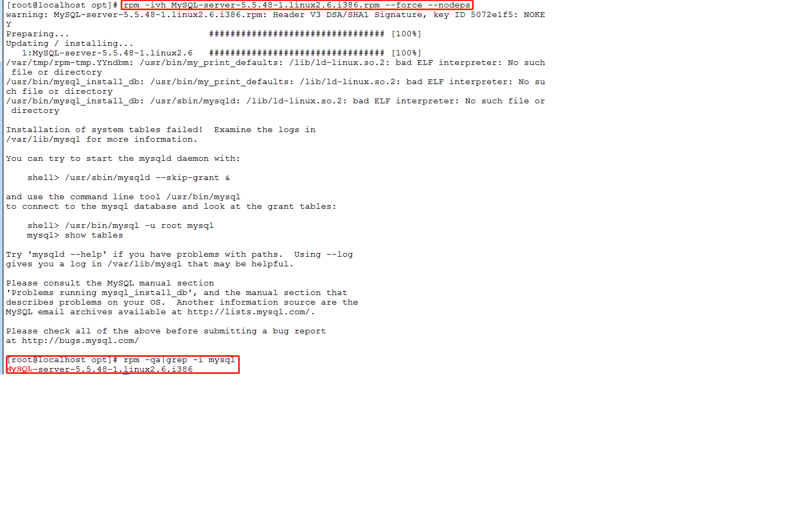

###           d、 安装mysql 客户端

```shell
[root@localhost opt]# rpm -ivh MySQL-client-5.5.48-1.linux2.6.i386.rpm --force --nodeps
warning: MySQL-client-5.5.48-1.linux2.6.i386.rpm: Header V3 DSA/SHA1 Signature, key ID 5072e1f5: NOKEY
Preparing...                          ################################# [100%]
Updating / installing...
   1:MySQL-client-5.5.48-1.linux2.6   ################################# [100%]

```

### 	e、查看mysql安装时创建的mysql用户和mysql组

```shell
#mysql用户
[root@localhost opt]#  cat /etc/passwd|grep mysql
mysql:x:995:992:MySQL server:/var/lib/mysql:/bin/bash
#mysql组
[root@localhost opt]# cat /etc/group|grep mysql
mysql:x:992:

或者使用 mysqladmin --version
```

### 	f、mysql服务启动+停止

```shell
service mysql start

service mysql stop
```

### 	g、mysql启动后开始连接

```shell
按照安装server 中的提示修改登录密码
格式：mysqladmin -u用户名 -p旧密码 password 新密码  
 
例子：mysqladmin -uroot -p123456 password 123  
```


### 	h、自启动mysql服务

```shell
设置开机启动mysql
chkconfig msql on
```

### 	i、修改配置文件 位置

| 路径                | 解释              | 备注                              |
| ----------------- | --------------- | ------------------------------- |
| /var/lib/mysql    | mysql数据库文件的存放路径 | /var/lib/mysqlatguigu.cloud.pid |
| /usr/share/mysql  | 配置文件目录          | mysql.server命令及配置文件             |
| /usr/bin          | 相关命令目录          | mysqladmin  mysqldump等命令        |
| /etc/init.d/mysql | 启动相关脚本          |                                 |

### 	j、修改字符集和数据存储路径![(images/sql拷贝.png)

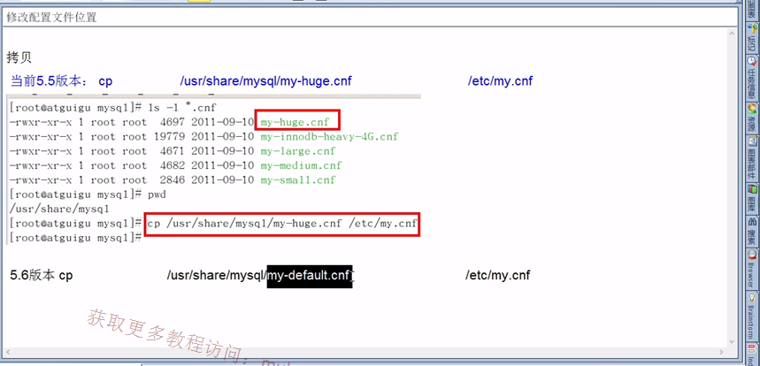

```shell
#显示所有数据库
mysql> show databases;
+--------------------+
| Database           |
+--------------------+
| information_schema |
| db01               |
| mysql              |
| performance_schema |
| test               |
+--------------------+
5 rows in set (0.00 sec)

#创建数据库
mysql> create database db01;
Query OK, 1 row affected (0.00 sec)

#使用数据库
mysql> use db01;
Database changed

#查看该数据库下的表
mysql> show tables;
+----------------+
| Tables_in_db01 |
+----------------+
| user           |
+----------------+
1 row in set (0.00 sec)

#查看表（注意中文 乱码了）
mysql> select * from user;
+----+------+
| id | name |
+----+------+
|  1 | zs   |
|  2 | ??   |
+----+------+
2 rows in set (0.00 sec)

```

（1）查看字符集：(任选其一即可)

show variables like 'character%';

show variables like '%char%';

```shell
mysql> show variables like '%char%';
+--------------------------+----------------------------+
| Variable_name            | Value                      |
+--------------------------+----------------------------+
| character_set_client     | latin1                     |
| character_set_connection | latin1                     |
| character_set_database   | latin1                     |
| character_set_filesystem | binary                     |
| character_set_results    | latin1                     |
| character_set_server     | latin1                     |
| character_set_system     | utf8                       |
| character_sets_dir       | /usr/share/mysql/charsets/ |
+--------------------------+----------------------------+
8 rows in set (0.00 sec)
```

默认的是客户端和服务器都用了latin1,所以会乱码。

（2）修改配置文件（5.5版本 my.cnf|5.6版本my-default.cnf）

```shell
root@14fc415d42c3:/usr/share/mysql# cat my-default.cnf 
# For advice on how to change settings please see
# http://dev.mysql.com/doc/refman/5.6/en/server-configuration-defaults.html
# *** DO NOT EDIT THIS FILE. It's a template which will be copied to the
# *** default location during install, and will be replaced if you
# *** upgrade to a newer version of MySQL.

[mysqld]

# Remove leading # and set to the amount of RAM for the most important data
# cache in MySQL. Start at 70% of total RAM for dedicated server, else 10%.
# innodb_buffer_pool_size = 128M

# Remove leading # to turn on a very important data integrity option: logging
# changes to the binary log between backups.
# log_bin

# These are commonly set, remove the # and set as required.
# basedir = .....
# datadir = .....
# port = .....
# server_id = .....
# socket = .....

# Remove leading # to set options mainly useful for reporting servers.
# The server defaults are faster for transactions and fast SELECTs.
# Adjust sizes as needed, experiment to find the optimal values.
# join_buffer_size = 128M
# sort_buffer_size = 2M
# read_rnd_buffer_size = 2M 

sql_mode=NO_ENGINE_SUBSTITUTION,STRICT_TRANS_TABLES 
```

修改模板演示：

原版：

```shell
[client]
password		=123456
port			=3306
default-character-set=utf8
[mysqld]
port		  	=3306
character_set_server=utf8
character_set_client=utf8
collation-server=utf8_general_ci
#（注意Linux下mysql安装后是默认：表明区分大小写，列名不区分大小写；0：区分大小写，1：不区分大小写）
lower_case_table_names=1
#(设置最大连接数，默认为151，mysql服务器允许的最大连接数16384；)
max_connections=1000
[mysql]
default-character-set=utf8
```

修改：

```shell
[client]
#password		=123456
port			=3306
socket =/var/lib/mysql/mysql.sock

default-character-set=utf8

#The MySQL server
[mysqld]
port		  	=3306

character_set_server=utf8
character_set_client=utf8
collation-server=utf8_general_ci

socket =/var/lib/mysql/mysql.sock
skip-extemal-locking
key_buffer_size = 384M
max_allowed_packet = 1M
table_open_cache = 512
sort_buffer_size = 2M
read_buffer_size = 2M
lower_case_table_names=1

max_connections=1000
[mysql]
no-auto-rehash
default-character-set=utf8
```

==docker中 添加 my.cnf文件即可修改字符问题：==

```shell
[client]

default-character-set=utf8

[mysqld]

character-set-server=utf8

[mysql]

default-character-set=utf8

```

重启，重连，重建库，即可看出变化；


### ==k、MySQL的安装位置==

​	在Linux下查看安装目录 平时 ps -ef|grep mysql

## 3、mysql配置文件

**只要配置文件有：**

### 1）、二进制日志log-bin

​	主要作用  ： 用于主从复制；

### 2）、错误日志log-error

​	默认是关闭的，记录严重的警告和错误信息，每次启动和关闭的详细信息等。

### 3）、查询日志log  默认关闭，记录查询的sql语句，如果开启会减低mysql的整体性能，因为记录日志也是需要消耗系统资源的

### 4）、数据文件

#### 	a、两个系统

​		windows  D:\devsoft\MySQLServer5.5\data 目录下可以挑选很多库；

​		linux : 

​		（1）看看挡墙系统中的全部库后再进去

​		（2）默认路径： /var/lib/mysql

==.frm文件：保存了每个表的元数据，包括表结构的定义等；==

==.ibd文件：InnoDB引擎开启了独立表空间(my.ini中配置innodb_file_per_table = 1)产生的存放该表的数据和索引的文件。==

#### 	b、frm 文件 ------存放表结构

#### 	c、myd 文件 ------存放表数据

#### 	e、myi 文件 ------存放表索引

### 5）、如何配置

​	windows  -------my.ini文件

​	Linux        -------/etc/my.cnf文件

### 4、Mysql 逻辑架构介绍

​	1）、总体概览

​		和其他数据库相比，mysql有点与众不同，它的架构可以在多种不同场景中应用并发挥良好作用。==主要体现在存储引擎的架构上，插件式的存储引擎架构将查询处理和其他的系统任务以及数据的存储提取相分离==。可以按需选择。

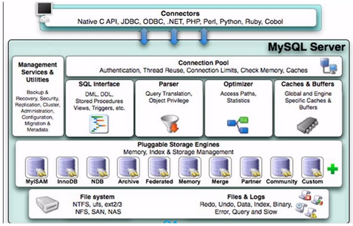

​		（1）、连接层

​		（2）、服务层

​		（3）、引擎层

​		（4）、存储层

​	2）、查询说明

### 5、mysql存储引擎

#### 	1）、查看命令

​		如何用命令查看 你mysql现在已提供什么存储引擎；

```shell
mysql> mysql> show engines;
+--------------------+---------+----------------------------------------------------------------+--------------+------+------------+
| Engine             | Support | Comment                                                        | Transactions | XA   | Savepoints |
+--------------------+---------+----------------------------------------------------------------+--------------+------+------------+
| FEDERATED          | NO      | Federated MySQL storage engine                                 | NULL         | NULL | NULL       |
| MRG_MYISAM         | YES     | Collection of identical MyISAM tables                          | NO           | NO   | NO         |
| MyISAM             | YES     | MyISAM storage engine                                          | NO           | NO   | NO         |
| BLACKHOLE          | YES     | /dev/null storage engine (anything you write to it disappears) | NO           | NO   | NO         |
| CSV                | YES     | CSV storage engine                                             | NO           | NO   | NO         |
| MEMORY             | YES     | Hash based, stored in memory, useful for temporary tables      | NO           | NO   | NO         |
| ARCHIVE            | YES     | Archive storage engine                                         | NO           | NO   | NO         |
| InnoDB             | DEFAULT | Supports transactions, row-level locking, and foreign keys     | YES          | YES  | YES        |
| PERFORMANCE_SCHEMA | YES     | Performance Schema                                             | NO           | NO   | NO         |
+--------------------+---------+----------------------------------------------------------------+--------------+------+------------+
```

​	方式二：

```shell
mysql> show variables like '%storage_engine%';                                    
+----------------------------+--------+
| Variable_name              | Value  |
+----------------------------+--------+
| default_storage_engine     | InnoDB |
| default_tmp_storage_engine | InnoDB |
| storage_engine             | InnoDB |
+----------------------------+--------+
3 rows in set (0.00 sec)
```

#### 	2）、MyISAM和InonoDB

| 对比项  | MyISAM                            | InnoDB                                   |
| ---- | --------------------------------- | ---------------------------------------- |
| 主外键  | 不支持                               | 支持                                       |
| 事务   | 不支持                               | 支持                                       |
| 行表锁  | 表锁，即使操作一条记录也会锁住整个表，==不适合高并发的操作==。 | 行锁，操作时只锁某一行，不对其它行有影响，<br />==适合高并发的操作。== |
| 缓存   | 值缓存索引，不缓存真实数据                     | 不仅缓存索引还要缓存真实数据，对内存要求较高，而且内存大小对性能有决定性的影响  |
| 表空间  | 小                                 | 大                                        |
| 关注点  | 性能                                | 事务                                       |
| 默认安装 | Y                                 | Y                                        |

#### 	3）、阿里巴巴、淘宝用哪个


# 二、索引优化分析	

## 1、性能下降SQL慢执、行时间长、等待时间长

​	1）、查询语句写的烂

​	2）、索引失效(建了索引 没有用上)

​		a、单值

```sql
select * from user where name='';
创建索引(潜规则 索引 以idex开头)
create index idx_user_name on user(name)
```

​		b、复合

```sql
select * from user where name='' and eimal='';
创建索引(潜规则 索引 以idex开头)
create index idx_user_nameEimal on user(name,eimal)
```

​	3）、关联查询太多join（设计缺陷或不得已的需求）

​	4）、服务器调优及各个参数设置（缓冲，线程数等）

## 2、常见通用的join查询

### 	1）、SQL执行顺序

​		a、手写

```sql
SELECT DISTINCT
	<select_list>
FROM
	<left_table><join_type>
JOIN<right_table> ON <join_condition>
WHERE
	<where_condition>
GROUP BY
	<group_by_list>
HAVING
	<having_condition>
ORDER BY
	<order_by_condition>
LIMIT <limit_number>
```

​		b、机读

```sql
FROM
	<left_table>
ON <join_condition>
<join_type>JOIN<right_table> 
WHERE
	<where_condition>
GROUP BY
	<group_by_list>
HAVING
	<having_condition>
SELECT 
DISTINCT <select_list>
ORDER BY
	<order_by_condition>
LIMIT <limit_number>
```

​		c、总结

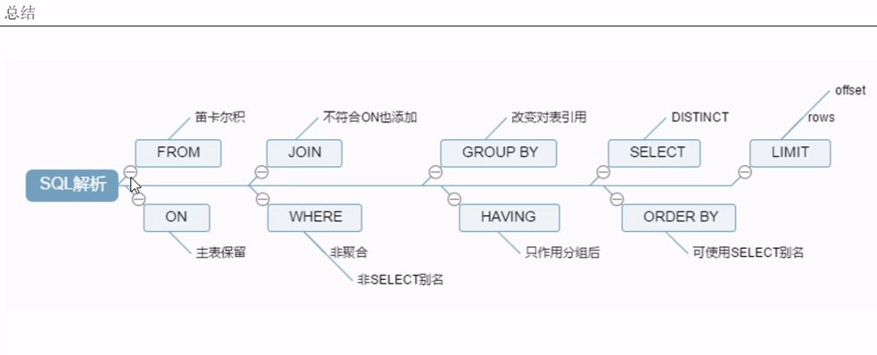

### 	2）、join图


A和B的**交集**（AB的共有）

```sql
SELECT <select_list>
FORM TableA A
INNER JOIN TableB B
ON A.Key=B.Key
```

------


A的全有，和AB的共有

```sql
SELECT <select_list>
FROM TableA A
LEFT JOIN TableB B
ON A.Key = B.Key
```


A和B相交后，取A独有的部分

```sql
SELECT <select_list>
FROM TableA A
LEFT JOIN TableB B
ON A.Key = B.Key
WHERE B.Key IS NULL
```


------


B的全有，和AB共有

```sql
SELECT <select_list>
FROM TableA A
RIGHT JOIN TableB B
ON A.Key = B.Key
```


A和B相交后，取B独有的部分

```sql
SELECT <select_list>
FROM TableA A
RIGHT JOIN TableB B
ON A.Key=B.Key
WEHER A.Key IS NULL
```

------


全连接（AB相交全部都有）

```sql
SELECT <select_list>
FROM TableA A
FULL OUTER JOIN TableB B
ON A.Key = B.Key
```


AB相交后，取A独有和B独有部分

```sql
SELECT <select_list>
FROM TableA A
FULL OUTER JOIN TableB B
ON A.Key = B.Key
WEHER A.Key IS NULL
OR B.Key IS NULL
```

### 	3）、建表sql

```sql
create TABLE tbl_dept(
	id INT(11) NOT NULL AUTO_INCREMENT,
	deptName VARCHAR(30) DEFAULT NULL,
	locAdd VARCHAR(40) DEFAULT NULL,
	PRIMARY KEY(id)
)ENGINE=INNODB AUTO_INCREMENT=1 DEFAULT CHARSET=UTF8;

CREATE TABLE tbl_emp(
	id INT(11) NOT NULL AUTO_INCREMENT,
	name VARCHAR(20) DEFAULT NULL,
	deptId INT(11) DEFAULT NULL,
	PRIMARY KEY(id),
	KEY fk_dept_id(deptId)
)ENGINE=INNODB AUTO_INCREMENT=1 DEFAULT CHARSET=UTF8;

INSERT INTO tbl_dept(deptName,locAdd) VALUES('RD',11);
INSERT INTO tbl_dept(deptName,locAdd) VALUES('HK',12);
INSERT INTO tbl_dept(deptName,locAdd) VALUES('MK',13);
INSERT INTO tbl_dept(deptName,locAdd) VALUES('MIS',14);
INSERT INTO tbl_dept(deptName,locAdd) VALUES('FD',15);

INSERT INTO tbl_emp(NAME,deptId) VALUES('Z3',1);
INSERT INTO tbl_emp(NAME,deptId) VALUES('Z4',1);
INSERT INTO tbl_emp(NAME,deptId) VALUES('Z5',1);

INSERT INTO tbl_emp(NAME,deptId) VALUES('w5',2);
INSERT INTO tbl_emp(NAME,deptId) VALUES('w6',2);

INSERT INTO tbl_emp(NAME,deptId) VALUES('s7',3);
INSERT INTO tbl_emp(NAME,deptId) VALUES('s8',4);
INSERT INTO tbl_emp(NAME,deptId) VALUES('s9',51);
```

### 	4）、7种join

第一种：中心连接

```sql
mysql> select * from tbl_emp a inner join tbl_dept b on a.deptId=b.id;
+----+------+--------+----+----------+--------+
| id | name | deptId | id | deptName | locAdd |
+----+------+--------+----+----------+--------+
|  1 | Z3   |      1 |  1 | RD       | 11     |
|  2 | Z4   |      1 |  1 | RD       | 11     |
|  3 | Z5   |      1 |  1 | RD       | 11     |
|  4 | w5   |      2 |  2 | HK       | 12     |
|  5 | w6   |      2 |  2 | HK       | 12     |
|  6 | s7   |      3 |  3 | MK       | 13     |
|  7 | s8   |      4 |  4 | MIS      | 14     |
+----+------+--------+----+----------+--------+
```

第二种：左连接

```sql
mysql> select * from tbl_emp a left join tbl_dept b on a.deptId=b.id;
+----+------+--------+------+----------+--------+
| id | name | deptId | id   | deptName | locAdd |
+----+------+--------+------+----------+--------+
|  1 | Z3   |      1 |    1 | RD       | 11     |
|  2 | Z4   |      1 |    1 | RD       | 11     |
|  3 | Z5   |      1 |    1 | RD       | 11     |
|  4 | w5   |      2 |    2 | HK       | 12     |
|  5 | w6   |      2 |    2 | HK       | 12     |
|  6 | s7   |      3 |    3 | MK       | 13     |
|  7 | s8   |      4 |    4 | MIS      | 14     |
|  8 | s9   |     51 | NULL | NULL     | NULL   |
+----+------+--------+------+----------+--------+
8 rows in set
```

第三种：右连接

```sql
mysql> select * from tbl_emp a right join tbl_dept b on a.deptId=b.id;
+------+------+--------+----+----------+--------+
| id   | name | deptId | id | deptName | locAdd |
+------+------+--------+----+----------+--------+
|    1 | Z3   |      1 |  1 | RD       | 11     |
|    2 | Z4   |      1 |  1 | RD       | 11     |
|    3 | Z5   |      1 |  1 | RD       | 11     |
|    4 | w5   |      2 |  2 | HK       | 12     |
|    5 | w6   |      2 |  2 | HK       | 12     |
|    6 | s7   |      3 |  3 | MK       | 13     |
|    7 | s8   |      4 |  4 | MIS      | 14     |
| NULL | NULL | NULL   |  5 | FD       | 15     |
+------+------+--------+----+----------+--------+
8 rows in set
```

第四种(左连接的变形)：AB相交后，取 A独有的部分；A要独，则B一定是null

```sql
mysql> select * from tbl_emp a left join tbl_dept b on a.deptId = b.id where b.id is null;
+----+------+--------+------+----------+--------+
| id | name | deptId | id   | deptName | locAdd |
+----+------+--------+------+----------+--------+
|  8 | s9   |     51 | NULL | NULL     | NULL   |
+----+------+--------+------+----------+--------+
1 row in set
```

第五种（右连接的变形）：AB相交后，取 B独有的部分；B要独，则A一定是null

```sql
mysql> select * from tbl_emp a right join tbl_dept b on a.deptId = b.id where a.deptId is null;
+------+------+--------+----+----------+--------+
| id   | name | deptId | id | deptName | locAdd |
+------+------+--------+----+----------+--------+
| NULL | NULL | NULL   |  5 | FD       | 15     |
+------+------+--------+----+----------+--------+
1 row in set
```

第六种：全连接（全有）

```sql
mysql> select * from tbl_emp a right join tbl_dept b on a.deptId = b.id
    -> union
    -> select * from tbl_emp a left join tbl_dept b on a.deptId = b.id;
+------+------+--------+------+----------+--------+
| id   | name | deptId | id   | deptName | locAdd |
+------+------+--------+------+----------+--------+
|    1 | Z3   |      1 |    1 | RD       | 11     |
|    2 | Z4   |      1 |    1 | RD       | 11     |
|    3 | Z5   |      1 |    1 | RD       | 11     |
|    4 | w5   |      2 |    2 | HK       | 12     |
|    5 | w6   |      2 |    2 | HK       | 12     |
|    6 | s7   |      3 |    3 | MK       | 13     |
|    7 | s8   |      4 |    4 | MIS      | 14     |
| NULL | NULL | NULL   |    5 | FD       | 15     |
|    8 | s9   |     51 | NULL | NULL     | NULL   |
+------+------+--------+------+----------+--------+
9 rows in set
```

第七种：A独有+B独有

```sql
mysql> select * from tbl_emp a left join tbl_dept b on a.deptId = b.id where b.id is null
    -> union
    -> select * from tbl_emp a right join tbl_dept b on a.deptId = b.id where a.deptId is null;
+------+------+--------+------+----------+--------+
| id   | name | deptId | id   | deptName | locAdd |
+------+------+--------+------+----------+--------+
|    8 | s9   |     51 | NULL | NULL     | NULL   |
| NULL | NULL | NULL   |    5 | FD       | 15     |
+------+------+--------+------+----------+--------+
2 rows in set
```

问题：什么是索引？

回答：


## 3、索引简介

### 	1）、是什么

​		  **a、mysql官方对索引的定义为：索引（Index）是帮助MySQL高效获取数据的数据结构**

​		  可以得到索引的本质：索引是数据结构。

​		  索引的目的在于提高查询效率，可以类比字典

​		 **b、==你可理解为“排好序的快速查找数据结构”==** 

​			**详解**（重要）：

```properties
在数据之外，---数据库系统还维护着满足特定查找算法的数据结构---，这些数据结构以某种方法引用（指向）数据，这样就可以在这些数据结构上实现高级查找算法。这种数据结构，就是索引。
```


​			**结论**：

==在数据之外，---数据库系统还维护着满足特定查找算法的数据结构---，这些数据结构以某种方法引用（指向）数据，这样就可以在这些数据结构上实现高级查找算法。这种数据结构，就是索引。==

​		**c、一般来说索引本身也很大，不可能全部存储在内存中，因此索引往往以索引文件形式存储的磁盘。** 

​		**d、==我们平常所说的索引，如果没有特别指明，都是指B树（多路搜索树，并不一定是二叉的）结构组织的索引==。其中狙击索引，次要索引，覆盖索引，复合索引，前缀索引，唯一索引默认都是使用B+树索引。 ** 

### 	2）、优势

​		a、类似大学图书馆建书目索引，提高数据检索的效率，降低数据库的IO成本

​		b、通过索引列队数据进行排序，降低数据排序的成本，降低了CPU的消耗。

### 	3）、劣势

​		a、实际上索引也是一张表，该表保存了主键与索引字段，并指向实体表的记录，所以索引列也要占用空间的。

​		b、虽然索引大大提高了查询速度，同时却会降低更新表的速度，如对表进行INSERT、update、delete。因为更新表时，MYSQL不仅要保存数据，还要保存一下索引文件每次更新添加了索引列的字段，都会调整因为更新所带来的键值变化后的索引信息。

​		c、索引只是提高效率的一个因数，如果你的mysql有大数据量的表，就需要花时间研究建立最优秀得索引，或优化查询语句。

### 	4）、mysql索引分类

​		a、单值索引

​			即一个索引只包含单个列，一个表可以有多个单列索引

​		b、唯一索引

​			索引的值必须唯一，但允许有空值

​		c、复合索引

​			即一个索引包含多个列

​		d、基本语法

​			（1）创建

```sql
CREATE [UNIQUE] INDEX indexName ON mytable(columnname(length));
```

```sql
ALTER mytable ADD [UNIQUE] INDEX [indexName] ON (columnname(length));
```

​			（2）删除

```sql
DROP INDEX [indexName] ON mytable;
```

​			（3）查看

```sql
SHOW INDEX FROM table_name\G
```

​			（4）使用ALTER命令

```sql
有四种方式来添加数据表的索引；

(1):ALTER TABLE tbl_name ADD PRIMARY KEY (column_list);该语句添加一个主键，这意味着索引值必须是唯一的，且不能为null。

(2)ALTER TABLE tbl_name ADD UNIQUE index_name(column_list);该语句创建索引的值必须是唯一的（除了NULL外，null可能会出现多次）。

(3)ALTER TABLE tbl_name ADD INDEX index_name(column_list);添加普通索引，索引值可出现多次。

(4)ALTER TABLE tbl_name ADD FULLTEXT index_name(column_list);该语句指定了索引为FULLTEXT，用于1全文检索。
```


### 	5）、mysql索引结构

​		a、BTree索引（重点）

​		b、hash索引 

​		c、full-text全文索引

​		d、R-Tree索引

### 	6）、那些情况需要创建索引

```properties
1、主键自动建立唯一索引
2、频繁作为查询条件的字段应该创建索引
3、查询中与其它表关联的字段，外键关系建立索引
4、频繁更新的字段不适合创建索引-------------因为每次更新不单单是更新了记录，还会更新索引
5、where条件中用不到字段不创建索引
6、单键/复合索引的选择问题，who？（在高并发倾向创建复合索引）
7、查询中排序的字段，排序字段若通过索引1去访问将大大提高排序速度
8、查询中统计或者分组字段
```


### 	7）、那些情况不要创建索引

```properties
1、表记录太少
2、经常增删改的表
	WHY:提高了查询速度，同时却会降低更新表的速度，如对表进行insert，update、delete,
	因为更新表时，mysql不仅要保存数据，还要保存一下索引文件。
3、数据重复且分布平均的字段，因此应该只为最经常查询和最经常排序的数据列建立索引，注意，如果某个数据列包含了许多重复的内容，为它建立索引就没有太大的实际效果。
```

## 4、性能分析	

### 1）、mysql query optimizer

```properties
1、mysql 中有专门负责优化select 语句的优化器模块，主要功能：通过计算分析系统中收集到的统计信息，为客户端请求的query提供他认为最优的执行计划（他认为最优的数据检索方式，但不见得是是DBA认为最优的，这部分最耗费时间）

2、当客户端想mysql请求一条query，命令解析器模块完成请求分类，区别出是select 并转发给mysql qurey optimizer 时，mysql query optimizer 首先会对整条query进行优化，处理掉一些常量表达式的预算，直接换算成常量值。并对query中的查询条件镜像简化和转换，如去掉一些无用或显而易见的条件、结构调整等。然后分析query中的hint信息（如果有），看显示hint信息是否可以完全啊确定该query的执行计划。如果没有hint或hint信息还不足以完全确定执行计划，则会读取所涉及对象的统计信息，根据query镜像写相应的计算分析，然后再得出最后的执行计划。
```

### 2）、mysql 常见瓶颈

```properties
CUP:cup在饱和的时候一般发生在数据装入内存或从磁盘上读取数据时候
IO:磁盘I/O瓶颈发生在装入数据远大于内存容量的时候
服务器硬件的性能瓶颈:top,free,iostat和vmstat来查看系统的性能状态
```

### 3）、Explain

#### a： 是什么

使用explain关键字可以模拟优化器执行是sql查询语句，从而知道mysql是如何处理你的mysql语句。分析你的查询语句或是表结构的性能瓶颈。

#### b：能干嘛？

（1）表的读取顺序

（2）数据读取操作的操作类型

（3）那些索引可以使用

（4）那么索引被实际使用

（5）表之间的引用

（6）每张表有多少行被优化器查询

#### c：怎么玩？

（1）·explain + SQL语句

（2）执行计划包含的信息

```sql
id | select_type | table | type | possible_keys | key | key_len | ref | rows | Extra
```

#### d：各字段解释

##### （1）id:

```
select查询的序列号，包含一组数字，表示查询中执行select子句或操作表顺序
```

三种情况：

```shell
1、id相同，执行顺序由上至下
mysql> explain select t2.*
	-> from t1,t2,t3
	-> where t1.id = t2.id and t1.id = t3.id
	-> and t1.other.column = '';
+----+-------------+---------+------+---------------+------+---------+------+------+-------+
| id | select_type | table   | type | possible_keys | key  | key_len | ref  | rows | Extra |
+----+-------------+---------+------+---------------+------+---------+------+------+-------+
|  1 | SIMPLE      | t1      | ALL  | NULL          | NULL | NULL    | NULL |    7 | NULL  |
+----+-------------+---------+------+---------------+------+---------+------+------+-------+
|  1 | SIMPLE      | t3      | ALL  | NULL          | NULL | NULL    | NULL |    7 | NULL  |
+----+-------------+---------+------+---------------+------+---------+------+------+-------+
|  1 | SIMPLE      | t2      | ALL  | NULL          | NULL | NULL    | NULL |    7 | NULL  |
+----+-------------+---------+------+---------------+------+---------+------+------+-------+
	
	id相同时，执行顺序由上到下
```

```shell
2、id不同
mysql> explain select t2.*
	-> from t2
	-> where id = (select id
					form t1
					where id = (select t3.id
								  from t3
								  where t3.other_column = ''));
 +----+-------------+---------+------+---------------+------+---------+------+------+-------+
| id | select_type | table   | type | possible_keys | key  | key_len | ref  | rows | Extra |
+----+-------------+---------+------+---------------+------+---------+------+------+-------+
|  1 | PRIMARY     | t2      | ALL  | NULL          | NULL | NULL    | NULL |    7 | NULL  |
+----+-------------+---------+------+---------------+------+---------+------+------+-------+
|  2 | SUBQUERY    | t1      | ALL  | NULL          | NULL | NULL    | NULL |    7 | NULL  |
+----+-------------+---------+------+---------------+------+---------+------+------+-------+
|  3 | SUBQUERY    | t3      | ALL  | NULL          | NULL | NULL    | NULL |    7 | NULL  |
+----+-------------+---------+------+---------------+------+---------+------+------+-------+
	
SUBQUERY: 代表子查询
PRIMARY : 代表最外层查询
	
如果是子查询，id的序号会递增，**id值越大优先级越高，越先被执行**
```

```shell
3、id相同不同，同时存在
mysql> explain select t2.* from (
	->	select t3.id 
	->	from t3
	->	where t3.other_column = '') s1,t2
	->	where s1.id = t2.id;
	
+----+-------------+---------+------+---------------+------+---------+------+------+-------+
| id | select_type | table   | type | possible_keys | key  | key_len | ref  | rows | Extra |
+----+-------------+---------+------+---------------+------+---------+------+------+-------+
|  1 | PRIMARY     |<derived2>| ALL | NULL          | NULL | NULL    | NULL |    7 | NULL  |
+----+-------------+---------+------+---------------+------+---------+------+------+-------+
|  1 | PRIMARY     | t2      | ALL  | NULL          | NULL | NULL    | NULL |    7 | NULL  |
+----+-------------+---------+------+---------------+------+---------+------+------+-------+
|  2 | DERIVED     | t3      | ALL  | NULL          | NULL | NULL    | NULL |    7 | NULL  |
+----+-------------+---------+------+---------------+------+---------+------+------+-------+
	
	id如果相同，可以认为是一组，从上往下顺序执行；、
	在所有组中，id值越大，优先级越高，越先执行
	
	衍生 = DERIVED
```

##### （2）select_type

​	有那些

```shell
+----+-------------+
| id | select_type | 
+----+-------------+
|  1 | SIMPLE      |
+----+-------------+
|  2 | PRIMARY     |
+----+-------------+
|  3 | SUBQUERY    |
+----+-------------+
|  4 | DERIVED     |
+----+-------------+
|  5 | UNION       |
+----+-------------+
|  6 | UNION RESULT|
+----+-------------+
```

​	查询的类型，主要是用于区别 

​	普通查询、联合查询、子查询等的复杂查询

```properties
1、simple   : 简单的select查询，查询中不包含子查询或union
2、primary  :查询中若包含任何复杂的子部分，最外层查询则被标记为primary(最外层的  鸡蛋壳)
3、subquery :在select或where列表中包含了 子查询
4、derived  :在from 列表中包含的子查询被标记为DEREIVED（衍生） mysql会递归执行这些子查询，把结果放			 入临时表中
5、union   :若第二个select出现在union之后，则被标记为union；若union包含在from 子句的子查询张，外层				select将被标记为：DERIVED;
6、union result:从union表中获取结果的select
```

##### （3）table----表名

##### （4）type

​	字面意思：访问类型

​	有以下几种

```shell
+----+-------------+---------+------+---------------+------+---------+------+------+-------+
|ALL | index       | range   | ref  | eq_ref        | const,system   | NULL |    
+----+-------------+---------+------+---------------+------+---------+------+------+-------+
```

​	访问类型排列

```
type显示的是访问类型，是较为重要的一个指标，结果值从最好到最坏依次是：

system>const>eq_ref>ref>range>index>ALL

一般来说，的保证查询至少达到range级别，最好能达到ref
```

​	显示查询使用了何种类型，

​	==从最好到最差依次是：==

​	system>const>eq_ref>ref>range>index>ALL

**system : 表只有一行记录（等于系统表），这是const类型的特例，平时不会出现，这个也可以忽略**

**const  : 通过索引一次就找到了，const用于比较primary key 或者unique索引。因为只匹配一行数据，所以很快		   如将主键置于where列表中，mysql就能将该查询转换为一个常量**

```shell
mysql> explain select * from (select * from t1 where id = 1) d1;
+----+-------------+---------+------+---------------+------+---------+------+------+-------+
| id | select_type | table   | type | possible_keys | key  | key_len | ref  | rows | Extra |
+----+-------------+---------+------+---------------+------+---------+------+------+-------+
|  1 | PRIMARY     |<derived2>|system| NULL          | NULL | NULL    | NULL |    7 | NULL  |
+----+-------------+---------+------+---------------+------+---------+------+------+-------+
|  2 | DERIVED     | t1      | const| NULL          | NULL | NULL    | NULL |    7 | NULL  |
+----+-------------+---------+------+---------------+------+---------+------+------+-------+
```

**eq_ref : 唯一性索引扫描，对于每个索引键，表中只有一条记录与之匹配。常见主键或唯一索引扫描 ** 

```shell
mysql> explain select * from t1,t2 where t1.id = t2.id;
+----+-------------+---------+------+---------------+------+---------+------+------+-------+
| id | select_type | table   | type | possible_keys | key  | key_len | ref  | rows | Extra |
+----+-------------+---------+------+---------------+------+---------+------+------+-------+
|  1 | SIMPLE      | t2 	 |All   | NULL          | NULL | NULL    | NULL |    7 | NULL  |
+----+-------------+---------+------+---------------+------+---------+------+------+-------+
|  1 | SIMPLE      | t1      |eq_ref| NULL          | NULL | NULL    | NULL |    7 | NULL  |
+----+-------------+---------+------+---------------+------+---------+------+------+-------+
```

**ref ： 非唯一性索引扫描，返回匹配某个单独值得所有行，**

​	   **本质上也是一种索引访问，它返回所有匹配某个单独值的行，然而，**

​	   **它可能会找到多个符合条件的行，所以他应该属于查找和扫描的混合体**  

```shell
mysql>create index idx_clo1_col2 on t1(col1,col2);
Query OK,1000 rows affected(0.5 sec)
mysql>select count(distinct col1) from t1;
+----+---- ---------+
|  5 |count(distinct col1) |
+----+-------------+
|  6 |7				|
+----+-------------+
mysql>explain select * from t1 where col1 = 'ac';
+----+-------------+---------+------+---------------+------+---------+------+------+-------+
| id | select_type | table   | type | possible_keys | key  | key_len | ref  | rows | Extra |
+----+-------------+---------+------+---------------+------+---------+------+------+-------+
|  1 | SIMPLE      | t1 	 | ref  | NULL          | NULL | NULL    | NULL |    7 | NULL  |
+----+-------------+---------+------+---------------+------+---------+------+------+-------+
```

**range:只检索指定范围的行，使用一个索引来选择行。key列显示使用了哪个索引**

​	   **一般就是在你的where语句中出现了between、<、>、in、等得查询**

​	  **这种范围扫描索引扫描比全表扫描要好，因为它只需要一开始于索引的某一点，而结束于另一点，不用扫描		 全表索引**

```shell
mysql>select * from t1 where id between 30 and 60;
+----+-------------+---------+------+---------------+------+---------+------+------+-------+
| id | select_type | table   | type | possible_keys | key  | key_len | ref  | rows | Extra |
+----+-------------+---------+------+---------------+------+---------+------+------+-------+
|  1 | SIMPLE      | t1 	 | range| primary       |primary| NULL    | NULL |    7 | NULL  |
+----+-------------+---------+------+---------------+------+---------+------+------+-------+

mysql>select * from t1 where id in (1,2,3);
+----+-------------+---------+------+---------------+------+---------+------+------+-------+
| id | select_type | table   | type | possible_keys | key  | key_len | ref  | rows | Extra |
+----+-------------+---------+------+---------------+------+---------+------+------+-------+
|  1 | SIMPLE      | t1 	 | range| primary       |primary| NULL    | NULL |    7 | NULL  |
+----+-------------+---------+------+---------------+------+---------+------+------+-------+
```

**index：Full index Scan，index与ALL区别为index类型只遍历索引树。这通常比ALL快，因为索引文件通常比数据文件小。（==也就是说虽然all和index都是读全表==，但index是从索引中读取的，而all是从硬盘中读的）**

```shell
mysql>explain select id from t1;
+----+-------------+---------+------+---------------+------+---------+------+------+-------+
| id | select_type | table   | type | possible_keys | key  | key_len | ref  | rows | Extra |
+----+-------------+---------+------+---------------+------+---------+------+------+-------+
|  1 | SIMPLE      | t1 	 | index| primary       |primary| NULL   | NULL |    7 | NULL  |
+----+-------------+---------+------+---------------+------+---------+------+------+-------+
```

**All：将全表扫一遍**

​	

##### 	（5）possible_keys

​		显示可能应用在这张表中的索引，一个或多个。

​		查询涉及到的字段上若存在索引，则该索引将被列出，==但不一定被查询实际使用==

##### 	（6）key

​		实际使用的索引。若果为null，则没有使用索引。

​		==查询中若使用了覆盖索引，则该索引仅出现在key列表中==  

```shell
mysql>explain select col1,col2 from t1;
+----+-------------+---------+------+---------------+------+---------+------+------+-------+
| id | select_type | table   | type | possible_keys | key  | key_len | ref  | rows | Extra |
+----+-------------+---------+------+---------------+------+---------+------+------+-------+
|  1 | SIMPLE      | t1 	 | index| null          |idx_col1_col2| NULL | NULL | 7 | NULL |
+----+-------------+---------+------+---------------+------+---------+------+------+-------+
```

##### 	（7）key_len

​		表示索引中使用的字节数，可通过该列计算查询中使用的索引的长度。在不损失精确性的情况下，长度越短越好。

​		key_len是显示索引字段的最大可能长度，==并非实际使用长度==，即key_len是根据表定义计算而得，不是通过表内检索出的

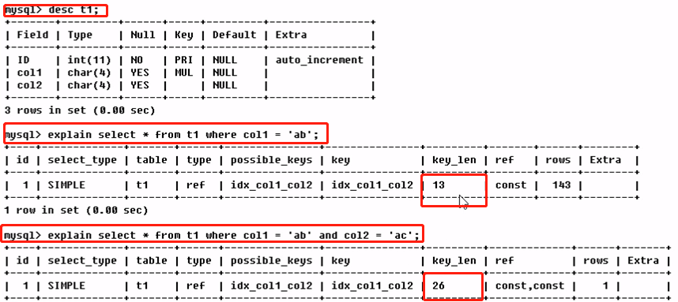

##### 	（8）ref

​		显示索引的那一列被使用了，如果可能的话，是一个常数。那些列或常量被用于查找索引列上的值

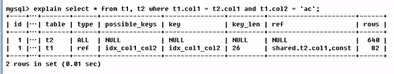

​		由key_len可知t1表的idx_col1_col2被充分使用，col1匹配t2表的col1,col2匹配了一个常量，即‘ac’

​		查询中与其它表关联的字段，外键关系建立索引。

##### 	（9）rows

​		根据表统计信息及索引选用情况，大致估算出找到所需的记录所需要读取的行数(------越少越好---)


##### 	（10）Extra

​		包含不适合在其它列中显示但十分重要的额外信息

​		==Using filesort：==

​			说明mysql会对数据使用一个外部的索引排序，而不是按照表内的索引顺序进行读取。

​			mysql中无法利用索引完成的排序操作称为“文件排序”。

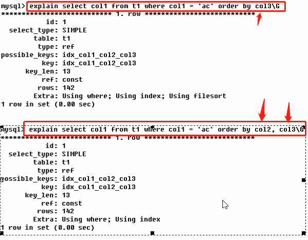

​		==Using temporary：==

​			使用了临时表保存中间结果，mysql在对查询结果排序时使用临时表。

​			常见于排序Order by 和分组查询group by


​		==Using index：==

​			表示相应的select操作 中使用了覆盖索引（Coving Index），避免访问了表单的数据行，效率不错！	

​			如果同时出现using where ，表明索引被用来执行索引键值的查找；

​			如果没有同时出现using where，表明索引用来读取数据而非执行查找动作。

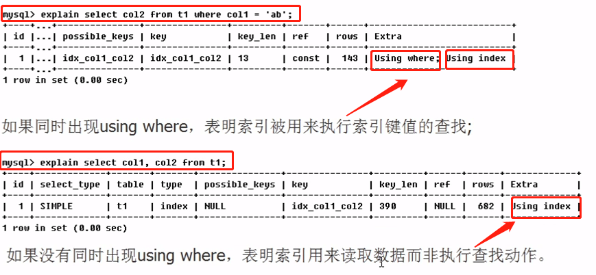

​			**覆盖索引** ：也称为索引覆盖

​			理解方式：就是select 的数据列只用从索引中就能够取得，不必读取数据行，mysql可以利用索引返回select列表中的字段，而不必根据索引再次读取数据文件，换句话说  ==查询列要被所建的索引覆盖==。

​			注意：

​			如果要使用覆盖索引，一定要注意select列表中只取出需要的列，不可select * ，

​			因为如果将所有字段一起做索引会导致索引文件过大，查询性能下降。

​		==Using where：使用了查询过滤== 

​		==Using join buffer ：使用了连接缓存== 

​		==impossible where==  ：where子句的值总是false，不能用来获取任何元组（错乱）

​		==select tables optimized away== 

​		==distinct== 

​				

#### f：热身case

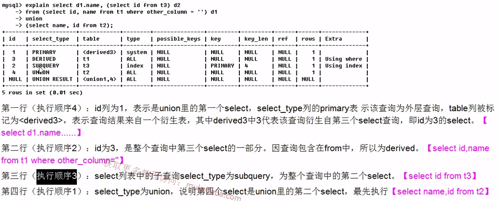

第五行（执行顺序5）：代表从union的临时表中读取行的阶段，table列的<union1,4>表示用第一个和第四个select的结果进行【union操作】


## 5、索引优化

### 1）、索引优化

#### 	a、单表

​		建表sql

```shell
CREATE TABLE IF NOT EXISTS article(
	id INT(10) UNSIGNED NOT NULL PRIMARY KEY AUTO_INCREMENT,
	author_id INT(10) UNSIGNED NOT NULL,
	category_id INT(10) UNSIGNED NOT NULL,
	views INT(10) UNSIGNED NOT NULL,
	comments INT(10) UNSIGNED NOT NULL,
	title VARBINARY(255) NOT NULL,
	content TEXT NOT NULL
)ENGINE=INNODB DEFAULT CHARSET=utf8;

INSERT INTO article(author_id,category_id,views,comments,title,content) VALUES
(1,1,1,1,'1','1'),
(2,2,2,2,'2','2'),
(1,1,3,3,'3','3');
```

​		**案例:**

​			需求：查询category_id为1且comments大于1的情况下，views最多的article_id。

```shell
mysql> select id,author_id from article where category_id = 1 and comments > 1 order by views desc limit 1;
+----+-----------+
| id | author_id |
+----+-----------+
|  3 |         1 |
+----+-----------+
1 row in set

#分析性能
mysql> explain select id,author_id from article where category_id = 1 and comments > 1 order by views desc limit 1;
+----+-------------+---------+------+---------------+------+---------+------+------+-----------------------------+
| id | select_type | table   | type | possible_keys | key  | key_len | ref  | rows | Extra                       |
+----+-------------+---------+------+---------------+------+---------+------+------+-----------------------------+
|  1 | SIMPLE      | article | ALL  | NULL          | NULL | NULL    | NULL |    3 | Using where; Using filesort |
+----+-------------+---------+------+---------------+------+---------+------+------+-----------------------------+
1 row in set

#结论：type是ALL是最坏的情况，extra里还出现了Using filesort,也是最坏的情况。优化是必须的。

#开始优化
#1.1 新建索引 + 删除索引
mysql> create index idx_article_ccv on article(category_id,comments,views);
Query OK, 0 rows affected
Records: 0  Duplicates: 0  Warnings: 0

#再次查看性能
mysql> explain select id,author_id from article where category_id = 1 and comments > 1 order by views desc limit 1;
+----+-------------+---------+-------+-----------------+-----------------+---------+------+------+---------------------------------------+
| id | select_type | table   | type  | possible_keys   | key             | key_len | ref  | rows | Extra                                 |
+----+-------------+---------+-------+-----------------+-----------------+---------+------+------+---------------------------------------+
|  1 | SIMPLE      | article | range | idx_article_ccv | idx_article_ccv | 8       | NULL |    1 | Using index condition; Using filesort |
+----+-------------+---------+-------+-----------------+-----------------+---------+------+------+---------------------------------------+
1 row in set

#结论：
#type变成了range，这是可以忍的。但是extra里使用了Using filesort仍是无法接收的。
#但是我们已经建立了索引，为啥没有呢？
#这是因为按照BTree索引的工作原理
#先排序category_id;
#如果遇到相同的category_id则再排序comments，如果遇到相同的comments则再排序views.
#当comments字段在联合索引里处于中间位置时，
#因comments>1条件是一个范围值（所谓range）
#mysql无法利用索引再对后面的views部分进行检索，即range类型查询字段后面的索引无效。、

#删除索引
mysql> DROP INDEX idx_article_ccv ON article;
Query OK, 0 rows affected
Records: 0  Duplicates: 0  Warnings: 0

#1.2重新创建索引
mysql> create index idx_article_cv on article(category_id,views);
Query OK, 0 rows affected
Records: 0  Duplicates: 0  Warnings: 0

#性能分析
mysql> explain select id,author_id from article where category_id = 1 and comments > 1 order by views desc limit 1;
+----+-------------+---------+------+----------------+----------------+---------+-------+------+-------------+
| id | select_type | table   | type | possible_keys  | key            | key_len | ref   | rows | Extra       |
+----+-------------+---------+------+----------------+----------------+---------+-------+------+-------------+
|  1 | SIMPLE      | article | ref  | idx_article_cv | idx_article_cv | 4       | const |    2 | Using where |
+----+-------------+---------+------+----------------+----------------+---------+-------+------+-------------+
1 row in set

#结论 ok

```

​	

#### 	b、两表

​		建表sql

```shell
CREATE TABLE IF NOT EXISTS class(
	id INT(10) UNSIGNED NOT NULL auto_increment,
	card INT(10) UNSIGNED NOT NULL,
	PRIMARY KEY(id)
)ENGINE=INNODB DEFAULT charset=utf8;

CREATE TABLE IF NOT EXISTS book(
	bookid INT(10) UNSIGNED NOT NULL auto_increment,
	card INT(10) UNSIGNED NOT NULL,
	PRIMARY KEY(bookid)
)ENGINE=INNODB DEFAULT charset=utf8

INSERT INTO class(card) VALUES(FLOOR(1+(RAND()*20)));
INSERT INTO class(card) VALUES(FLOOR(1+(RAND()*20)));
INSERT INTO class(card) VALUES(FLOOR(1+(RAND()*20)));
INSERT INTO class(card) VALUES(FLOOR(1+(RAND()*20)));
INSERT INTO class(card) VALUES(FLOOR(1+(RAND()*20)));
INSERT INTO class(card) VALUES(FLOOR(1+(RAND()*20)));
INSERT INTO class(card) VALUES(FLOOR(1+(RAND()*20)));
INSERT INTO class(card) VALUES(FLOOR(1+(RAND()*20)));
INSERT INTO class(card) VALUES(FLOOR(1+(RAND()*20)));
INSERT INTO class(card) VALUES(FLOOR(1+(RAND()*20)));
INSERT INTO class(card) VALUES(FLOOR(1+(RAND()*20)));
INSERT INTO class(card) VALUES(FLOOR(1+(RAND()*20)));
INSERT INTO class(card) VALUES(FLOOR(1+(RAND()*20)));
INSERT INTO class(card) VALUES(FLOOR(1+(RAND()*20)));


INSERT INTO book(card) VALUES(FLOOR(1+(RAND()*20)));
INSERT INTO book(card) VALUES(FLOOR(1+(RAND()*20)));
INSERT INTO book(card) VALUES(FLOOR(1+(RAND()*20)));
INSERT INTO book(card) VALUES(FLOOR(1+(RAND()*20)));
INSERT INTO book(card) VALUES(FLOOR(1+(RAND()*20)));
INSERT INTO book(card) VALUES(FLOOR(1+(RAND()*20)));
INSERT INTO book(card) VALUES(FLOOR(1+(RAND()*20)));
INSERT INTO book(card) VALUES(FLOOR(1+(RAND()*20)));
INSERT INTO book(card) VALUES(FLOOR(1+(RAND()*20)));
INSERT INTO book(card) VALUES(FLOOR(1+(RAND()*20)));
INSERT INTO book(card) VALUES(FLOOR(1+(RAND()*20)));
INSERT INTO book(card) VALUES(FLOOR(1+(RAND()*20)));
INSERT INTO book(card) VALUES(FLOOR(1+(RAND()*20)));
INSERT INTO book(card) VALUES(FLOOR(1+(RAND()*20)));
INSERT INTO book(card) VALUES(FLOOR(1+(RAND()*20)));
INSERT INTO book(card) VALUES(FLOOR(1+(RAND()*20)));
INSERT INTO book(card) VALUES(FLOOR(1+(RAND()*20)));
INSERT INTO book(card) VALUES(FLOOR(1+(RAND()*20)));
INSERT INTO book(card) VALUES(FLOOR(1+(RAND()*20)));
```

​		案例

```shell
#下面开始explain分析
mysql> explain select * from class left join book on  class.card= book.card;
+----+-------------+-------+------+---------------+------+---------+------+------+----------------------------------------------------+
| id | select_type | table | type | possible_keys | key  | key_len | ref  | rows | Extra                                              |
+----+-------------+-------+------+---------------+------+---------+------+------+----------------------------------------------------+
|  1 | SIMPLE      | class | ALL  | NULL          | NULL | NULL    | NULL |   14 | NULL                                               |
|  1 | SIMPLE      | book  | ALL  | NULL          | NULL | NULL    | NULL |   19 | Using where; Using join buffer (Block Nested Loop) |
+----+-------------+-------+------+---------------+------+---------+------+------+----------------------------------------------------+
2 rows in set
#结论： type有all

#添加索引优化（左连接，索引加在了右表）
mysql> ALTER TABLE book ADD INDEX Y(card);

#第二次explain
mysql> explain select * from class left join book on  class.card= book.card;
#可以看到第二行的type变为了ref，rows也变成了1优化比较明显。
#这是由左连接特性决定的。Left join条件用于确定如何从右表搜索行，左边一定都有，
#所以，右边是我们的关键，右边一定要建立索引。

#右连接与之相同
```


#### 	c、三表

​		建表sql

```shell
CREATE TABLE if NOT EXISTS phone(
	phoneid INT(10) UNSIGNED NOT NULL auto_increment,
	card INT(10) UNSIGNED NOT NULL,
	primary KEY(phoneid)
)ENGINE=INNODB DEFAULT charset=utf8;

INSERT INTO phone(card) VALUES(FLOOR(1+(RAND()*20)));
INSERT INTO phone(card) VALUES(FLOOR(1+(RAND()*20)));
INSERT INTO phone(card) VALUES(FLOOR(1+(RAND()*20)));
INSERT INTO phone(card) VALUES(FLOOR(1+(RAND()*20)));
INSERT INTO phone(card) VALUES(FLOOR(1+(RAND()*20)));
INSERT INTO phone(card) VALUES(FLOOR(1+(RAND()*20)));
INSERT INTO phone(card) VALUES(FLOOR(1+(RAND()*20)));
INSERT INTO phone(card) VALUES(FLOOR(1+(RAND()*20)));
INSERT INTO phone(card) VALUES(FLOOR(1+(RAND()*20)));
INSERT INTO phone(card) VALUES(FLOOR(1+(RAND()*20)));
INSERT INTO phone(card) VALUES(FLOOR(1+(RAND()*20)));
INSERT INTO phone(card) VALUES(FLOOR(1+(RAND()*20)));
```

​		案例

```shell
#三表连接查询
mysql> select * from class left join book on class.card = book.card left join phone on book.card=phone.card;
+----+------+--------+------+---------+------+
| id | card | bookid | card | phoneid | card |
+----+------+--------+------+---------+------+
|  2 |   11 |      9 |   11 |       3 |   11 |
|  9 |   11 |      9 |   11 |       3 |   11 |
| 12 |   11 |      9 |   11 |       3 |   11 |
|  2 |   11 |     19 |   11 |       3 |   11 |
|  9 |   11 |     19 |   11 |       3 |   11 |
| 12 |   11 |     19 |   11 |       3 |   11 |
|  4 |   16 |      3 |   16 |       5 |   16 |
|  5 |   16 |      3 |   16 |       5 |   16 |
|  4 |   16 |      4 |   16 |       5 |   16 |
|  5 |   16 |      4 |   16 |       5 |   16 |
|  4 |   16 |     11 |   16 |       5 |   16 |
|  5 |   16 |     11 |   16 |       5 |   16 |
|  4 |   16 |     16 |   16 |       5 |   16 |
|  5 |   16 |     16 |   16 |       5 |   16 |
|  7 |   15 |      2 |   15 | NULL    | NULL |
| 13 |   10 |      5 |   10 | NULL    | NULL |
| 10 |   14 |     10 |   14 | NULL    | NULL |
| 11 |   14 |     10 |   14 | NULL    | NULL |
|  1 |   18 | NULL   | NULL | NULL    | NULL |
|  3 |    2 | NULL   | NULL | NULL    | NULL |
|  6 |    8 | NULL   | NULL | NULL    | NULL |
|  8 |    7 | NULL   | NULL | NULL    | NULL |
| 14 |   17 | NULL   | NULL | NULL    | NULL |

#分析性能
mysql>explain select * from class left join book on class.card = book.card left join phone on book.card=phone.card;
#结论 type为all,3张表全部是全表扫描，效率慢

#添加索引（左连接，索引建立在右则表）
mysql> AlTER TABLE phone ADD INDEX z(card);

mysql> alter table book add index Y(card);

#分析性能
explain select * from class left join book on class.card = book.card left join phone on book.card=phone.card;

#后2行的type都是ref且总rows优化很好，效果不错。因此索引最好设置在需要经常查询的字段中。

【结论】
join语句的优化
 
尽可能减少Join语句中的NestedLoop的循环总次数；永远用小结果集驱动大的结果集
优先优化NestedLoop的内层循环；
保证Join语句中被驱动表上Join条件字段已经被索引；

当无法保证被驱动表的Join条件字段被索引且内层资源充足的前提下，不要太小气JoinBuffer的设置；
```


### 2）、索引失效（应该避免）

​	建表sql:

```shell
CREATE TABLE staffs(
	id INT PRIMARY KEY auto_increment,
	NAME VARCHAR(24) NOT NULL DEFAULT '' COMMENT '姓名',
	age INT NOT NULL DEFAULT 0 COMMENT '年龄',
	pos VARCHAR(20) NOT NULL DEFAULT '' COMMENT '职位',
	add_time TIMESTAMP NOT NULL DEFAULT CURRENT_TIMESTAMP COMMENT '入职时间'
)ENGINE=INNODB DEFAULT CHARSET=utf8 COMMENT '员工记录表';

INSERT INTO staffs(NAME,age,pos,add_time) VALUES('z3',22,'manager',NOW());
INSERT INTO staffs(NAME,age,pos,add_time) VALUES('July',23,'dev',NOW());
INSERT INTO staffs(NAME,age,pos,add_time) VALUES('2000',23,'dev',NOW());

ALTER TABLE staffs add index idx_staffs_nameAgePos(name,age,pos);
```

​	案例（索引失效）：

#### 		1、全职匹配我最爱

```
mysql> explain select * from staffs where NAME='July';
mysql> explain select * from staffs where NAME='July' AND age = 25;
mysql> explain select * from staffs where NAME='July' AND age = 25 AND pos='dev';
```

#### 		==2、最佳左前缀法则==  

```properties
1:如果索引了多列，要遵守最左前缀法则。指的是查询从索引的最左前列开始并且****不跳过索引中的列*****。
explain select * rrom staffs where age = 25 and pos = dev;
explain select * rrom staffs where age pos = dev;
```

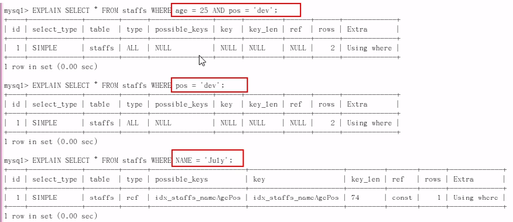

#### 		3、不在索引列上做任何操作（计算，函数，(自动、手动)类型转换），会导致索引失效而转向全表扫描		

```shell
mysql> explain select * from staffs where left(name,4)='July';
+----+-------------+--------+------+---------------+------+---------+------+------+-------------+
| id | select_type | table  | type | possible_keys | key  | key_len | ref  | rows | Extra       |
+----+-------------+--------+------+---------------+------+---------+------+------+-------------+
|  1 | SIMPLE      | staffs | ALL  | NULL          | NULL | NULL    | NULL |    3 | Using where |
+----+-------------+--------+------+---------------+------+---------+------+------+-------------+
```

#### 		4、存储引擎不能使用索引中范围条件右边的列

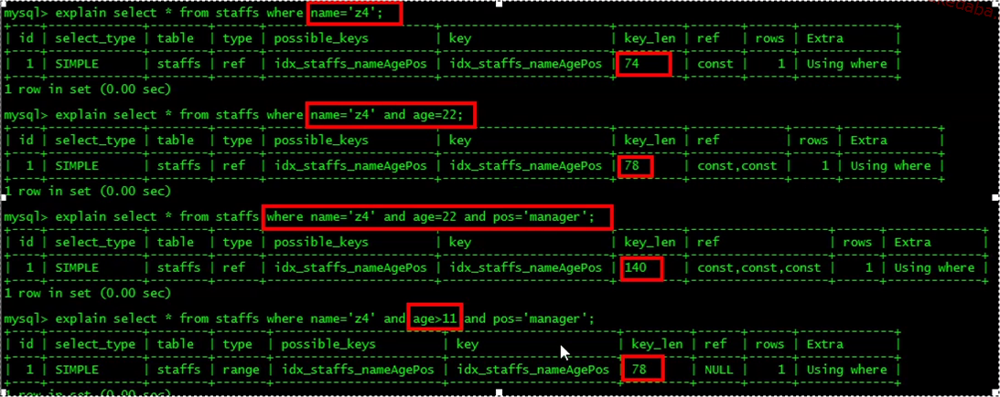

#### 		5、尽量使用覆盖索引（值访问索引的查询（索引列和查询列一致）），减少select

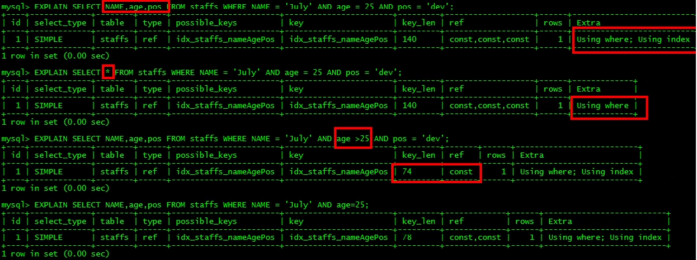

#### 		6、mysql在使用不等于（！=或<>）的时候无法使用索引会导致全表扫描

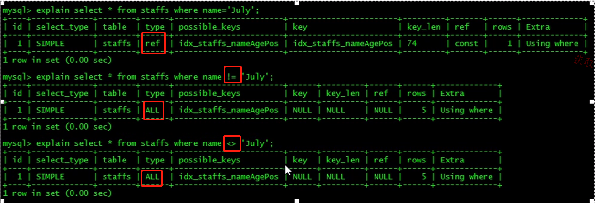

#### 		7、is null，is not null 也无法使用索引

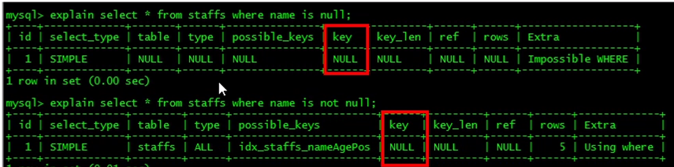

#### 		8、like以通配符（‘%abc...’）mysql 索引失效会变成全表扫描的操作

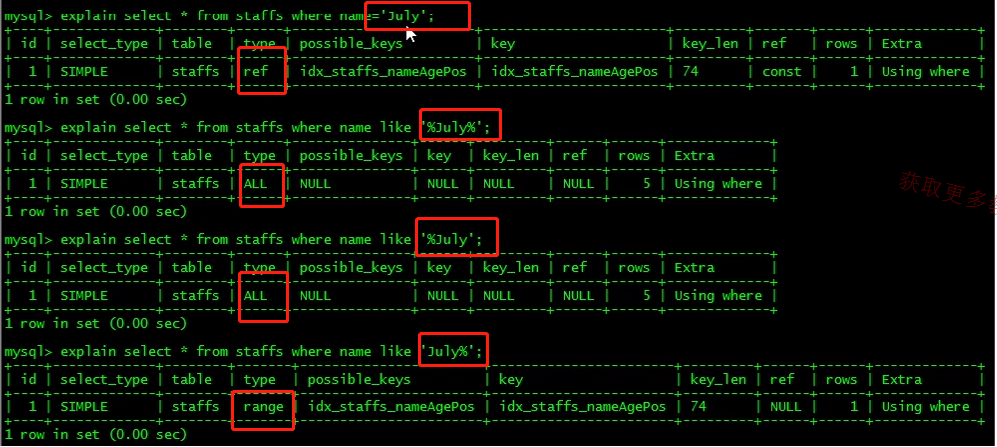

问题：解决like '%字符串%'时索引不被使用的方法？--------使用覆盖索引解决

​		建表：

```sql
CREATE TABLE tbl_user(
	id INT(11) NOT NULL auto_increment,
	NAME VARCHAR(20) DEFAULT NULL,
	age INT(11) DEFAULT NULL,
	email VARCHAR(20) DEFAULT NULL,
	PRIMARY KEY(id)
)ENGINE=INNODB DEFAULT CHARSET=utf8;

INSERT INTO tbl_user(NAME,age,email) VALUES('1aa1',21,'b@163.com');
INSERT INTO tbl_user(NAME,age,email) VALUES('2aa2',222,'c@163.com');
INSERT INTO tbl_user(NAME,age,email) VALUES('3aa3',265,'a@163.com');
INSERT INTO tbl_user(NAME,age,email) VALUES('4aa4',21,'d@163.com');
```

案例：

```shell
#没建索引之前
explain select NAME,age from tbl_user where name like '%aa%';

explain select id from tbl_user where name like '%aa%';
explain select NAME from tbl_user where name like '%aa%';
explain select age from tbl_user where name like '%aa%';

explain select id,NAME from tbl_user where name like '%aa%';
explain select id,NAME,age from tbl_user where name like '%aa%';
explain select NAME,age from tbl_user where name like '%aa%';
#结果 type:ALL  全表扫描

#创建索引
create index idx_user_nameAge on tbl_user(NAME,age);

#再次性能测试，以上全部不在是全表扫描

explain select * from tbl_user where name like '%aa%';---此语句，全表，索引失效了。覆盖不了索引失效。
```

#### 		9、字符串不加单引号索引失效

#### 		10、少用or，用它来连接时会索引失效

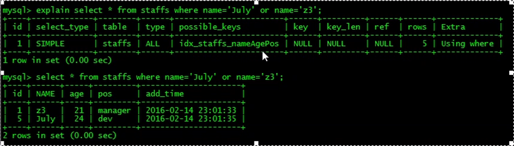

​		11、小总结

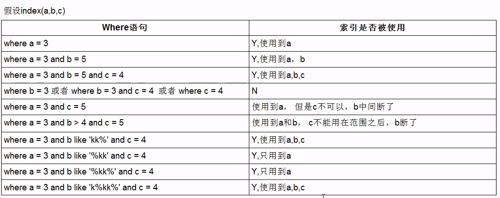

​	面试题讲解

​		题目sql

```shell
#建表sql
CREATE TABLE test03(
	id INT(10) PRIMARY KEY NOT NULL auto_increment,
	c1 CHAR(10),
	c2 CHAR(10),
	c3 CHAR(10),
	c4 CHAR(10),
	c5 CHAR(10)
)ENGINE=INNODB DEFAULT CHARSET=utf8;

INSERT INTO test03(c1,c2,c3,c4,c5) VALUES('a1','a2','a3','a4','a5');
INSERT INTO test03(c1,c2,c3,c4,c5) VALUES('b1','b2','b3','b4','b5');
INSERT INTO test03(c1,c2,c3,c4,c5) VALUES('c1','c2','c3','c4','c5');
INSERT INTO test03(c1,c2,c3,c4,c5) VALUES('d1','d2','d3','d4','d5');
INSERT INTO test03(c1,c2,c3,c4,c5) VALUES('e1','e2','e3','e4','e5');

#[建索引]
create index idx_test03_c1234 on test03(c1,c2,c3,c4);
mysql> show index from test03;

#问题：我们创建了复合索引idx_test03_c1234,根据以下sql分析下索引使用情况？
explain select * from test03 where c1='a1';
explain select * from test03 where c1='a1' and c2='a2';
explain select * from test03 where c1='a1' and c2='a2' and c3='a3';
explain select * from test03 where c1='a1' and c2='a2' and c3='a3' and c4='a4';
#以上全职匹配，全部用到索引

1）
explain select * from test03 where c1='a1' and c2='a2' and c3='a3' and c4='a4';
#全部使用索引
2)
explain select * from test03 where c1='a1' and c2='a2'  and c4='a4' and c3='a3';
#虽然是1243，但是mysql优化器，可以优化为1234
explain select * from test03 where c1='a1' and c2='a2'  and c4='a4' and c3='a3';
#虽然是4321，但是mysql优化器，可以优化为1234
3)
explain select * from test03 where c1='a1' and c2='a2'  and c3>'a3' and c4='a4';
#用到索引 123, 3楼的时候，是范围，导致4楼 索引失效。
4）
explain select * from test03 where c1='a1' and c2='a2'   and c4='a4' and c3>'a3';
#用到索引 1234，虽然是1243，且4楼是范围，但是mysql底层优化，为1234，索引全部用到
5）
explain select * from test03 where c1='a1' and c2='a2'   and c4='a4' order by c3;
#用到12是查找，3是排序，4断掉了没有用到。
6）
explain select * from test03 where c1='a1' and c2='a2'  order by c3;
#用到12是查找，3是排序。
7）
explain select * from test03 where c1='a1' and c2='a2'  order by c4;
#用到12是查找，4是排序。出现了filesort(九死一生)
8）
8.1）
explain select * from test03 where c1='a1' and c5='a5'  order by c2,c3;
#用到了1，直接排序了c2、c3，无filesort,所以只用到了 1个，
8.2）
explain select * from test03 where c1='a1' and c5='a5'  order by c3,c2;
#出现了filesort，我们建的索引是1234，它没有按照排序来，3 2 颠倒了
9）
explain select * from test03 where c1='a1' and c2='a2'  order by c2,c3;
#用到了索引12，
10）
explain select * from test03 where c1='a1' and c2='a2' and c5='a5' order by c2,c3;
#用到了索引12（c1和c2）,但是c2和c3用于排序，c5只是迷惑作用，无filesort
11）
explain select * from test03 where c1='a1' and c2='a2' and c5='a5' order by c3,c2;
#和8.2进行比较使用，相差一个 c2='a2'，有常量c2的情况下，不会产生filesort
12）
explain select * from test03 where c1='a1' and c4='a4' group by c2,c3;
#group by,此处用到了一个 c1 索引
12）
explain select * from test03 where c1='a1' and c4='a4' group by c3,c2;
#出现了filesort， temp.
```

​		==定值、范围还是排序，一般Order by是给个范围==  

​		==group by基本上都需先要进行就排序，会有临时表产生==  

### 3）、一般性建议

​	对于单键索引，尽量选择针对当前query过滤性更好的索引

​	在选择组合索引的时候，当前query中过滤性最好的字段在索引字段顺序中，位置越靠前越好。

​	在选择祝贺索引的时候，尽量选择可以能够包含当前query中的where字句中更多字段的索引

​	尽可能通过分析统计信息和调整query的写法来达到选择合适索引的目的

### 4）、记忆口诀

全职匹配我最爱，最左前缀要遵守；

带头大哥不能死，中间兄弟不能断；

索引列上少计算，范围之后全失效；

like百分写最右，覆盖索引不写星；

不等空值还有or，索引失效要少用；

var引号不可丢，SQL高级也不难；

# 三、查询截取分析

```properties
分析总结
1、慢查询的开启和捕获
2、explain + 慢SQL分析
3、show profile查询SQL在mysql服务器里面的执行细节和生命周期情况
4、SQL数据库服务器的参数调优
```

## 1、查询优化

### 	1）、永远小表驱动大表

​		类似于嵌套循环Nested Loop


​		CASE:

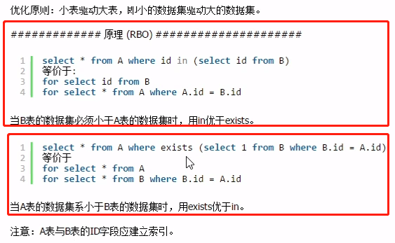

```properties
#EXISTS
SELECT ... FROM table WHERE EXISTS(subquery)
该语法可以理解为：将主查询的数据，放到子查询中做条件验证，根据验证结果（TRUE或FALSE）来决定主查询的数据结果是否得以保留。
#提示
1:EXISTS(subquery)只返回TRUE 或FALSE，因此子查询的SELECT  *  也可以是SELECT 1 或其他，官方说法是实际执行时会忽略SELECT清单，因此没有区别
2:EXISTS 值查询的实际执行过程可能经过了优化而不是我们理解的逐条对比，如果担忧效率问题，可以进行实际检验以确定是否有效率问题。
3:EXISTS子查询往往也可以用条件表达式、其他子查询或者JOIN来代替，何种最优需要具体问题具体分析
```


### 	2）、Order by关键字优化

​		a:**Order by子句，尽量使用index方式排序，避免使用FileSort方式排序**

​		(1)建表

```shell
CREATE TABLE tblA(
	age INT(11),
	birth TIMESTAMP NOT NULL
)ENGINE=INNODB DEFAULT charset=utf8;

INSERT INTO tblA(age,birth) VALUES(22,NOW());
INSERT INTO tblA(age,birth) VALUES(23,NOW());
INSERT INTO tblA(age,birth) VALUES(24,NOW());

CREATE INDEX idx_A_ageBirth on tblA(age,birth);
```

​		(2)CASE1:

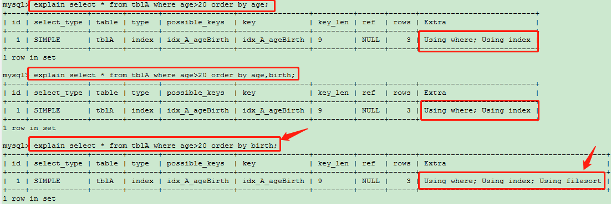

​		(3)CASE2:

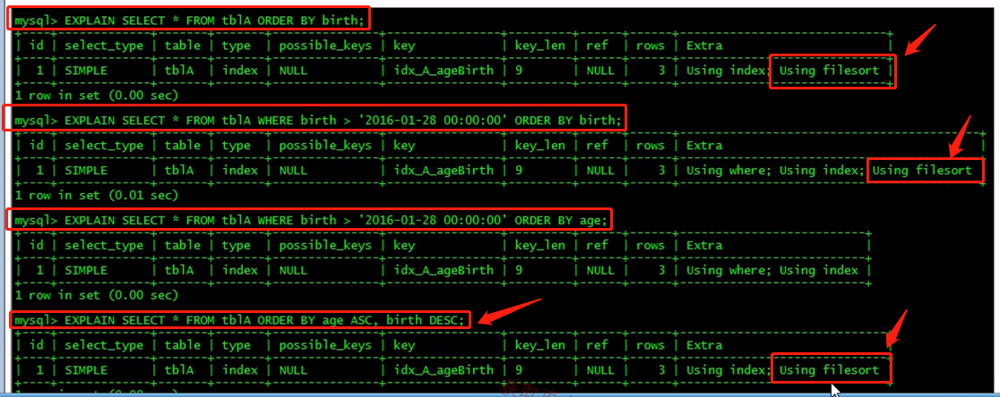

​		(4)

mysql支持两种方式的排序，filesort和index，index效率高，它指mysql扫描索引本身完成排序。filesort方式效率较低

​		(5)order by 满足两种情况，会使用index方式排序；

​			情况1：Order by语句使用索引最左前列

​			情况2：使用where子句与Order by子句条件列组合满足索引最左前列。

​					

​		**尽可能在索引上完成排序操作，遵照索引建的最佳左前缀**

​		**如果不在索引列上，filesort有两种算法：双路排序和单路排序**

```shell
#双路排序
	mysql4.1之前是使用双路排序，字面意思了就是两次扫描磁盘，最终得到数据，读取行指针和Orderby列，对他们进行排序，然后扫描已经排序好的列表，按照列表中的值重新从列表中读取对应的数据输出
	从磁盘取排序字段，在buffer进行排序，再从磁盘取其他字段。
	
#取一批数据，要对磁盘镜像了两次扫描，众所周知，i/o是很耗时的，所以在mysql4.1之后，出现了单路排序

#单路排序
	从磁盘读取查询需要的所以列，按照Order by列在buffer对它们进行排序，然后扫描排序后的列表进行输出，
	它的效率更快一些，避免了第二次读取数据。并且把随机I/O变成了顺序IO，但是它会使用更多得空间。
	因为他把每一行都保存在内存中了。

#结论及引申出的问题
	由于单路是后出的，总体而言好过双路
	但是用单路有问题：
	在sort_buffer中，方法B比方法A要多占用很多空间，因为方法B是把所有字段都取出来，所有有可能取出的数据的总大小超出了sort_buffer的总量，导致每次只能取sort_buffer容量大小的数据，进行排序（创建temp，多了合并），排完再取sort_buffer容量大小，再排........从而多次I/O。
	本来想省一次I/O操作，反而导致了大量的I/O操作，反而得不偿失。
```

​		**优化策略**

​		（1）增大sort_buffer_size参数设置

​		（2）增大max_length_for_sort_data参数的设置

​		（3）why？

```properties
提高Order by的速度

1:order by 时select * 是一个大忌只query需要的字段，这点非常重要。在这里的影响是：
	1.1当query的字段大小总和小于max_length_for_sort_data而且排序字段不是TEXT|BLOB类型时，会用改进后的算法--单路排序，否则用老算法--多了排序。
	1.2两种算法的数据都有可能超出sort_buffer的容量，超出之后，会创建tmp文件进行合并排序，导致多次IO，但是用单路排序算法会更大一些，所以提高sort_buffer_size.
2:尝试提高sort_buffer_size
	不管哪种算法，提高这个参数都会提高效率，当然，要根据系统的能力去提高，因为这个参数是针对每个进程的。
3:尝试提高max_length_for_sort_data
	提高这个参数，会增加用改进算法的概率。但是如果设的太高，数据中容量超出sort_buffer_size的概率就增大，明显症状是高的磁盘IO活动和低的处理器使用率。
```

​		**小总结**

```properties
为排序使用索引
	1:mysql两种排序方式：文件排序或扫描有序索引排序
	2:mysql能为排序与查询使用相同的索引
	KEY a_b_c(a,b,c)
	
	order by能使用索引最左前缀
	-ORDER BY a
	-ORDER BY a,b
	-ORDER BY a,b,c
	-ORDER BY a DESC,b DESC,c DESC	
	
	若果WHERE使用索引的最左前缀定义为常量，则Order by能使用索引
	-WHERE a = const ORDER BY b,c
	-WHERE a = const AND b = const ORDER BY c
	-WHERE a = const ORDER BY b,c
	-WHERE a = const AND b>const ORDER BY b,c
	
	不能使用索引进行排序
	-ORDER BY a ASC,b DESC,c DESC  /*排序不一致*/
	-WHERE g = const ORDER BY b,c  /*丢失a索引*/
	-WHERE a = const ORDER BY c    /*丢失b索引*/
	-WHERE a = const ORDER BY a,d  /*d不是索引的一部分*/
	-WHERE a in(...) ORDER BY b,c  /*对排序来说，多个相等条件也是范围查询*/
```

### 	3）、group by关键字优化

​		group by实质是先排序后分组，遵照索引建的最佳左前缀

​		当无法使用索引列，增大max_length_for_sort_data参数的设置+增大sort_buffer_size参数的设置

​		where高于having，能写在where限定的条件就不要去having限定了。

## 2、慢查询日志

### 	1）、是什么

```properties
*mysql的慢查询日志是mysql提供的一种日志记录，它用来记录在mysql中响应时间超过阀值的语句，具体指运行时间超过long_query_time值得sql,则会被记录到慢查询日志中。

*具体指运行时间超过long_query_time值得sql,则会被记录到慢查询日志中。long_query_time的默认值为10，意思是运行10秒以上的语句。

*由他来查看那些sql超出了我们的最大忍耐时间值，比如一条sql执行超过5秒钟，我们就算慢sql,希望能收集超过5秒的sql,结合之前explain进行全面的分析。
```

### 	2）、怎么玩

​		说明

```properties
默认情况下，mysql数据库没有开启慢查询日志，需要我们手动来设置这个参数。

当然，如果不是调优需要的话，一般不建议启动该参数，因为开启慢查询日志会或多或少带来一定的性能影响。慢查询日志支持将日志记录写入文件。
```

​		查看是否开启及如何开启?

​			默认：

```shell
mysql> show variables like '%slow_query_log%';
+---------------------+--------------------------------------+
| Variable_name       | Value                                |
+---------------------+--------------------------------------+
| slow_query_log      | OFF                                  |
| slow_query_log_file | /var/lib/mysql/057ab2a621aa-slow.log |
+---------------------+--------------------------------------+

#默认情况下slow_query_log的值为 OFF ，表示慢查询日志是禁用的，
#可以通过设置slow_query_log的值来开
```

​			开启：

```shell
mysql> set global slow_query_log=1;

#使用set global slow_query_log=1开启了慢查询日志只对当前数据库生效，
#mysql重启后则会失效
```

​		开启了慢查询日志后，什么样的SQL才会记录到慢查询日志里面呢?

```properties
这个是由参数long_query_time控制，默认情况下long_query_time的值为10秒，
命令:show variables like '%long_query_time%';

mysql> show variables like '%long_query_time%';
+-----------------+-----------+
| Variable_name   | Value     |
+-----------------+-----------+
| long_query_time | 10.000000 |
+-----------------+-----------+

可以使用命令修改，也可以在my.cnf参数里面修改。
```

​		case

​			（1）查看当前多少秒算慢

```shell
mysql> show variables like '%long_query_time%';
+-----------------+-----------+
| Variable_name   | Value     |
+-----------------+-----------+
| long_query_time | 10.000000 |
+-----------------+-----------+
```

​			（2）设置的阀值时间

```shell
使用命令
set global long_query_time=3;
修改为阀值到3秒钟的就是慢sql

mysql> set global long_query_time=3;
Query OK, 0 rows affected

mysql> show variables like '%long_query_time%';
+-----------------+-----------+
| Variable_name   | Value     |
+-----------------+-----------+
| long_query_time | 10.000000 |
+-----------------+-----------+

#可以看出修改后，任然是10秒，莫非修改无效？
```

​			（3）为什么设置后看不出变化

```shell
#为什么修改以后看不到修改的变化
	方法1：需要重新连接或新开一个会话才能看到修改值。
		  SHOW VARIABLES LIKE '%long_query_time%';
	方法2：SHOW global VARIABLES LIKE '%long_query_time%';
```

​			（4）记录慢sql并后续分析

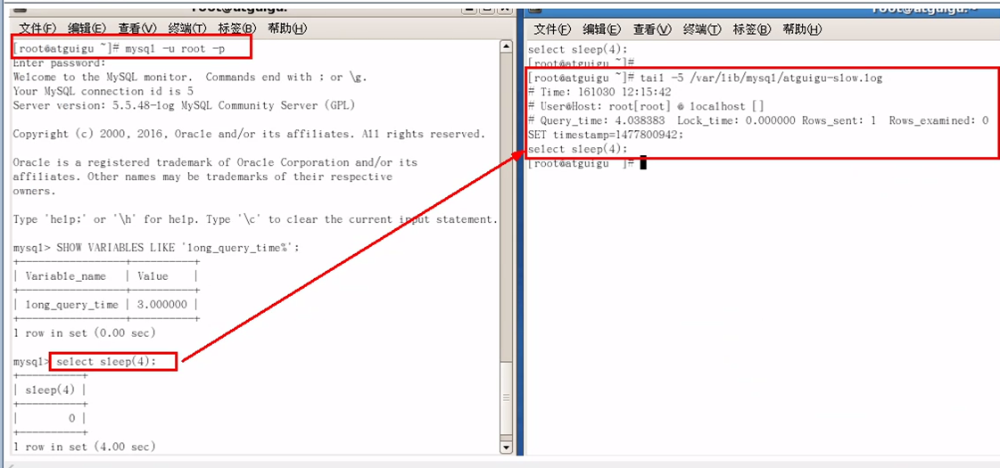

​			（5）查询当前系统中有多少条慢查询记录

```shell
mysql> show global status like '%Slow_queries';
+---------------+-------+
| Variable_name | Value |
+---------------+-------+
| Slow_queries  | 0     |
+---------------+-------+
```

​		配置版

```properties
【mysqld】下配置：
slow_query_log=1;
slow_query_log_file=/var/lib/mysql/atguigu-slow.log
long_query_time=3;
log_output=FILE
```

### 	3）、日志分析工具

​			在生产环境中，如果要手工分析日志，查找，分析SQL,显然是个体力活，mysql提供了日志分析工具mysqldumpslow。

#### 		**查看mysqldumpslow的帮助信息**   

[root@localhost logs]# mysqldumpslow --help

```properties
		s:是表示按照何种方式排序；

		c:访问次数

		l:锁定时间

		r:返回记录

		t:查询时间

		al:平均锁定时间

		ar:平均返回记录数

		at:平均查询时间

		t:即为返回前面多少条的数据；

		g:后边搭配一个正则匹配模式，大小写不敏感的

```

#### 		**工作常用参考** 

```shell
#得到返回记录集最多的10个sql
mysqldumpslow -s r -t 10 /var/lib/mysql/atguigu-slow.log

#得到访问次数最多的10个sql
mysqldumpslow -s c -t 10 /var/lib/mysql/atguigu-slow.log

#得到按照时间排序的前10条里面含有左连接的查询语句
mysqldumpslow -s t -t 10 -g "left join" /var/lib/mysql/atguigu-slow.log

#另外建议在使用这些命令时结合|和more使用，否则有可能出现爆屏情况
mysqldumpslow -s r -t 10 /var/lib/mysql/atguigu-slow.log|more
```


## 3、批量数据脚本

------------往表里插入1000W数据

### 	1）、建表

```sql
#新建库
create database bigData;
use bigData;

#1 建表dept
create table dept(
	id int unsigned primary key auto_increment,
  	deptno mediumint unsigned not null default 0,
  	dname varchar(20) not null default "",
  	loc varchar(13) not null default ""
)engine=innodb default charset=GBK;

#2 建表emp	
create table emp(
	id int unsigned primary key auto_increment,
  	empno MEDIUMINT unsigned not null default 0,
  	ename varchar(20) not null default "",
  	job varchar(9) not null default "",
  	mgr MEDIUMINT unsigned not null default 0,
  	hiredate date not null,
  	sal DECIMAL(7,2) not null,
  	comm DECIMAL(7,2) not null,
  	deptno MEDIUMINT unsigned not null default 0
)engine=innodb default charset=GBK;
```

### 	2）、设置参数log_bin_trust_function_creators

```shell
创建函数，假如报错：this function has none of DETERMINISTIC......
#由于开启过慢查询日志，因为我们开启了bin-log,我们就必须为我们的function指定一个参数。

show variables like 'log_bin_trust_function_creators';

set global log_bin_trust_function_creators=1;

#这样添加了参数以后，如果mysql重启，上述参数又会消失，永久方法：

windows下my.ini[mysqld]加上log_bin_trust_function_creators=1

linux下  /etc/my.cnf 下my.cnf[mysqld] 加上log_bin_trust_function_creators=1
```


### 	3）、创建函数，保证每条数据都不同

​		随机产生字符串

```mysql
DELIMITER $$
CREATE FUNCTION rand_string(n INT) RETURNS VARCHAR(255)
BEGIN
	DECLARE chars_str VARCHAR(100) DEFAULT 'abcdefghijklmnopqrstuvwxyzABCDEFGHIJKLMNOPQRSTUVWXYZ';
	DECLARE return_str VARCHAR(255) DEFAULT '';
	DECLARE i INT DEFAULT 0;
	WHILE i < n DO
	SET return_str =CONCAT(return_str,SUBSTRING(chars_str,FLOOR(1+RAND()*52),1));
	SET i = i + 1;
	END WHILE;
	RETURN return_str;
END $$
```

​		随机产生部门编号

```mysql
DELIMITER $$
CREATE FUNCTION rand_num()
RETURNS INT(5)
BEGIN
	DECLARE i INT DEFAULT 0;
	SET i = FLOOR(100+RAND()*10);
	RETURN i;
END $$

#假如要删除
#drop func rand_num;
```


### 	4）、创建存储过程

​		创建emp表中插入数据的存储过程

```mysql
DELIMITER $$
CREATE PROCEDURE insert_emp(IN START INT(10),IN max_num INT(10))
BEGIN
	DECLARE i INT DEFAULT 0;
	#set autocommit=0 把autocommit 设置为0
	SET autocommit = 0;
	REPEAT
	SET i = i + 1;
	INSERT INTO emp (empno,ename,job,mgr,hiredate,sal,comm,deptno) VALUES((START+i),rand_string(6),'SALESMAN',0001,CURDATE(),2000,400,rand_num());
	UNTIL i = max_num
	END REPEAT;
	COMMIT;
END $$
```

​		创建dept表中插入数据的存储过程

```mysql
DELIMITER $$
CREATE PROCEDURE insert_dept(IN START INT(10),IN max_num INT(10))
BEGIN
	DECLARE i INT DEFAULT 0;
	SET autocommit = 0;
	REPEAT
	SET i = i + 1;
	INSERT INTO dept (deptno,dname,loc) VALUES((START+i),rand_string(10),rand_string(8));
	UNTIL i = max_num
	END REPEAT;
	COMMIT;
END $$
```


### 	5）、调用存储过程

​		dept

```shell
DELIMITER ;
CALL insert_dept(100,10);
```

​		emp

```shell
#执行存储过程，往emp表添加50万条数据

DELIMITER ;
CALL insert_emp(100001,500000);
```


## 4、show profile

### 	是什么:

是mysql提供可以用来分析当前会话中语句执行的资源消耗情况。可以用于sql的调优和测量

### 	官网：

​	默认情况下，参数处于关闭状态，并保持最近15次的运行结果

### 	分析步骤

#### 		1）、是否支持，看看当前的mysql版本是否支持

```shell
Show variables like 'profiling';
默认是关闭，使用前需要开启
mysql> Show variables like 'profiling';
+---------------+-------+
| Variable_name | Value |
+---------------+-------+
| profiling     | OFF   |
+---------------+-------+
```

#### 		2）、开启功能，默认是关闭，使用前需要开启

```shell
mysql> set profiling=on;
Query OK, 0 rows affected
```

#### 		3）、运行sql

```mysql
select * from emp group by id%10 limit 150000;

select * from emp group by id%20 order by 5;
```

#### 		4）、查看结果，show profiles;

```mysql
mysql> show profiles;
+----------+------------+----------------------------------------------------------------+
| Query_ID | Duration   | Query                                                          |
+----------+------------+----------------------------------------------------------------+
|        1 |   0.000778 | Show variables like 'profiling'                                |
|        2 | 0.05251175 | select * from tbl_emp                                          |
|        3 |   0.028765 | select * from tbl_emp e inner join tbl_dept d on e.deptId=d.id |
|        4 |   0.000385 | select * from tbl_emp e inner join tbl_dept d on e.deptId=d.id |
|        5 |   0.000375 | select * from tbl_emp e inner join tbl_dept d on e.deptId=d.id |
|        6 | 0.59920725 | select * from emp group by id%10 limit 150000                  |
|        7 |   0.661562 | select * from emp group by id%20 order by 5                    |
|        8 |   0.000156 | show profies                                                   |
+----------+------------+----------------------------------------------------------------+
```

#### 		5）、诊断sql，show profile cpu,block io for query 上一步前面的问题SQL数据号码；

```
mysql> show profile cpu,block io for query 3;
```

​			==参数备注：==  

```shell
type:
|ALL		 		--显示所有的开销信息

|BLOCK IO 			--显示块IO相关开销
|CONTEXT SWITCHES  --上下文切换相关开销
|CPU				--显示CPU相关开销
|IPC				--显示发送和接收相关开销信息
|MEMORY				--显示内存相关开销信息
|PAGE FAULTS		--显示页面错误相关开销信息
|SOURCE				--显示和Source_function,Source_file,Source_line相关的开销信息
|SWAPS				--显示交换次数相关开销的信息
```

#### 		6）、日常开发需要注意的结论

​			converting HEAP to MyISAM 查询结果太大，内存都不够用了，往磁盘上搬了

​			Creating tmp table 创建临时表

​				拷贝数据到临时表

​				用完再删除

​			Copying to tmp table on disk 把临时表复制到磁盘，危险！！

​			locked

## 5、全局查询日志

### 	1）、配置启用

### 	2）、编码启用

### 	3）、永远不要在生产环境开启这个功能

# 四、MYSQL锁的机制

## 1、概述

### 	（1）定义

```properties
锁是计算机协调多个进程或线程并发访问某一资源的机制。

在数据库中，除传统的计算资源（CPU,RAM,I/O等）的征用以外，数据也是一种供许多用户共享的资源。如何保证数据并发访问的一致性，有效是所有数据库必须解决的一个问题，锁冲突也是影响数据库并发访问性的重要因素，从这个角度，锁对数据库而言显得尤其重要，也更加复杂。
```

### 	（2）生活购物

```properties
打个比方，我们在淘宝上买一件商品，商品只有一件库存，这个时候如果还有另一个人买，name如何解决是你买到还是另一个人买到的问题？

这里肯定要用到事务，我们先从库存表中取出物品数量，然后插入订单，付款后插入付款表信息，然后更新商品数量，在这个过程中，使用锁可以对有限的资源进行保护，解决格尼和并发问题。
```


### 	（3）锁的分类

​		a、从对数据操作的类型（读/写）分

```
读锁（共享锁）：针对同一份数据，多个读操作可以同时进行而不会相互影响。
```

```
写锁（排它锁）：当前写操作没有完成前，它会阻断其它写锁和读锁。
```

​		b、从对数据操作的粒度分--（表锁/行锁）


## 2、三锁

### 	（1）表锁（偏读）

#### 		a、特点

偏向MyISAM存储引擎，开销小，加锁快，无死锁，锁定粒度大，发生锁冲突概率最高，并发度最低。

#### 		b、案例分析

##### 			1）建表sql

```mysql
CREATE TABLE mylock(
	id INT NOT NULL PRIMARY KEY auto_increment,
	name VARCHAR(20)
)ENGINE myisam;

insert into mylock(name) values('a');
insert into mylock(name) values('b');
insert into mylock(name) values('c');
insert into mylock(name) values('d');
insert into mylock(name) values('e');

#手动增加表锁
lock table 表名字 read（write），表名字2 read(write),其它;


#查看表上过的锁
show open tables;

#给mylock上read锁，给book表上write锁
lock table mylock read,book write;

#释放锁
unlock tables;
```

##### 			2）加读锁

我们为mylock表加read锁（读阻塞写例子）

| session1                                 | session2                                 |
| ---------------------------------------- | ---------------------------------------- |
| 获得表mylock的READ锁定<br /> | 连接终端                                     |
| 当前session可以查询该表记录<br />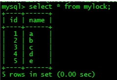 | 其它session也可以查询当前记录<br />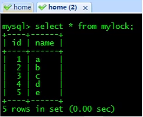 |
| 当前session不能查询其它没有锁的表<br /> | 其它session可以 查询或者更新未锁定的表<br />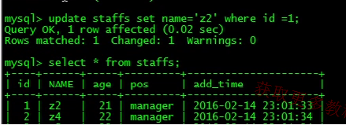 |
| 当前session中插入或者更新锁定的表都会提示报错<br />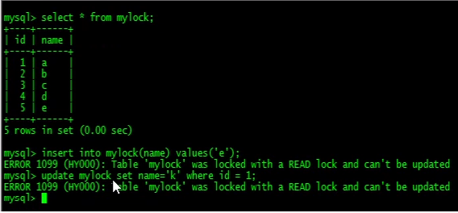 | 其它session插入或者更新锁定表会一直等待获得锁；<br />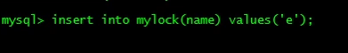 |
| 释放锁<br />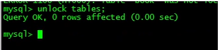           | session2获得锁，插入操作完成<br />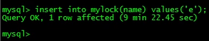 |
|                                          |                                          |
|                                          |                                          |

##### 			3）加写锁

我们为mylock表加write锁（MyISAM存储引擎的写阻塞读例子）

| session1                                 | session2                                 |
| ---------------------------------------- | ---------------------------------------- |
| 获得表mylock的write锁定<br />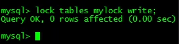 | 待session开启写锁后，session2再连接终端              |
| 当前session对锁定表的查询+更新+插入操作都可以进行<br />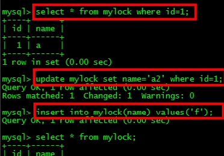 | 其它session对锁定表的查询被阻塞，需要等待锁被释放<br />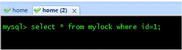<br />如果可以，请换成不同的ID来进行测试，因为mysql有缓存，第二次从缓存中取出 |
| 释放锁<br />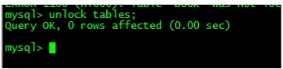          | session2获得锁，查询返回；<br />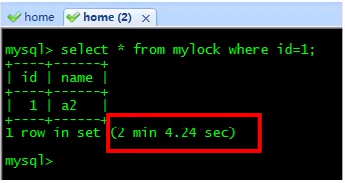 |
|                                          |                                          |
|                                          |                                          |

#### 		c、案例结论

```
MyISAM在只想查询语句（select）前，会自动给涉及的所有表加读锁，在执行增删改操作前，会自动给涉及的表加写锁。

MySQL的表级锁有两种模式：
	表共享读锁（Table Read Lock）
	表独占写锁（Table Write Lock）
```

| 锁类型  | 可否兼容 | 读锁   | 写锁   |
| ---- | ---- | ---- | ---- |
| 读锁   | 是    | 是    | 否    |
| 写锁   | 是    | 否    | 否    |

结论：

​	结合上表，所有对MySAM表进行操作，会有一下情况：

​	1、对MyISAM表的读操作（加读锁），不会阻塞其它进程对同一表的读请求，但会阻塞对同一张表的写请求。只有当读锁释放后，才会执行其它进程的写操作。

​	2、对MyISAM表的写操作（加写锁），会阻塞其它进程对同一表的读和写操作，只有当写锁释放后，才会执行其它进程的读写操作。

​	**==简而言之，就是读锁会阻塞写，但是不会阻塞读。而写锁则会把读和写都阻塞。==**  

#### 		d、表锁分析

​			【看看那些表被加锁了】

​			mysql>show open tables;

​			【如何分析表锁定】

​			可以通过检查table_locks_waited和table_locks_immediate状态变量来分析系统上的表锁定；

​			SQL: show status like 'table';

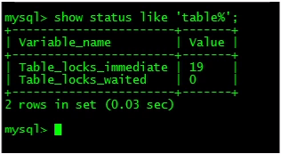

```
这里有两个状态变量记录mysql内部表级锁定的情况，两个变量说明如下：
Table_locks_immediate:产生表级锁定的次数，表示可以立即获取锁的查询次数
Table_locks_waited：出现表级锁定争用而发生等待的次数（不能立即获取锁的次数，每次等待 值+1），此值较高，说明存在着严重的表级锁争用情况；
```

==**此外，Mysiam的读写锁调度室写优化，这也是myisam不适合做写为主表的引擎。因为写锁后，其它线程不能做任何操作，大量的更新会使查询很难得到锁，从而造成永久阻塞。**==  

### 	（2）行锁（偏写）

#### 		a、特点:

偏向Innodb存储引擎，开销大，加锁慢；会出现死锁；锁定粒度最小，发送锁冲突概率最低，并发也最高。

innodb与MyISAM的最大不同有两点：一是支持事务；二是支持行级锁；

#### 		b、复习老知识，==由于行锁支持事务==，

```properties
#事务及其ACID属性
事务是由一组sql语句组成的逻辑处理单元，事务具有以下4个属性，通常简称为事务的ACID属性。

原子性（Atomicity）:事务是一个原子操作单元，其对数据的修改，要么全部执行，要么全不执行。
一致性（Consistent）:在事务开始和完成时，数据都必须保持一致状态。这意味着所有相关的数据规则都必须应用于事务的修改，以保持数据的完整性；事务结束时，所有的内部数据结构（如B树索引或双休链表）也都必须正确
隔离性（Isolation）:数据库系统提供一定的隔离机制，保证事务在不受外部并发操作的“独立”环境执行。着意味着事务处理过程的中间状态对外部是不可见的，反之亦然。
持久性（Durable）:事务完成之后，它对数据的修改是永久性的，即使出现系统故障也能够保持。

#并发事务处理带来的问题
1、丢失更新
当两个或多个事务选择一行，然后基于最初选的的值更新该行是，由于每事务都不知道其它事务的存在，就会发生丢失更新问题----最后更新覆盖了由其它事务所做的更新。

例如，两个程序员修改同一java文件。每程序员独立地更改其副本，然后保存更改后的副本，这样就覆盖了原始文档。最后保存期更改副本的编辑人员覆盖前一个程序员所做的更改。

如果一个程序员完成并提交事务，另一个程序员不能访问该文件，则可以避免此问题

2、脏读
一句话:事务A读取到了事务B***已修改但未提交***的数据，还在这个数据基础上做了操作。此时，如果B事务回滚，A读取的数据无效，不符合一致性要求。

3、不可重复读
一个事务在读取某些数据后的某个时间，再次读取以前读过的数据，却发现其读出的数据已经发送了改变、或某些记录已经被删除了！这种现象就叫做“不可重复读”。

一句话：事务A读取到了事务B已经提交的修改数据，不符合隔离性。

4、幻读
一个事务按相同的查询条件重新读取以前检索过的数据，却发现其他事务插入了满足其查询条件的新数据，这种现象就称为“幻读”。

一句话:事务A读取到了事务B提交的新增数据，不符合隔离性。

多说一句:幻读和脏读有点类似，
	脏读是事务B里面修改了数据，
	幻读是事务B里面新增了数据，

#事务隔离级别
脏读、不可重复读、幻读，其实都是数据库读一致性问题，必须由数据库提供一定的事务隔离机制来解决。

数据库的事务隔离越严重，并发副作用越小，但付出的代价也就越大，因为事务隔离实质上就是使事务在一定程度上“串行化”进行，这显然与“并发”是矛盾的。同事，不同的应用对读一致和事务隔离程度的要求也是不同的，比如许多应用对“不可重复读”和“幻读”并不敏感，可能更关心数据并发访问的能力。

常看当前数据库的事务隔离级别：show variables like 'tx_isolation';

mysql> show variables like 'tx_isolation';
+---------------+-----------------+
| Variable_name | Value           |
+---------------+-----------------+
| tx_isolation  | REPEATABLE-READ |
+---------------+-----------------+
```


#### 		c、案例分析

​			（1）建表

```mysql
create table test_innodb_lock (a INT(11),b varchar(16))ENGINE=INNODB DEFAULT charset=utf8;

insert into test_innodb_lock values(1,'b2');
insert into test_innodb_lock values(3,'3');
insert into test_innodb_lock values(4,'4000');
insert into test_innodb_lock values(5,'5000');
insert into test_innodb_lock values(6,'6000');
insert into test_innodb_lock values(7,'7000');
insert into test_innodb_lock values(8,'8000');
insert into test_innodb_lock values(9,'9000');
insert into test_innodb_lock values(1,'b1');

create index test_innodb_a_ind on test_innodb_lock(a);

create index test_innodb_lock_b_ind on test_innodb_lock(b);
```

​			（2）行锁定基本演示

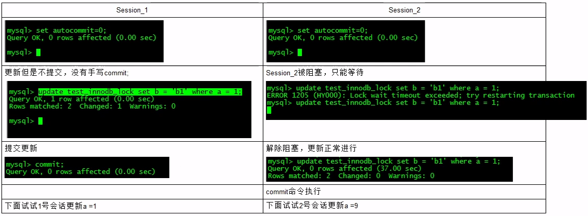

​			（3）无效索引行锁升级为表锁，阻塞表，变慢

​			（4）间隙锁危害

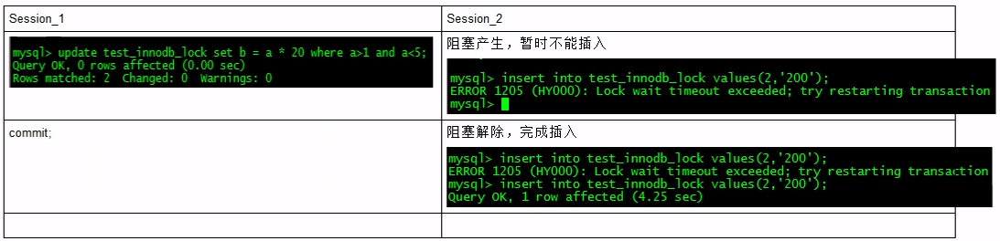

```properties
#什么是间隙锁
当我们用范围条件而不是相等条件共享或排他锁是，InnoDB会给符合条件的已有数据记录的索引加锁；对键值在条件范围内但不存在的记录，叫做 “间隙锁（GAP）”

#【危害】
因为query执行过程中通过范围查找的话，他会锁定整个范围内所有的索引键值，即使这个键值并不存在。
间隙锁有个比较致命的弱点，就是当锁定一个范围键值之后，即使某些不存在得到键值也会被无辜锁定，从而造成在锁定的时候，无法插入锁定键值范围内的任何数据。在某些场景下这可能会对性能造成很大的危害
```

​			（5）面试题：常考如何锁定一行

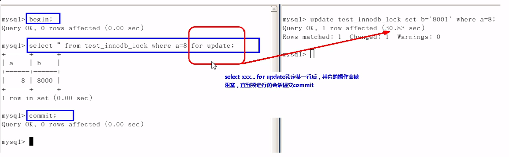

​			

#### 		d、案例结论

```properties
	innodb存储引擎由于现实了行级锁定，虽然在锁定机制的实现方面所带来的性能损耗可能比表级锁定会要更高一些，但是在整体并发处理能力方面要远远优于MyISAM的表级锁定的。当系统并发量较高时，innodb的整体性能和MyISAM相比就会明显的优势。
	但是innodb的行级锁定同样也有其脆弱的一面，当我们使用不当的时候，可能会让innodb整体性能表现不仅不能比MyISAM高，甚至可能会更差。
```

#### 		e、行锁分析

```properties
#【如何分析行锁定】
通过检查innodb_row_lock状态变量来分析系统上的行锁的争夺情况
mysql> show status like 'innodb_row_lock%';
+-------------------------------+-------+
| Variable_name                 | Value |
+-------------------------------+-------+
| Innodb_row_lock_current_waits | 0     |
| Innodb_row_lock_time          | 0     |
| Innodb_row_lock_time_avg      | 0     |
| Innodb_row_lock_time_max      | 0     |
| Innodb_row_lock_waits         | 0     |
+-------------------------------+-------+

对各个状态量的说明如下：
innodb_row_lock_current_waits:当前正在等待锁定的数量；
innodb_row_lock_time:从系统启动到现在锁定总时间长度；
Innodb_row_lock_time_avg:每次等待所花平均时间
Innodb_row_lock_time_max:从系统启动到现在等待最长的一次，所花的时间
Innodb_row_lock_waits:系统启动后到现在总共等待的次数；-----

#对于这5个状态变量，比较重要的***主要**是
innodb_row_lock_time_avg(等待平均时长),
innodb_row_lock_waits(等待总次数)
innodb_row_lock_time(等待总时长)这三项。
尤其是当等待次数很高，而且每次等待时长也不小的时候，我们就需要分析系统中为什么会有如此多的等待，然后根据分析结果来着手制定优化计划。（show profiles）
```


#### 		f、优化建议

```properties
1、尽可能让所有数据检索都通过索引来完成，避免无效索引行锁升级为表锁。
2、合理设计索引，尽量缩小锁的范围
3、尽可能较少检索条件，避免间隙锁
4、尽量控制事务大小，减少锁定资源量和时间长度
5、尽可能低级别事务隔离
```


## 	3、页锁

​		a、开销和加锁时间介于表锁和行锁之间；会出现死锁；锁定粒度介于表锁和行锁之间，并发度一般。

​		b、了解一下即可

# 五、主从复制

## 1、复制的基本原理

​	（1）slave会从master读取binlog来进行数据同步

​	（2）三步骤+原理图

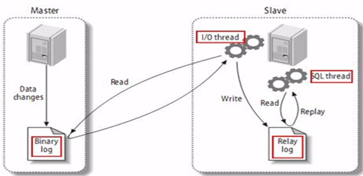

```properties
mysql复制过程分为3步
1、master将改变记录到二进制日志（binary log）。这些记录过程叫做二进制日志事件binary log events。
2、slave将master的binary log events拷贝到它的中继日志（relay log）
3、slave重做中继日志中的事件，将改变应用到自己的数据库中。mysql复制是异步且串行话的
```

## 2、复制的基本原则

​	（1）每个slave只有一个master

​	（2）每个slave只能有一个唯一的服务器ID

​	（3）每个master可以有多个salve

## 3、复制的最大问题

​	----------延时	

## 4、一主一从最常见配置

​	（1）mysql版本一致且后台以服务运行

​	（2）主从都配置在==【mysqld】==节点下，都是小写

​	（3）主机修改my.ini配置文件

​	（4）从机修改my.cnf配置文件

​	（5）因修改过配置文件，请主机+从机都重启后台mysql服务

​	（6）主机从机都关闭防火墙

​	（7）在Windows==主机==上建立账户并授权slave

​	（8）在Linux==从机==上配置需要复制的主机

​	（9）主机新建库、新建表、insert记录，从机复制

​	（10）stop slave；  如何停止从服务复制功能

## 5、docker 下mysql主从复制

​	linux手动关闭防火墙 service iptables stop;

​	[基于Docker的Mysql主从复制搭建](https://www.cnblogs.com/songwenjie/p/9371422.html)

为什么基于Docker搭建？

- 资源有限

- 虚拟机搭建对机器配置有要求，并且安装mysql步骤繁琐

- 一台机器上可以运行多个Docker容器

- Docker容器之间相互独立，有独立ip，互不冲突

- Docker使用步骤简便，启动容器在秒级别

  ### （1）安装主从机mysql安装

  **Master(主)：**

  `docker run -p 3339:3306 --name mymysql -e MYSQL_ROOT_PASSWORD=123456 -d mysql:5.7`

  **Slave(从)：**

  `docker run -p 3340:3306 --name mymysql -e MYSQL_ROOT_PASSWORD=123456 -d mysql:5.7`

  Master对外映射的端口是3339，Slave对外映射的端口是3340。因为docker容器是相互独立的，每个容器有其独立的ip，所以不同容器使用相同的端口并不会冲突。这里我们应该尽量使用mysql默认的3306端口，否则可能会出现无法通过ip连接docker容器内mysql的问题。

  ### （2）此时可以使用Navicat等工具测试连接mysql

  ### （3）配置Master（主机）

  ```shell
  通过docker exec -it 627a2368c865 /bin/bash命令进入到Master容器内部，也可以通过docker exec -it mysql-master /bin/bash命令进入。627a2368c865是容器的id,而mysql-master是容器的名称。

  cd /etc/mysql切换到/etc/mysql目录下，然后vi my.cnf对my.cnf进行编辑。此时会报出bash: vi: command not found，需要我们在docker容器内部自行安装vim。使用apt-get install vim命令安装vim

  会出现如下问题：

  Reading package lists... Done
  Building dependency tree       
  Reading state information... Done
  E: Unable to locate package vim

  执行apt-get update，然后再次执行apt-get install vim即可成功安装vim。然后我们就可以使用vim编辑my.cnf，在my.cnf中添加如下配置：

  [mysqld]
  ## 同一局域网内注意要唯一
  server-id=100  
  ## 开启二进制日志功能，可以随便取（关键）
  log-bin=mysql-bin

  #配置完成之后，需要重启mysql服务使配置生效。使用service mysql restart完成重启。重启mysql服务时会使得docker容器停止，我们还需要docker start mysql-master启动容器。

  #下一步在Master数据库创建数据同步用户，授予用户 slave REPLICATION SLAVE权限和REPLICATION CLIENT权限，用于在主从库之间同步数据。

  CREATE USER 'slave'@'%' IDENTIFIED BY '123456';

  GRANT REPLICATION SLAVE, REPLICATION CLIENT ON *.* TO 'slave'@'%';
  ```

  ###   （4）配置Slave(从)

  和配置Master(主)一样，在Slave配置文件my.cnf中添加如下配置：

```shell
[mysqld]
## 设置server_id,注意要唯一
server-id=101  
## 开启二进制日志功能，以备Slave作为其它Slave的Master时使用
log-bin=mysql-slave-bin   
## relay_log配置中继日志
relay_log=edu-mysql-relay-bin  
```

### 	（5）链接Master(主)和Slave(从)

​	在Master进入mysql，执行`show master status;`

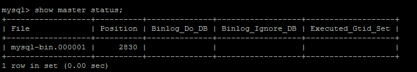

==File和Position字段的值后面将会用到，在后面的操作完成之前，需要保证Master库不能做任何操作，否则将会引起状态变化，File和Position字段的值变化。== 

### 	（6）从机中添加主机信息

​		在Slave 中进入 mysql，执行

```shell
change master to master_host='172.17.0.2', master_user='slave', master_password='123456', master_port=3306, master_log_file='mysql-bin.000001', master_log_pos= 2830, master_connect_retry=30;
```

​	  **命令说明：**    

```shell
master_host ：Master的地址，指的是容器的独立ip,可以通过docker inspect --format='{{.NetworkSettings.IPAddress}}' 容器名称|容器id查询容器的ip
master_port：Master的端口号，指的是容器的端口号

master_user：用于数据同步的用户

master_password：用于同步的用户的密码

master_log_file：指定 Slave 从哪个日志文件开始复制数据，即上文中提到的 File 字段的值

master_log_pos：从哪个 Position 开始读，即上文中提到的 Position 字段的值

master_connect_retry：如果连接失败，重试的时间间隔，单位是秒，默认是60秒

在Slave 中的mysql终端执行show slave status \G;用于查看主从同步状态。
```

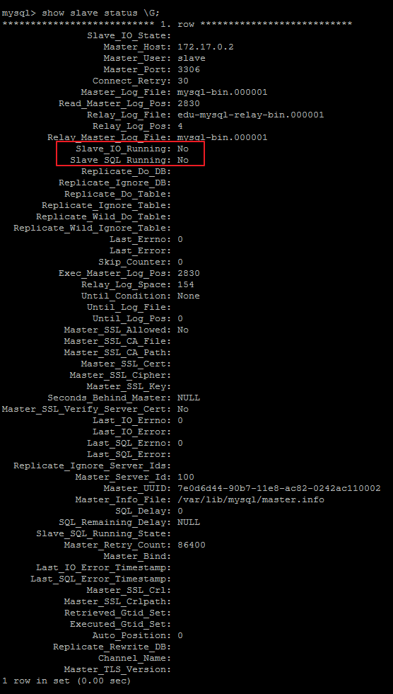

### 	（7）开启从机复制

正常情况下，SlaveIORunning 和 SlaveSQLRunning 都是No，因为我们还没有开启主从复制过程。

使用`start slave`开启主从复制过程，然后再次查询主从同步状态`show slave status \G;`。


SlaveIORunning 和 SlaveSQLRunning 都是Yes，说明主从复制已经开启。此时可以测试数据同步是否成功。

### 		（8）主从复制排错


使用`start slave`开启主从复制过程后，如果SlaveIORunning一直是Connecting，则说明主从复制一直处于连接状态，这种情况一般是下面几种原因造成的，我们可以根据 Last_IO_Error提示予以排除。

1. 网络不通

   检查ip,端口

2. 密码不对

   检查是否创建用于同步的用户和用户密码是否正确

3. pos不对

   检查Master的 Position

### （9）测试主从复制

测试主从复制方式就十分多了，最简单的是在Master创建一个数据库，然后检查Slave是否存在此数据库。