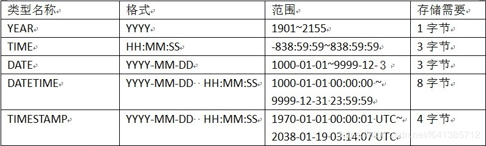
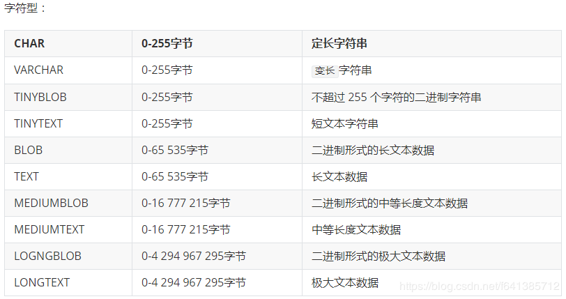

# MySql数据类型---日期时间类型的使用

前言：

学习MySQL优化的时候，就有一个原则就是存储数据时应采用最小占用空间的数据类型。int类型是4个字节，TIMESTAMP也是4个字节，但是在需要使用日期时，时间戳还需要进一步转换，而TIMESTAMP类型数据就不需要了。

# 一：时间日期数据类型总概况

MySQL中有多种表示时间日期的数据类型，主要有YEAR、TIME、DATE、DATETIME、TIMESTAMP等。每一种数据类型都有存储的时间日期格式、以及取值范围，因此在使用时间日期数据类型的时候需要选取最佳的数据类型。



此处注意发现：Time类型HH的取值竟然是800+，而不是我们本以为的24以内的数字，具体原因，下面会有解释

#### 各类型详细讲解

## 1、YEAR

见名之意，year用于存储年，存储时只需要**一个字节**，插入数据时可以使用各种格式指定YEAR值（非常节约内存，所以
当你只需要年的时候，用此字段合适）。

支持的常见插入格式为：

（推荐甚至强制要求必须）四位字符串或者数字，范围为“1901”~“2155”，写多少即为多少
两位字符串格式：范围为“00”“99”，"00""69"被转化为20**（例如：“16”转化为“2016”），“70”~“99”被转化为19**（下同）
两位数字格式，范围为199，169被转化为20**（例如：1转化为2001），70~99被转化为19**

## 2、Time

time用于存储时间信息，存储时需要三个字节。
虽然，小时的范围是0~~23，但是为了表示某种特殊需要的时间间隔，将Time类型的范围扩大了。而且还支持了负值。

支持的常见插入格式为：

（推荐甚至强制要求必须）字符串格式：‘HH:MM:SS’,‘HH:MM’,‘D HH:MM’,‘D HH’,'SS’等形式。举个例子，输入‘30’，Time类型会自动转换为00：00：30。
‘HHMMSS’格式的字符串或HHMMSS格式的数值表示，例如，输入‘123456’，Time类型会转换成12：34：56；输入123456，Time类型会转换成12：34：56。如果输入0或者‘0’，那么TIME类型会转换为0000：00：00。
‘D HH:MM:SS’格式的字符串表示。其中，D表示天数，取值范围是0~~34。保存时，小时的值等于（D*24+HH）。举个例子，输入‘2 11：30：50’，Time类型会转换为59：30：50。

使用current_time或者current_time()或者now()输入当前系统时间。（一般用于默认值）

SQL实例：

```mysql
INSERT INTO `linkinframe`.`test` (`id`, `a`) VALUES ('1', '1 01:50:50');
INSERT INTO `linkinframe`.`test` (`id`, `a`) VALUES ('2', '01:50:50');
INSERT INTO `linkinframe`.`test` (`id`, `a`) VALUES ('3', '50:05');
INSERT INTO `linkinframe`.`test` (`id`, `a`) VALUES ('4', '1 05:05');
INSERT INTO `linkinframe`.`test` (`id`, `a`) VALUES ('5', '59');
INSERT INTO `linkinframe`.`test` (`id`, `a`) VALUES ('6', '66');
INSERT INTO `linkinframe`.`test` (`id`, `a`) VALUES ('7', '123456');
INSERT INTO `linkinframe`.`test` (`id`, `a`) VALUES ('8', 123456);
INSERT INTO `linkinframe`.`test` (`id`, `a`) VALUES ('9', 0);
INSERT INTO `linkinframe`.`test` (`id`, `a`) VALUES ('10', '0');
INSERT INTO `linkinframe`.`test` (`id`, `a`) VALUES ('11', now());
INSERT INTO `linkinframe`.`test` (`id`, `a`) VALUES ('12', current_time);
INSERT INTO `linkinframe`.`test` (`id`, `a`) VALUES ('13', current_time());
```

`Time类型专门用来存储时间数据，而且只占3个字节，所以`如果只需要记录时间，选择Time类型是最合适的`

## 3、Date

date用于存储日期，没有时间部分，存储时需要三个字节。

MySQL中是以YYYY-MM-DD的形式显示date类型的值。

支持的常见插入格式为：

（推荐甚至强制要求必须） ‘YYYY-MM-DD’或‘YYYYMMDD’格式的字符串表示，这种方式可以表达的范围是‘1000-01-01’~‘9999-12-31’。
MySQL中还支持一些不严格的语法格式，任何标点都可以用来做间隔符。如’YYYY/MM/DD‘，’YYYY@MM@DD‘，’YYYY.MM.DD‘等分隔形式。举个例子，输入’2011.3.8‘，date类型将转换为2011-03-08。
’YY-MM-DD‘或者’YYMMDD‘格式的字符串表示，其中’YY‘的取值，’00‘’69‘转换为20002069，’70‘’99‘转换为19701999。与year类型类似。

使用current_date或now()来输入当前系统时间。

SQL实例：

```mysql
INSERT INTO `linkinframe`.`test` (`id`, `a`) VALUES ('1', '2008-08-08');
INSERT INTO `linkinframe`.`test` (`id`, `a`) VALUES ('2', '20080808');
INSERT INTO `linkinframe`.`test` (`id`, `a`) VALUES ('3', '2008@08@08');
-- 格式出错，所以插入0000-00-00
INSERT INTO `linkinframe`.`test` (`id`, `a`) VALUES ('4', '2008#0808');
-- 格式没错，但是小于了date类型的最小值1000，但是数据库还是插进去了，我晕
INSERT INTO `linkinframe`.`test` (`id`, `a`) VALUES ('5', '0999-08-08');
INSERT INTO `linkinframe`.`test` (`id`, `a`) VALUES ('6', '690808');
INSERT INTO `linkinframe`.`test` (`id`, `a`) VALUES ('7', '700808');
INSERT INTO `linkinframe`.`test` (`id`, `a`) VALUES ('8', 690808);
INSERT INTO `linkinframe`.`test` (`id`, `a`) VALUES ('9', 700808);
INSERT INTO `linkinframe`.`test` (`id`, `a`) VALUES ('10', '0');
INSERT INTO `linkinframe`.`test` (`id`, `a`) VALUES ('11', 0);
INSERT INTO `linkinframe`.`test` (`id`, `a`) VALUES ('12', now());
INSERT INTO `linkinframe`.`test` (`id`, `a`) VALUES ('13', current_date);
INSERT INTO `linkinframe`.`test` (`id`, `a`) VALUES ('14', current_date());
```


## 4、Datetime

datetime类型使用8个字节来表示日期和时间。
MySQL中以‘YYYY-MM-DD HH:MM:SS’的形式来显示dateTime类型的值。

支持的常见插入格式为：

（推荐甚至强制要求必须）‘YYYY-MM-DD HH:MM:SS’或‘YYYYMMDDHHMMSS’格式的字符串表示。这种方式可以表达的范围是‘1000-01-01 00:00:00’~~‘9999-12-31 23:59:59’。
MySQL中还支持一些不严格的语法格式，任何的标点都可以用来做间隔符。情况与date类型相同，而且时间部分也可以使用任意的分隔符隔开，这与Time类型不同，Time类型只能用‘:’隔开呢。

使用now()来输入当前系统日期和时间。

SQL实例：

```mysql
INSERT INTO `linkinframe`.`test` (`id`, `a`) VALUES ('1', '2008-08-08 08:08:08');
INSERT INTO `linkinframe`.`test` (`id`, `a`) VALUES ('2', '20080808080808');
INSERT INTO `linkinframe`.`test` (`id`, `a`) VALUES ('3', '2008@08@08 08*08*08');
INSERT INTO `linkinframe`.`test` (`id`, `a`) VALUES ('4', '69-01-01 11:11:11');
INSERT INTO `linkinframe`.`test` (`id`, `a`) VALUES ('5', '70-01-01 11:11:11');
INSERT INTO `linkinframe`.`test` (`id`, `a`) VALUES ('6', 20080808080808);
INSERT INTO `linkinframe`.`test` (`id`, `a`) VALUES ('7', 690808080808);
INSERT INTO `linkinframe`.`test` (`id`, `a`) VALUES ('8', 700808080808);
INSERT INTO `linkinframe`.`test` (`id`, `a`) VALUES ('9', 0);
INSERT INTO `linkinframe`.`test` (`id`, `a`) VALUES ('10', now());
```

`dateTime类型用来记录日期和时间，其作用等价于date类型和Time类型的组合。一个dateTime类型的字段可以用一个date类型的字段和一个time类型的字段代替。但是如果需要同时记录日期和时间，选择dateTime类型是个不错的选择。`

## 5、timestamp

timestamp类型使用4个字节来表示日期和时间。
timestamp类型与dateTime类型显示的格式是一样的。

支持的常见插入格式为：
同datetime

二者主要区别在于取值范围。

timestamp存储需要四个字节，它的取值范围为“1970-01-01 00:00:01” UTC ~ “2038-01-19 03:14:07” （和时区有关）
而datetime取值范围为“1000-01-01 00:00:00” ~ “9999-12-31 23:59:59”（和时区无关，怎么存入怎么返回，对程序员友好）

```mysql
INSERT INTO `linkinframe`.`test` (`id`, `a`) VALUES ('1', null);
INSERT INTO `linkinframe`.`test` (`id`, `a`) VALUES ('2', 'NULL');
INSERT INTO `linkinframe`.`test` (`id`, `a`) VALUES ('3', current_timestamp());
```

`从数据库显示的结果来看，timestamp的范围确实很小的，2069明显的超过了2038，所以数据库插入0。`

==在MySQL 5.6.5版本之前，Automatic Initialization and Updating只适用于TIMESTAMP，而且一张表中，最多允许一个TIMESTAMP字段采用该特性。从MySQL 5.6.5开始，Automatic Initialization and Updating同时适用于TIMESTAMP和DATETIME，且不限制数量。== 

## datetime和timestamp的比较

1、timestamp相对于datetime的不同之处：
（1.1），使用current_timestamp来输入系统当前日期与时间
（1.2），输入null时，系统会输入系统当前日期与时间

（1.3），无任何输入时，系统会输入null。

2、timestamp类型还有一个很大的特殊点，就是时间是根据时区来显示的。
例如，在东八区插入的timestamp类型为2009-09-30 14:21:25，在东七区显示时，时间部门就变成了13:21:25，在东九区显示时，时间部门就变成了15:21:25。
3、需要显示日期与时间，timestamp类型需要根据不同地区的时区来转换时间，但是，timestamp类型的范围太小，其最大时间为2038-01-19 11:14:07。

如果插入时间的比这个大，将会数据库插入0000-00-00 00:00:00。所以需要的时间范围比较大，还是选择dateTime类型比较安全。

MySQL中如何表示当前时间？
其实，表达方式还是蛮多的，汇总如下：
CURRENT_TIMESTAMP
CURRENT_TIMESTAMP()
NOW()
LOCALTIME
LOCALTIME()
LOCALTIMESTAMP
LOCALTIMESTAMP()

小结
了解MySQL的日期时间数据类型对于选取一种适合存储类型是很有必要的。假若只有存储年份可以选取YEAR、仅存储时间可以选择TIME、又或者需要存储完整日期时间，那么可以根据实际情况选取DATATIME（推荐）或者TIMESTAMP数据类型。

## 附：MySql常用转换函数

unix_timestamp(),
unix_timestamp(date),
from_unixtime(unix_timestamp),

from_unixtime(unix_timestamp,format)

```mysql
select unix_timestamp(); -- 1218290027
select unix_timestamp('2008-08-08'); -- 1218124800
select unix_timestamp('2008-08-08 12:30:00'); -- 1218169800

select from_unixtime(1218290027); -- '2008-08-09 21:53:47'
select from_unixtime(1218124800); -- '2008-08-08 00:00:00'
select from_unixtime(1218169800); -- '2008-08-08 12:30:00'

select from_unixtime(1218169800, '%Y %D %M %h:%i:%s %x'); -- '2008 8th August 12:30:00 2008'

```

`date_format(date,format), time_format(time,format) 能够把一个日期/时间转换成各种各样的字符串格式。它是 str_to_date(str,format) 函数的 一个逆转换。`

## 附：MySql各大数据类型占用字节数


字符型占用字节:



修正：varchar最大大小是65532字节。char是定长(每个值都占用M个字节，如果某个长度小于M，MySQL就会在它的右边用空格字符补足)，varchar是变长 

## 附：mysql中的date类型直接比较大小是按照字符串比较还是时间戳

Mysql在比较两种不同数据类型时，第一步是将他们转化为同一种类型，然后在比较。那么Date和String在比较的时候，一定是把String转化为Date吗？答案是Yes

例子：

```mysql
select * FROM test.orders where ceate_record_time > '2019'
```

为什么会出现 2018 的字符串？

再举个例子：如果是用字符串比较，“2004-04-31"这个string应该比2004-01-01这个date来得大，但是4-31是一个invalid的日期（4月是小月），会被转化成"0000-00-00”，所以2004-01-01 (日期) > “2014-04-31”。

```properties
所以，在存储方面：如果你是表示的时间，请尽量不要采用str类型来存储（虽然大多数情况下存入的效果一样，但不建议）。
在查询方面：如果你确实遇到的存储的是字符串，那么请用STR_TO_DATE函数转成日期格式在查询，形如：
```

```mysql
select * from orders where date(str_to_date(`ceate_record_time`.`publish_date`,'%Y-%m-%d')) > '2019-0-0'
```

## 附：unsigned解释

整型的每一种都分有无符号（unsigned）和有符号（signed）两种类型（float和double总是带符号的），在默认情况下声明的整型变量都是有符号的类型。

如果需声明无符号类型的话就需要在类型前加上unsigned。无符号版本和有符号版本的区别就是无符号类型能保存2倍于有符号类型的正整数数据，比如16位系统中一个int能存储的数据的范围为-3276832767，而unsigned能存储的数据范围则是065535。由于在计算机中,整数是以补码形式存放的。根据最高位的不同，如果是1,有符号数的话就是负数；如果是无符号数,则都解释为正数。

简而言之就是由于Int型占4字节，也就是16位，2^16 = 65535，如果有符号位就+ -两边均分，如果没有就全给+

```mysql
CREATE TABLE `fast_group_task` (
  `id` bigint unsigned NOT NULL AUTO_INCREMENT COMMENT '主键',
  ...
  PRIMARY KEY (`id`)
) ENGINE=InnoDB DEFAULT CHARSET=utf8mb4 COMMENT='批量组建班级的任务';
```

# 二:MySQL中int(M)和tinyint(M)

数值类型中M值的意义

```properties
上述表格中的数值类型都是定长的，也就是说，无论你存的数值是多少，多大或者多小，占用的字节大小都是固定的。例如，之前设置的int(1)，虽然M值是1个字符，但是它所占用的空间大小永远都是4个字节的大小，换句话说就是，你可以存入有符号整型从-2 147 483 648到2 147 483 647包括这两个数的中间任何一个数。int(1)和int(11)占用的是4个字节，可以存入上述这些数，tinyint(1)和tinyint(4)占用的是1个字节，可以存入从-128到127的数，这也是为什么之前的一次试验，int(1)插入128成功，而tinyint(1)插入128却提示超出长度。

那么，这个M值到底代表什么意思呢？
```

```mysql
mysql> ALTER TABLE test MODIFY id1 int(2) zerofill;
mysql> SELECT * FROM test;
+------+
|  id1 |
+------+
|  01  |
+------+
```

现在是不是有些清楚了。我们设置的M值是2，没有设置zerofill用0填充时，对于操作没有任何影响，而设置了zerofill后，我们可以清楚地看到值1字符数不足M值，左前位置补0。我们也可以将M值设置成别的大小进行多次测试，这里就不进行测试了。

需要强调的是，不同的数据类型中的M值意义是不一样的，我们这里仅讨论整型中的M值。

从上面我们可以得到如下的结论：

1、整数型的数值类型已经限制了取值范围，有符号整型和无符号整型都有，而M值并不代表可以存储的数值字符长度，==它代表的是数据在显示时显示的最小长度==；

2、当存储的字符长度超过M值时，没有任何的影响，只要不超过数值类型限制的范围；

3、当存储的字符长度小于M值时，只有在设置了zerofill用0来填充，才能够看到效果，==换句话就是说，没有zerofill，M值就是无用的==。

 

总结：int(11)，tinyint(1)，bigint(20)，后面的数字，不代表占用空间容量。而代表最小显示位数。这个东西基本没有意义，除非你对字段指定zerofill。

所以我们在设计mysql数据库时，建表时，==mysql会自动分配长度：int(11)、tinyint(4)、smallint(6)、mediumint(9)、bigint(20)。== 

所以，就用这些默认的显示长度就可以了。不用再去自己填长度，比如搞个int(10)、tinyint(1)之类的，基本没用。而且导致表的字段类型多样化。

阿里手册参考：

| 对象   | 年龄区间    | 类型                | 字节   | 表示范围                |
| ---- | ------- | ----------------- | ---- | ------------------- |
| 人    | 150 岁之内 | unsigned tinyint  | 1    | 无符号值：0 到 255        |
| 龟    | 数百岁     | unsigned smallint | 2    | 无符号值：0 到 65535      |
| 恐龙化石 | 数千万年    | unsigned int      | 4    | 无符号值：0 到约 42.9 亿    |
| 太阳   | 约 50 亿年 | unsigned bigint   | 8    | 无符号值：0 到约 10 的 19次方 |

# 三、mysql字符集utf8 和utf8mb4编码问题

最近看了一篇文章是关于Mysql中utf-8编码问题的，我们在Mysql中用到的utf8实际上不是真正的 UTF-8，在Mysql中utf8mb4才是真正的UTF-8。

    在有些地方看到说utf8mb4相比于utf8是为了解决emoji（就是我们聊天的时候笑脸表情）问题，感觉这种说法对但是不完全对。utf8mb4相当于utf8的一个扩展，出现utf8mb4是因为现在Mysql中的utf8已经不能满足我们对字符编码的需求了。

    Mysql从4.1 版本开始支持 UTF-8，最大字符长度为 3 字节，三个字节的 UTF-8 最大能编码的 Unicode 字符是 0xFFFF，也就是 Unicode 中的基本多文平面（BMP）。也就是说，任何不在基本多文平面的 Unicode字符，都无法使用MySQL原有的 utf8 字符集存储。这些不在BMP中的字符包括哪些呢？最常见的就是Emoji 表情（Emoji 是一种特殊的 Unicode 编码，常见于 ios 和 android 手机上），和一些不常用的汉字，以及任何新增的 Unicode 字符等等。于是在MySQL5.5.3版本后就有了utf8mb4，它支持四个字节编码在utf8消耗空间一些，但是它可以支持跟多的字符。

    所以，在我们最新设计数据库的时候最好使用utf8mb4字符集，同时使用varchar代替char类型。

