# spring-aop原理

**简介**：

Aspect Oriented Programming  面向切面编程。解耦是程序员编码开发过程中一直追求的。AOP也是为了解耦所诞生。

具体思想是：定义一个切面，在切面的纵向定义处理方法，处理完成之后，回到横向业务流。

AOP 在Spring框架中被作为核心组成部分之一，的确Spring将AOP发挥到很强大的功能。最常见的就是事务控制。工作之余，对于使用的工具，不免需要了解其所以然。学习了一下，写了些程序帮助理解。

AOP 主要是利用代理模式的技术来实现的。


## **1、静态代理：** 

**就是设计模式中的proxy模式**

a.业务接口

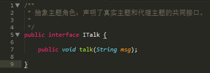

b.业务实现

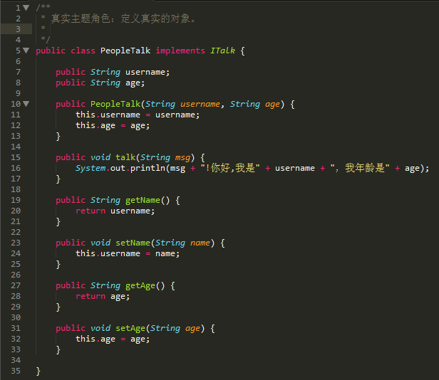

c.代理对象

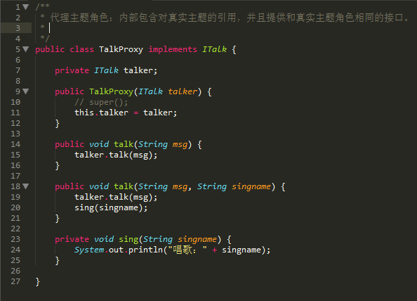


d.测试类 

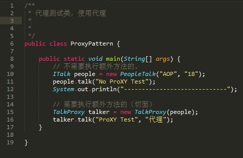


从这段代码可以看出来，代理模式其实就是AOP的雏形。 上端代码中talk(String msg, String singname)是一个切面。在代理类中的sing(singname)方法是个后置处理方法。

这样就实现了，其他的辅助方法和业务方法的解耦。业务不需要专门去调用，而是走到talk方法，顺理成章的调用sing方法

再从这段代码看：1、要实现代理方式，必须要定义接口。2、每个业务类，需要一个代理类。


## 2、动态代理：

**jdk1.5中提供，利用反射。实现InvocationHandler接口。**


a.代理类

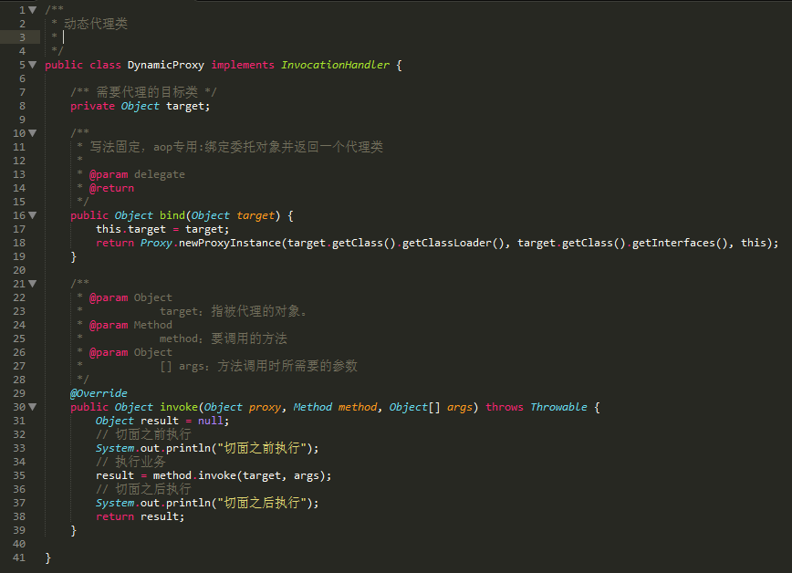


b.测试类

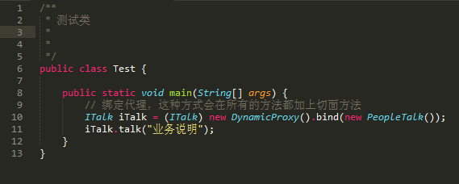


输出结果会是：

切面之前执行
people talk业务说法
切面之后执行

说明只要在业务调用方法切面之前，是可以动态的加入需要处理的方法。

从代码来看，如果再建立一个业务模块，也只需要一个代理类。ITalk iTalk = (ITalk) new DynamicProxy().bind(new PeopleTalk());  将业务接口和业务类绑定到动态代理类。

但是这种方式：还是需要定义接口。


## **3、利用cglib** 

a.业务类

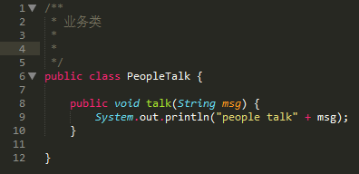

b.代理类

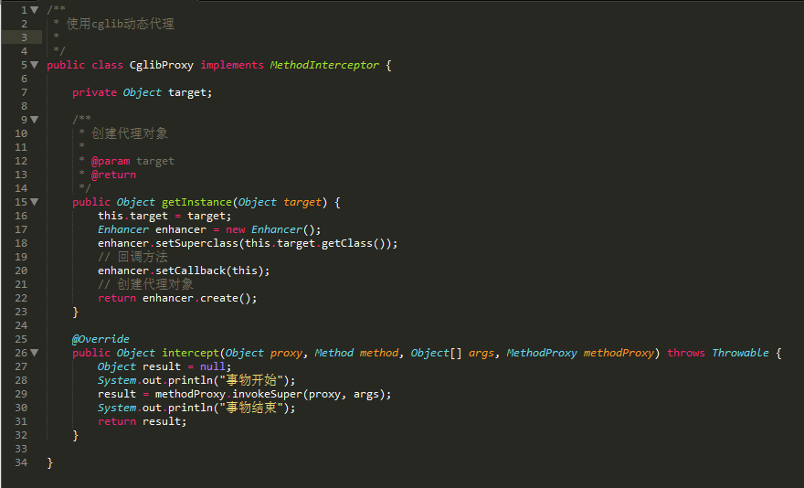


c.测试类

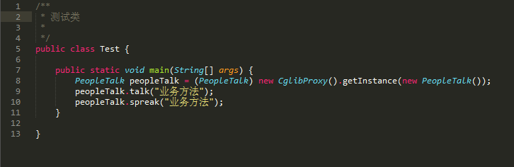


最后输出结果：

事物开始
people talk业务方法
事物结束
事物开始
spreak chinese业务方法
事物结束


# Java AOP

apo专业术语图解：

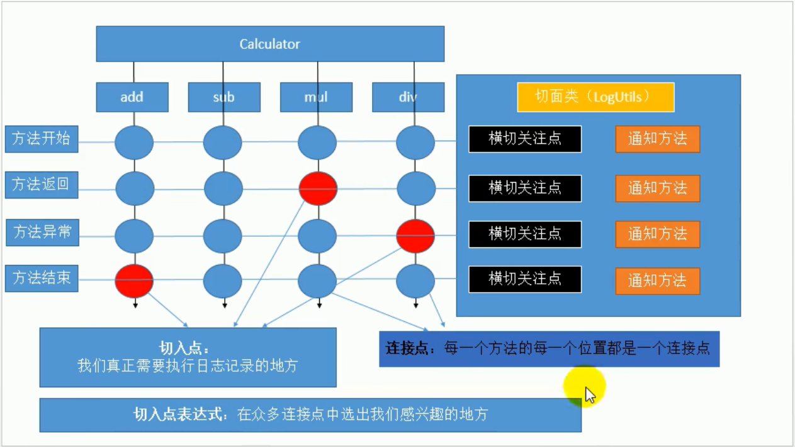

> 通知方法为：要写入的方法
>
> 连接点图中一共16个


**开发模式@Aspect注解说明**

## 2 注解说明

2.1 @Aspect

作用是把当前类标识为一个切面供容器读取


2.2 @Before
标识一个前置增强方法，相当于BeforeAdvice的功能，相似功能的还有

2.3 @AfterReturning

后置增强，相当于AfterReturningAdvice，方法正常退出时执行

2.4 @AfterThrowing

异常抛出增强，相当于ThrowsAdvice

2.5 @After

final增强，不管是抛出异常或者正常退出都会执行


2.6 @Around

环绕增强，相当于MethodInterceptor，前面四种的合体：

```java
try{
  @before 前置通知
  method.invoke();
  @afterreturning 返回通知
}catch(e){
  @afterthrowing 异常通知
}finally{
  @after  后置通知
}
```


## 3 execution切点函数


execution函数用于匹配方法执行的连接点，语法为：

execution(方法修饰符(可选)  返回类型  方法名  参数  异常模式(可选)) 

 

参数部分允许使用通配符：

*  匹配任意字符，但只能匹配一个元素

.. 匹配任意字符，可以匹配任意多个元素，表示类时，必须和*联合使用

+  必须跟在类名后面，如Horseman+，表示类本身和继承或扩展指定类的所有类


示例中的* chop(..)解读为：

方法修饰符  无

返回类型      *匹配任意数量字符，表示返回类型不限

方法名          chop表示匹配名称为chop的方法

参数               (..)表示匹配任意数量和类型的输入参数

异常模式       不限

 

更多示例：


void chop(String,int)

匹配目标类任意修饰符方法、返回void、方法名chop、带有一个String和一个int型参数的方法


public void chop(*)

匹配目标类public修饰、返回void、方法名chop、带有一个任意类型参数的方法


public String *o*(..)

 匹配目标类public修饰、返回String类型、方法名中带有一个o字符、带有任意数量任意类型参数的方法


public void *o*(String,..)

 匹配目标类public修饰、返回void、方法名中带有一个o字符、带有任意数量任意类型参数，但第一个参数必须有且为String型的方法

也可以指定类：


public void examples.chap03.Horseman.*(..)

匹配Horseman的public修饰、返回void、不限方法名、带有任意数量任意类型参数的方法


public void examples.chap03.*man.*(..)

匹配以man结尾的类中public修饰、返回void、不限方法名、带有任意数量任意类型参数的方法

指定包：


public void examples.chap03.*.chop(..)

匹配examples.chap03包下所有类中public修饰、返回void、方法名chop、带有任意数量任意类型参数的方法


public void examples..*.chop(..)

匹配examples.包下和所有子包中的类中public修饰、返回void、方法名chop、带有任意数量任意类型参数的方法
可以用这些表达式替换StorageAdvisor中的代码并观察效果


## 4 更多切点函数

除了execution()，Spring中还支持其他多个函数，这里列出名称和简单介绍，以方便根据需要进行更详细的查询


4.1 @annotation()

表示标注了指定注解的目标类方法

例如 @annotation(org.springframework.transaction.annotation.Transactional) 表示标注了@Transactional的方法


4.2 args()

通过目标类方法的参数类型指定切点

例如 args(String) 表示有且仅有一个String型参数的方法


4.3 @args()

通过目标类参数的对象类型是否标注了指定注解指定切点

如 @args(org.springframework.stereotype.Service) 表示有且仅有一个标注了@Service的类参数的方法


4.4 within()

通过类名指定切点

如 within(examples.chap03.Horseman) 表示Horseman的所有方法


4.5 target()

通过类名指定，同时包含所有子类

如 target(examples.chap03.Horseman)  且Elephantman extends Horseman，则两个类的所有方法都匹配


4.6 @within()

匹配标注了指定注解的类及其所有子类

如 @within(org.springframework.stereotype.Service) 给Horseman加上@Service标注，则Horseman和Elephantman 的所有方法都匹配


4.7 @target()

所有标注了指定注解的类

如 @target(org.springframework.stereotype.Service) 表示所有标注了@Service的类的所有方法


4.8 this()

大部分时候和target()相同，区别是this是在运行时生成代理类后，才判断代理类与指定的对象类型是否匹配


## 5 逻辑运算符

表达式可由多个切点函数通过逻辑运算组成

5.1 &&

与操作，求交集，也可以写成and

例如 execution(* chop(..)) && target(Horseman)  表示Horseman及其子类的chop方法

5.2 ||

或操作，求并集，也可以写成or

例如 execution(* chop(..)) || args(String)  表示名称为chop的方法或者有一个String型参数的方法

5.3 !

非操作，求反集，也可以写成not


## 6 实际使用：

```java
package com.example.aop.aop.aspect;

import org.aspectj.lang.JoinPoint;
import org.aspectj.lang.ProceedingJoinPoint;
import org.aspectj.lang.annotation.*;
import org.springframework.core.annotation.Order;
import org.springframework.stereotype.Component;

/**
 * DESC: *
 * Created by zhengyong on 2019/6/23.
 */
@Aspect
@Component
//多切面时，使用order注解来排序，执行规则是，先进后出。（面包反弹）
@Order(1)
public class MyAspect {

    /**
     * 抽取重复切入点
     * 要求：public void 方法 且未实现的方法
     */
    @Pointcut("execution(public Object com..service.MethodBusiness.*(int,int))")
    public void testPoint(){}


    /**
     * 告诉spring何时执行
     * try{
     *   @before 前置通知
     *   method.invoke();
     *   @afterreturning 返回通知
     * }catch(e){
     *   @afterthrowing 异常通知
     * }finally{
     *   @after 后置通知
     * }
     *
     * @Before         目标方法执行前
     * @AfterReturning 目标方法正常返回
     * @AfterThrowing  目标方法抛出异常后
     * @After          最后执行
     * @Around          环绕
     */
    //before表示何时执行，切入点表达式表示何时执行
    @Before(value = "testPoint()")
    public static void testBefore() {
        System.out.println("切面，前置通知");
    }

    /**
     * 切入点表达式：
     * 固定格式： execution(访问权限符 返回值类型 方法类全名（参数列表）)
     * 通配符：
     *      * :
     *         1)匹配一个或者多个字符 execution(public Object com.example.aop.aop.service.Method*.*(int,int))
     *         2)匹配任意一个参数(可能会重载无法切入) execution(public Object com.example.aop.aop.service.Method*.*(int,*))
     *         3）只能匹配一层路径
     *         4）*不能代替访问权限符，可以省略
     *      ..:
     *         1）匹配任意个数任意参数（表达式开头不能已双点开始）
     *         execution(public Object com.example.aop.aop.service.MethodBusiness.*(..))
     *         2)匹配任意多层路径
     *         execution(public Object com..service.MethodBusiness.*(int,int))
     * 最精确的
     *  execution(public Object com.example.aop.aop.service.MethodBusiness.add(int,int))
     * 最模糊的
     *  execution(* *.*(..)) 千万别写
     *
     *  aferReturning可以拿到结果信息
     *  Object result 方法参数列表中写入接受结果的类型
     *  告诉spring 返回结果用什么参数来接收：returning = "result"
     */
    @AfterReturning(value = "execution(public Object com.example.aop.aop.service.Method*.*(*,*))",returning = "result")
    public static void testAfterReturning(JoinPoint joinPoint,Object result) {
        System.out.println("切面，返回通知,方法名："+joinPoint.getSignature().getName()+",结果是："+result);
    }

    /**
     * 通知执行顺序
     *  正常：@before @after（后置通知）  @aferReturnin(返回通知)
     *  异常：@before @after（后置通知）   @aferThrowing（异常通知）
     *
     * @AfterThrowing 可以获取异常信息
     */
    @AfterThrowing(value = "execution(public Object com.example.aop.aop.service.MethodBusiness.*(int,int))",throwing ="e")
    public static void testAfterThrowing(JoinPoint joinPoint,Exception e){
        System.out.println("切面，异常通知,异常是："+e);
    }

    /**
     * joinPoint获取 方法名和  方法参数
     */
    @After(value = "execution(public Object com.example.aop.aop.service.MethodBusiness.*(..))")
    public static void testAfter(JoinPoint joinPoint){
        //获取签名---获取方法名
        String name = joinPoint.getSignature().getName();
        System.out.println("方法名："+name);
        Object[] args = joinPoint.getArgs();
        for (Object arg : args) {
            System.out.println("方法参数列表："+arg);
        }
        System.out.println("切面，后置通知");
    }

    /**
     * 环绕方法就是动态代理
     * 和普通方法的却别就是，会直接影响目标方法
     *
     * @param joinPoint
     * @return
     * @throws Throwable
     */
    @Around(value = "execution(public Object com.example.aop.aop.service.MethodBusiness.*(..))")
    public static Object testAround(ProceedingJoinPoint joinPoint) throws Throwable{
        Object[] args = joinPoint.getArgs();
        Object proceed = null;
        try{
            //before
            //利用反射，执行目标方法，需要参数,就是mothod.invoke()
             proceed= joinPoint.proceed(args);
             //afterReturning
        }catch(Exception e){
            //afterThrowing
            //如果有异常，要抛出去（看需求）
        }finally {
            //after
        }
        //反射调用后，返回值一定也要返回出去
        return proceed;
    }
}

```

## 多切面执行顺序图解：

==面包反弹原理== 

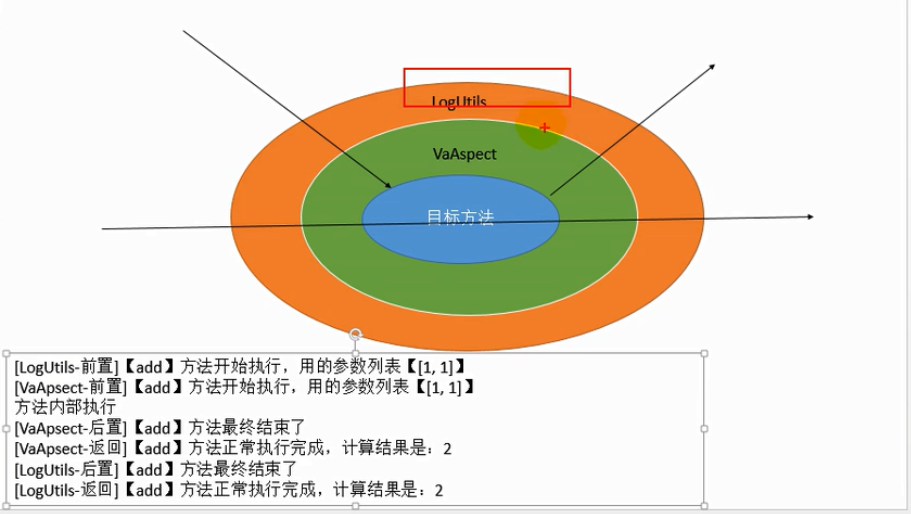

## aop获取注解上的值

```java
    @Before(value = "@annotation(com.example.aop.aop.annotation.DoSomething)")
    public void before(JoinPoint joinPoint){
        //获取签名
        Signature signature = joinPoint.getSignature();
        //获取强转为方法签名
        MethodSignature methodSignature = (MethodSignature) signature;
        //获取方法上的注解
        DoSomething annotation = methodSignature.getMethod().getAnnotation(DoSomething.class);
        //获取注解上的参数的值
        if(annotation.isDoSomething()){
            System.out.println("【老铁你来了】");
        }else{
            System.out.println("【给老子滚蛋】");
        }

        //获取参数
        Object[] args = joinPoint.getArgs();
        for (Object arg : args) {
            System.out.println("参数是："+arg);
        }
        System.out.println("注解前置方法");
    }
```


